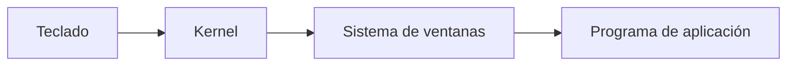

# Capítulo 1. Introducción

## Bienvenido a la Programación

Amo la programación. Disfruto el reto de no solo hacer un programa que funcione, sino de hacerlo con estilo. La programación es como la poesía. Transmite un mensaje, no solo a la computadora, sino a aquellos que modifican y usan tu programa. Con un programa, construyes tu propio mundo con tus propias reglas. Creas tu mundo de acuerdo con tu concepción tanto del problema como de la solución. Los programadores maestros crean mundos con programas que son claros y sucintos, muy parecidos a un poema o un ensayo.

Uno de los más grandes programadores, Donald Knuth, describe la programación no como decirle a una computadora cómo hacer algo, sino decirle a una persona cómo instruiría a una computadora para hacer algo. El punto es que los programas están destinados a ser leídos por personas, no solo por computadoras. Tus programas serán modificados y actualizados por otros mucho después de que pases a otros proyectos. Por lo tanto, la programación no se trata tanto de comunicarse con una computadora como de comunicarse con aquellos que vienen después de ti. Un programador es un solucionador de problemas, un poeta y un instructor, todo a la vez. Tu objetivo es resolver el problema en cuestión, haciéndolo con equilibrio y gusto, y enseñar tu solución a futuros programadores. Espero que este libro pueda enseñar al menos algo de la poesía y la magia que hace que la informática sea emocionante.

La mayoría de los libros introductorios sobre programación me frustran infinitamente. Al final de ellos todavía puedes preguntar "¿cómo funciona realmente la computadora?" y no tener una buena respuesta. Tienden a pasar por alto temas que son difíciles aunque sean importantes. Te llevaré a través de los temas difíciles porque esa es la única manera de avanzar hacia la programación maestra. Mi objetivo es llevarte de no saber nada sobre programación a entender cómo pensar, escribir y aprender como un programador. No lo sabrás todo, pero tendrás una base de cómo encaja todo. Al final de este libro, deberías ser capaz de hacer lo siguiente:

- Entender cómo funciona un programa e interactúa con otros programas
- Leer los programas de otras personas y aprender cómo funcionan
- Aprender nuevos lenguajes de programación rápidamente
- Aprender conceptos avanzados de ciencias de la computación rápidamente

No te enseñaré todo. La informática es un campo masivo, especialmente cuando combinas la teoría con la práctica de la programación de computadoras. Sin embargo, intentaré iniciarte en los cimientos para que puedas ir fácilmente a donde quieras después.

Existe un problema de tipo "el huevo o la gallina" al enseñar programación, especialmente el lenguaje ensamblador (assembly language). Hay mucho que aprender; es casi demasiado para aprender casi a la vez, pero cada pieza depende de todas las demás. Por lo tanto, debes ser paciente contigo mismo y con la computadora mientras aprendes a programar. Si no entiendes algo la primera vez, reléelo. Si aún no lo entiendes, a veces es mejor aceptarlo por fe y volver a ello más tarde. A menudo, después de más exposición a la programación, las ideas tendrán más sentido. No te desanimes. Es una escalada larga, pero vale mucho la pena.

Al final de cada capítulo hay tres conjuntos de ejercicios de revisión. El primer conjunto es más o menos una repetición: verifican si puedes devolver lo que aprendiste en el capítulo. El segundo conjunto contiene preguntas de aplicación: verifican si puedes aplicar lo que aprendiste para resolver problemas. El conjunto final es para ver si eres capaz de ampliar tus horizontes. Algunas de estas preguntas pueden no tener respuesta hasta más adelante en el libro, pero te dan algunas cosas en qué pensar. Otras preguntas requieren algo de investigación en fuentes externas para descubrir la respuesta. Otras requieren que simplemente analices tus opciones y expliques una mejor solución. Muchas de las preguntas no tienen respuestas correctas o incorrectas, pero eso no significa que no sean importantes. Aprender los temas involucrados en la programación, aprender cómo investigar respuestas y aprender a mirar hacia adelante son una parte importante del trabajo de un programador.

Si tienes problemas que simplemente no puedes superar, hay una lista de correo para este libro donde los lectores pueden discutir y obtener ayuda con lo que están leyendo. La dirección es pgubook-readers@nongnu.org. Esta lista de correo está abierta para cualquier tipo de pregunta o discusión en la línea de este libro. Puedes suscribirte a esta lista yendo a http://mail.nongnu.org/mailman/listinfo/pgubook-readers.

## Tus Herramientas

Este libro enseña lenguaje ensamblador (assembly language) para procesadores x86 y el sistema operativo GNU/Linux. Por lo tanto, daremos todos los ejemplos utilizando el conjunto de herramientas estándar GCC de GNU/Linux. Si no estás familiarizado con GNU/Linux y el conjunto de herramientas GCC, se describirán en breve. Si eres nuevo en Linux, deberías consultar la guía disponible en http://rute.sourceforge.net/ [^1] Lo que pretendo mostrarte es más sobre programación en general que sobre el uso de un conjunto de herramientas específico en una plataforma específica, pero estandarizar en una hace la tarea mucho más fácil.

Aquellos que son nuevos en Linux también deberían intentar involucrarse en su Grupo de Usuarios de GNU/Linux local. Los miembros de los Grupos de Usuarios suelen ser de gran ayuda para las personas nuevas y te ayudarán en todo, desde la instalación de Linux hasta aprender a usarlo de manera más eficiente. Una lista de Grupos de Usuarios de GNU/Linux está disponible en http://www.linux.org/groups/

Todos estos programas han sido probados con Red Hat Linux 8.0 y deberían funcionar también con cualquier otra distribución de GNU/Linux. [^2] No funcionarán con sistemas operativos que no sean Linux, como BSD u otros sistemas. Sin embargo, todas las habilidades aprendidas en este libro deberían ser fácilmente transferibles a cualquier otro sistema.

Si no tienes acceso a una máquina GNU/Linux, puedes buscar un proveedor de hosting que ofrezca una cuenta de shell de Linux, que es una interfaz solo de línea de comandos para una máquina Linux. Hay muchos proveedores de cuentas de shell de bajo costo, pero debes asegurarte de que cumplan con los requisitos anteriores (es decir, Linux en x86). Alguien en tu Grupo de Usuarios de GNU/Linux local podría darte una también. Las cuentas de shell solo requieren que ya tengas una conexión a Internet y un programa telnet. Si usas Windows®, ya tienes un cliente telnet: simplemente haz clic en inicio, luego en ejecutar, luego escribe telnet. Sin embargo, suele ser mejor descargar PuTTY de http://www.chiart.greenend.co.uk/~sgtatham/putty/ porque el telnet de Windows tiene algunos problemas extraños. También hay muchas opciones para Macintosh. NiftyTelnet es mi favorita.

Si no tienes GNU/Linux y no puedes encontrar un servicio de cuenta de shell, entonces puedes descargar Knoppix de http://www.knoppix.org/ Knoppix es una distribución de GNU/Linux que arranca desde un CD para que no tengas que instalarlo realmente. Una vez que hayas terminado de usarlo, simplemente reinicias y retiras el CD y estarás de vuelta en tu sistema operativo habitual.

Entonces, ¿qué es GNU/Linux? GNU/Linux es un sistema operativo modelado según UNIX®. La parte GNU proviene del Proyecto GNU (http://www.gnu.org/) [^3], que incluye la mayoría de los programas que ejecutarás, incluido el conjunto de herramientas GCC que usaremos para programar. El conjunto de herramientas GCC contiene todos los programas necesarios para crear programas en varios lenguajes de computadora.

Linux es el nombre del kernel. El kernel es la parte central de un sistema operativo que realiza el seguimiento de todo. El kernel es tanto una valla como una puerta. Como puerta, permite que los programas accedan al hardware de manera uniforme. Sin el kernel, tendrías que escribir programas para lidiar con cada modelo de dispositivo jamás fabricado. El kernel maneja todas las interacciones específicas del dispositivo para que tú no tengas que hacerlo. También maneja el acceso a archivos y la interacción entre procesos. Por ejemplo, cuando escribes, lo que escribes pasa por varios programas antes de llegar a tu editor. Primero, el kernel es el que maneja tu hardware, por lo que es el primero en recibir aviso sobre la pulsación de tecla. El teclado envía scancodes al kernel, que luego los convierte en las letras, números y símbolos reales que representan. Si estás utilizando un sistema de ventanas (como Microsoft Windows® o el X Window System), el sistema de ventanas lee la pulsación de tecla del kernel y la entrega a cualquier programa que esté actualmente enfocado en la pantalla del usuario.

### Ejemplo 1-1. Cómo procesa el ordenador las señales del teclado

El kernel también controla el flujo de información entre programas. El kernel es la puerta de un programa al mundo que lo rodea. Cada vez que los datos se mueven entre procesos, el kernel controla el mensaje. En nuestro ejemplo del teclado anterior, el kernel tendría que estar involucrado para que el sistema de ventanas comunicara la pulsación de tecla al programa de aplicación.

Como valla, el kernel evita que los programas sobrescriban accidentalmente los datos de los demás y que accedan a archivos y dispositivos para los que no tienen permiso. Limita la cantidad de daño que un programa mal escrito puede hacer a otros programas en ejecución.

 En nuestro caso, el kernel es Linux. Ahora bien, el kernel por sí solo no hará nada. Ni siquiera puedes arrancar una computadora con solo un kernel. Piensa en el kernel como las tuberías de agua de una casa. Sin las tuberías, los grifos no funcionarán, pero las tuberías son bastante inútiles si no hay grifos. Juntos, las aplicaciones de usuario (del proyecto GNU y otros lugares) y el kernel (Linux) conforman todo el sistema operativo, GNU/Linux.

En su mayor parte, este libro utilizará el lenguaje ensamblador de bajo nivel de la computadora. Existen esencialmente tres tipos de lenguajes:

**Lenguaje de Máquina**

Esto es lo que la computadora realmente ve y con lo que trata. Cada comando que la computadora ve se da como un número o secuencia de números.

**Lenguaje Ensamblador**

Esto es lo mismo que el lenguaje de máquina, excepto que los números de comando han sido reemplazados por secuencias de letras que son más fáciles de memorizar. Se hacen otras pequeñas cosas para facilitarlo también.

**Lenguaje de Alto Nivel**

Los lenguajes de alto nivel existen para facilitar la programación. El lenguaje ensamblador requiere que trabajes con la máquina misma. Los lenguajes de alto nivel te permiten describir el programa en un lenguaje más natural. Un solo comando en un lenguaje de alto nivel suele ser equivalente a varios comandos en un lenguaje ensamblador.

En este libro aprenderemos lenguaje ensamblador, aunque cubriremos un poco de lenguajes de alto nivel. Con suerte, al aprender lenguaje ensamblador, tu comprensión de cómo funcionan la programación y las computadoras te pondrá un paso adelante.

---

[^1]: Este es un documento bastante extenso. Ciertamente no necesitas saber todo para comenzar con este libro. Simplemente necesitas saber cómo navegar desde la línea de comandos y cómo usar un editor como pico, emacs o vi (u otros).
[^2]: Por "distribución de GNU/Linux", me refiero a una distribución de GNU/Linux para x86. Las distribuciones de GNU/Linux para Power Macintosh, el procesador Alpha u otros procesadores no funcionarán con este libro.
[^3]: El Proyecto GNU es un proyecto de la Free Software Foundation para producir un sistema operativo completo y libre.
