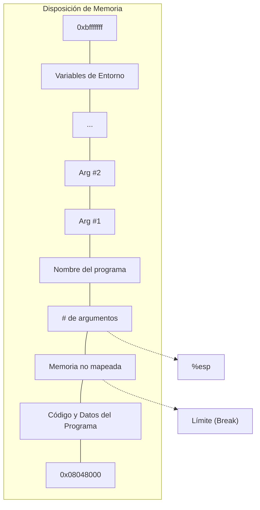

# Capítulo 9. Temas Intermedios de Memoria

## Cómo Ve una Computadora la Memoria

Repasemos cómo funciona la memoria dentro de una computadora. Quizás quieras volver a leer el [[02-capitulo-2|Capítulo 2]].

Una computadora ve la memoria como una larga secuencia de ubicaciones de almacenamiento numeradas. Una secuencia de millones de ubicaciones de almacenamiento numeradas. Todo se almacena en estas ubicaciones. Tus programas se almacenan allí, tus datos se almacenan allí, todo. Cada ubicación de almacenamiento se ve igual que cualquier otra. Las ubicaciones que contienen tu programa son iguales a las que contienen tus datos. De hecho, la computadora no tiene idea de cuáles son cuáles, excepto que el archivo ejecutable le dice dónde comenzar a ejecutar.

Estas ubicaciones de almacenamiento se llaman **[[17-apendice-D#byte|bytes]]**. La computadora puede combinar hasta cuatro de ellos en una sola **[[09-capitulo-9#word|palabra]]**. Normalmente, los datos numéricos se operan palabra por palabra. Como mencionamos, las instrucciones también se almacenan en esta misma memoria. Cada instrucción tiene una longitud diferente. La mayoría de las instrucciones ocupan una o dos ubicaciones de almacenamiento para la instrucción en sí, y luego ubicaciones de almacenamiento para los argumentos de la instrucción. Por ejemplo, la instrucción

```assembly
movl data_items(,%edi,4), %ebx
```

ocupa 7 ubicaciones de almacenamiento. Las dos primeras contienen la instrucción, la tercera indica qué registros usar, y las siguientes cuatro contienen la ubicación de almacenamiento de `data_items`. En la memoria, las instrucciones se ven exactamente como cualquier otro número, y las instrucciones mismas pueden moverse hacia y desde los registros como números, porque eso es lo que son.

Este capítulo se centra en los detalles de la memoria de la computadora. Para comenzar, repasemos algunos términos básicos que usaremos en este capítulo:

### [[09-capitulo-9#byte|Byte]]
Este es el tamaño de una ubicación de almacenamiento. En procesadores x86, un byte puede contener números entre 0 y 255.

### [[09-capitulo-9#word|Palabra]]
Este es el tamaño de un [[15-apendice-B|registro]] normal. En procesadores x86, una palabra tiene cuatro bytes de largo. La mayoría de las operaciones de la computadora manejan una palabra a la vez.

### [[09-capitulo-9#address|Dirección]]
Una dirección es un número que se refiere a un byte en la memoria. Por ejemplo, el primer byte de una computadora tiene una dirección de 0, el segundo tiene una dirección de 1, y así sucesivamente.<sup>1</sup> Cada pieza de datos en la computadora que no está en un registro tiene una dirección. La dirección de los datos que abarcan varios bytes es la misma que la dirección de su primer byte.

Normalmente, nunca escribimos la dirección numérica de nada, sino que dejamos que el [[02-capitulo-2|ensamblador]] lo haga por nosotros. Cuando usamos etiquetas en el código, el símbolo usado en la etiqueta será equivalente a la dirección que está etiquetando. El ensamblador luego reemplazará ese símbolo con su dirección dondequiera que lo uses en tu programa. Por ejemplo, digamos que tienes el siguiente código:

```assembly
.section .data
my_data:
.long 2, 3, 4
```

Ahora, cada vez que se use `my_data` en el programa, será reemplazado por la dirección del primer valor de la directiva `.long`.

### [[09-capitulo-9#pointer|Puntero]]
Un puntero es un registro o palabra de memoria cuyo valor es una dirección. En nuestros programas usamos `%ebp` como un puntero al marco de pila actual. Todo direccionamiento de puntero base involucra punteros. La programación usa muchos punteros, por lo que es un concepto importante de entender.

---
<sup>1</sup> En realidad nunca usas direcciones tan bajas, pero funciona para la discusión.

## La Disposición de Memoria de un Programa Linux

Cuando tu programa se carga en la memoria, cada `.section` se carga en su propia región de memoria. Todo el código y los datos declarados en cada sección se reúnen, incluso si estaban separados en tu código fuente.

Las instrucciones reales (la sección `.text`) se cargan en la dirección `0x08048000` (los números que comienzan con `0x` están en [[10-capitulo-10#octal-and-hexadecimal-numbers|hexadecimal]], que se discutirá en el [[10-capitulo-10|Capítulo 10]]). La sección `.data` se carga inmediatamente después, seguida por la sección `.bss`.

El último byte que se puede direccionar en Linux es la ubicación `0xbfffffff`. Linux comienza la [[04-capitulo-4|pila]] aquí y la hace crecer hacia abajo hacia las otras secciones. Entre ellas hay un gran espacio. La disposición inicial de la pila es la siguiente: En la parte inferior de la pila (la parte inferior de la pila es la dirección superior de la memoria - ver [[04-capitulo-4|Capítulo 4]]), hay una palabra de memoria que es cero. Después viene el nombre del programa terminado en nulo usando caracteres [[17-apendice-D|ASCII]]. Después del nombre del programa vienen las [[05-capitulo-5|variables de entorno]] del programa (no son importantes para nosotros en este libro). Luego vienen los argumentos de línea de comandos del programa. Estos son los valores que el usuario escribió en la línea de comandos para ejecutar este programa. Cuando ejecutamos `as`, por ejemplo, le damos varios argumentos - `as`, `sourcefile.s`, `-o`, y `objectfile.o`. Después de estos, tenemos el número de argumentos que se usaron. Cuando el programa comienza, aquí es donde apunta el puntero de pila, `%esp`. Empujes adicionales en la pila mueven `%esp` hacia abajo en la memoria. Por ejemplo, la instrucción

```assembly
pushl %eax
```

es equivalente a

```assembly
movl %eax, (%esp)
subl $4, %esp
```

Del mismo modo, la instrucción

```assembly
popl %eax
```

es lo mismo que

```assembly
movl (%esp), %eax
addl $4, %esp
```

La región de datos de tu programa comienza en la parte inferior de la memoria y sube. La pila comienza en la parte superior de la memoria y se mueve hacia abajo con cada push. Esta parte media entre la pila y las secciones de datos de tu programa es memoria inaccesible - no tienes permitido acceder a ella hasta que le digas al [[12-capitulo-12#system-calls|kernel]] que la necesitas.<sup>2</sup> Si lo intentas, obtendrás un error (el mensaje de error suele ser "segmentation fault"). Lo mismo sucederá si intentas acceder a datos antes del comienzo de tu programa, `0x08048000`. La última dirección de memoria accesible para tu programa se llama el **límite del sistema** (system break) (también llamado el *límite actual* o simplemente el *límite*).

---
<sup>2</sup> La pila puede acceder a ella a medida que crece hacia abajo, y puedes acceder a las regiones de la pila a través de `%esp`. Sin embargo, la sección de datos de tu programa no crece de esa manera. La forma de hacerla crecer se explicará en breve.

### Disposición de Memoria de un Programa Linux al Inicio



## Cada Dirección de Memoria es una Mentira

Entonces, ¿por qué la computadora no permite acceder a la memoria en el área del límite? Para responder a esta pregunta, tendremos que profundizar en cómo tu computadora realmente maneja la memoria.

Quizás te hayas preguntado, ya que cada programa se carga en el mismo lugar de la memoria, ¿no se pisan unos a otros, o se sobrescriben? Parecería que sí. Sin embargo, como escritor de programas, solo accedes a **[[09-capitulo-9#every-memory-address-is-a-lie|memoria virtual]]**.

La **memoria física** se refiere a los chips de RAM reales dentro de tu computadora y lo que contienen. Suele estar entre 16 y 512 Megabytes en computadoras modernas. Si hablamos de una dirección de memoria física, estamos hablando de dónde exactamente en estos chips se encuentra un trozo de memoria. La **memoria virtual** es la forma en que tu programa piensa acerca de la memoria. Antes de cargar tu programa, Linux encuentra un espacio de memoria física vacío lo suficientemente grande para tu programa, y luego le dice al procesador que finja que esta memoria está realmente en la dirección `0x0804800` para cargar tu programa. ¿Confundido? Déjame explicarte más.

Cada programa obtiene su propio arenero para jugar. Cada programa que se ejecuta en tu computadora piensa que fue cargado en la dirección de memoria `0x0804800`, y que su pila comienza en `0xbffffff`. Cuando Linux carga un programa, encuentra una sección de memoria no utilizada, y luego le dice al procesador que use esa sección de memoria como la dirección `0x0804800` para este programa. La dirección que un programa cree usar se llama la **dirección virtual**, mientras que la dirección real en los chips a la que se refiere se llama la **dirección física**. El proceso de asignar direcciones virtuales a direcciones físicas se llama **mapeo**.

Anteriormente hablamos sobre la memoria inaccesible entre `.bss` y la pila, pero no hablamos sobre por qué estaba allí. La razón es que esta región de direcciones de memoria virtual no ha sido mapeada a direcciones de memoria física. El proceso de mapeo toma considerable tiempo y espacio, por lo que si cada dirección virtual posible de cada programa posible estuviera mapeada, no tendrías suficiente memoria física para ejecutar ni siquiera un programa. Entonces, el límite es el comienzo del área que contiene memoria no mapeada. Con la pila, sin embargo, Linux mapeará automáticamente la memoria a la que se accede desde los pushes de la pila.

Por supuesto, esta es una visión muy simplificada de la memoria virtual. El concepto completo es mucho más avanzado. Por ejemplo, la memoria virtual puede mapearse a más que solo memoria física; también puede mapearse a [[02-capitulo-2|disco]]. Las particiones de intercambio (swap) en Linux permiten que el sistema de memoria virtual de Linux mapee memoria no solo a RAM física, sino también a bloques de disco. Por ejemplo, digamos que solo tienes 16 Megabytes de memoria física. Digamos también que 8 Megabytes están siendo usados por Linux y algunas aplicaciones básicas, y quieres ejecutar un programa que requiere 20 Megabytes de memoria. ¿Puedes? La respuesta es sí, pero solo si has configurado una partición de intercambio. Lo que sucede es que después de que todos tus 8 Megabytes restantes de memoria física han sido mapeados en memoria virtual, Linux comienza a mapear partes de la memoria virtual de tu aplicación a bloques de disco. Por lo tanto, si accedes a una ubicación de "memoria" en tu programa, esa ubicación puede no estar realmente en la memoria en absoluto, sino en el disco. Como programador, no notarás la diferencia, porque todo se maneja detrás de escena por Linux.

Ahora, los procesadores x86 no pueden ejecutar instrucciones directamente desde el disco, ni pueden acceder a datos directamente desde el disco. Esto requiere la ayuda del [[02-capitulo-2#system-calls|sistema operativo]]. Cuando intentas acceder a memoria que está mapeada en disco, el procesador nota que no puede atender tu solicitud de memoria directamente. Entonces le pide a Linux que intervenga. Linux nota que la memoria está realmente en el disco. Por lo tanto, mueve algunos datos que están actualmente en memoria al disco para hacer espacio, y luego mueve la memoria a la que se está accediendo desde el disco de vuelta a la memoria física. Luego ajusta las tablas de búsqueda de memoria virtual a física del procesador para que pueda encontrar la memoria en la nueva ubicación. Finalmente, Linux devuelve el control al programa y lo reinicia en la instrucción que estaba intentando acceder a los datos en primer lugar. Esta instrucción ahora puede completarse exitosamente, porque la memoria está ahora en la RAM física.<sup>3</sup>

Aquí hay una visión general de la forma en que se manejan los accesos a memoria bajo Linux:

*   El programa intenta cargar memoria desde una dirección virtual.
*   El procesador, usando tablas proporcionadas por Linux, transforma la dirección de memoria virtual en una dirección de memoria física sobre la marcha.
*   Si el procesador no tiene una dirección física listada para la dirección de memoria, envía una solicitud a Linux para cargarla.
*   Linux mira la dirección. Si está mapeada a una ubicación de disco, continúa al siguiente paso. De lo contrario, termina el programa con un error de segmentación.
*   Si no hay suficiente espacio para cargar la memoria desde el disco, Linux moverá otra parte del programa u otro programa al disco para hacer espacio.
*   Linux luego mueve los datos a una dirección de memoria física libre.
*   Linux actualiza las tablas de mapeo de memoria virtual a física del procesador para reflejar los cambios.
*   Linux restaura el control al programa, haciendo que re-emita la instrucción que causó este proceso.
*   El procesador ahora puede manejar la instrucción usando la memoria y las tablas de traducción recién cargadas.

Es mucho trabajo para el sistema operativo, pero le da al usuario y al programador una gran flexibilidad cuando se trata de la gestión de la memoria.

Ahora, para hacer el proceso más eficiente, la memoria se separa en grupos llamados **páginas**. Al ejecutar Linux en procesadores x86, una página tiene 4096 bytes de memoria. Todos los mapeos de memoria se hacen página por página. La asignación de memoria física, el intercambio, el mapeo, etc. se hacen en páginas de memoria en lugar de direcciones de memoria individuales. Lo que esto significa para ti como programador es que cada vez que programas, debes tratar de mantener la mayoría de los accesos a memoria dentro del mismo rango básico de memoria, para que solo necesites una página o dos de memoria a la vez. De lo contrario, Linux puede tener que seguir moviendo páginas hacia y desde el disco para satisfacer tus necesidades de memoria. El acceso al disco es lento, por lo que esto realmente puede ralentizar tu programa.

A veces, tantos programas pueden cargarse que apenas hay suficiente memoria física para ellos. Terminan pasando más tiempo solo intercambiando memoria hacia y desde el disco que procesándola realmente. Esto lleva a una condición llamada **swap death** (muerte por intercambio) que hace que tu sistema no responda y sea improductivo. Generalmente es recuperable si comienzas a terminar tus programas que consumen mucha memoria, pero es molesto.

**Tamaño del Conjunto Residente:** La cantidad de memoria que tu programa tiene actualmente en memoria física se llama su tamaño de conjunto residente, y se puede ver usando el programa `top`. El tamaño del conjunto residente se lista bajo la columna etiquetada "RSS".

---
<sup>3</sup> Ten en cuenta que no solo Linux puede tener una dirección virtual mapeada a una dirección física diferente, sino que también puede mover esos mapeos según sea necesario.

## Obteniendo Más Memoria

Ahora sabemos que Linux mapea toda nuestra memoria virtual en memoria física o intercambio. Si intentas acceder a un trozo de memoria virtual que aún no ha sido mapeado, se desencadena un error conocido como fallo de segmentación, que terminará tu programa. El punto de límite del programa, si recuerdas, es la última dirección válida que puedes usar. Ahora, todo esto está muy bien si sabes de antemano cuánto almacenamiento necesitarás. Puedes simplemente agregar toda la memoria que necesites a tus secciones `.data` o `.bss`, y todo estará allí. Sin embargo, digamos que no sabes cuánta memoria necesitarás. Por ejemplo, con un editor de texto, no sabes cuánto durará el archivo de la persona. Podrías tratar de encontrar un tamaño máximo de archivo, y simplemente decirle al usuario que no puede superar eso, pero eso es un desperdicio si el archivo es pequeño. Por lo tanto, Linux tiene una facilidad para mover el punto de límite para acomodar las necesidades de memoria de una aplicación.

Si necesitas más memoria, puedes simplemente decirle a Linux dónde quieres que esté el nuevo punto de límite, y Linux mapeará toda la memoria que necesites entre el límite actual y el nuevo, y luego moverá el punto de límite al lugar que especifiques. Esa memoria ahora está disponible para que tu programa la use. La forma en que le decimos a Linux que mueva el punto de límite es a través de la [[16-apendice-C|llamada al sistema]] `brk`. La llamada al sistema `brk` es el número de llamada 45 (que estará en `%eax`). `%ebx` debe cargarse con el punto de límite solicitado. Luego llamas a `int $0x80` para señalar a Linux que haga su trabajo. Después de mapear tu memoria, Linux devolverá el nuevo punto de límite en `%eax`. El nuevo punto de límite puede ser más grande de lo que pediste, porque Linux redondea a la página más cercana. Si no hay suficiente memoria física o intercambio para cumplir con tu solicitud, Linux devolverá un cero en `%eax`. Además, si llamas a `brk` con un cero en `%ebx`, simplemente devolverá la última dirección de memoria utilizable.

El problema con este método es llevar un registro de la memoria que solicitamos. Digamos que necesito mover el límite para tener espacio para cargar un archivo, y luego necesito mover el límite nuevamente para cargar otro archivo. Digamos que luego me deshago del primer archivo. Ahora tienes un enorme espacio en la memoria que está mapeado, pero que no estás usando. Si continúas moviendo el límite de esta manera para cada archivo que cargas, puedes quedarte sin memoria fácilmente. Entonces, lo que se necesita es un **[[09-capitulo-9#a-simple-memory-manager|administrador de memoria]]**.

Un administrador de memoria es un conjunto de rutinas que se encarga del trabajo sucio de obtener la memoria de tu programa para ti. La mayoría de los administradores de memoria tienen dos funciones básicas - **asignar** y **desasignar**.<sup>4</sup> Cada vez que necesitas una cierta cantidad de memoria, puedes simplemente decirle a asignar cuánto necesitas, y te devolverá una dirección a la memoria. Cuando hayas terminado con ella, le dices a desasignar que has terminado. Asignar entonces podrá reutilizar la memoria. Este patrón de gestión de memoria se llama **asignación dinámica de memoria**. Esto minimiza el número de "agujeros" en tu memoria, asegurando que estás haciendo el mejor uso posible de ella. El conjunto de memoria utilizado por los administradores de memoria se conoce comúnmente como el **montón (heap)**.

La forma en que funcionan los administradores de memoria es que llevan un registro de dónde está el límite del sistema y dónde está la memoria que has asignado. Marcan cada bloque de memoria en el montón como usado o no usado. Cuando solicitas memoria, el administrador de memoria verifica si hay algún bloque no usado del tamaño apropiado. Si no, llama a la llamada al sistema `brk` para solicitar más memoria. Cuando liberas memoria, marca el bloque como no usado para que futuras solicitudes puedan recuperarlo. En la siguiente sección veremos cómo construir nuestro propio administrador de memoria.

---
<sup>4</sup> Los nombres de las funciones usualmente no son `allocate` y `deallocate`, pero la funcionalidad será la misma. En el lenguaje de programación C, por ejemplo, se llaman `malloc` y `free`.

## Un Administrador de Memoria Simple

Aquí te mostraré un administrador de memoria simple. Es muy primitivo pero muestra los principios bastante bien. Como es habitual, primero te daré el programa para que lo examines. Después seguirá una explicación detallada. Parece largo, pero en su mayoría son comentarios.


```assembly
#PROPÓSITO: Programa para gestionar el uso de memoria - asigna
# y desasigna memoria según se solicite
#
#NOTAS: Los programas que usen estas rutinas pedirán
# un cierto tamaño de memoria. En realidad usamos
# más que ese tamaño, pero lo ponemos
# al principio, antes del puntero
# que devolvemos. Añadimos un campo de tamaño
# y un marcador de DISPONIBLE/NO DISPONIBLE. Por lo tanto, la
# memoria se ve así
#
# #########################################################
# #Marcador Disponible#Tamaño de memoria#Ubicaciones reales#
# #########################################################
# ^--Puntero devuelto
# apunta aquí
# El puntero que devolvemos solo apunta a las ubicaciones
# reales solicitadas para facilitar las cosas al
# programa que llama. También nos permite cambiar nuestra
# estructura sin que el programa que llama tenga que
# cambiar en absoluto.

.section .data

#######VARIABLES GLOBALES########
#Esto apunta al principio de la memoria que estamos gestionando
heap_begin:
.long 0

#Esto apunta a una ubicación más allá de la memoria que estamos gestionando
current_break:
.long 0

######INFORMACIÓN DE ESTRUCTURA####
#tamaño del espacio para el encabezado de la región de memoria
.equ HEADER_SIZE, 8
#Ubicación del marcador "disponible" en el encabezado
.equ HDR_AVAL_OFFSET, 0
#Ubicación del campo de tamaño en el encabezado
.equ HDR_SIZE_OFFSET, 4

###########CONSTANTES###########
.equ NO_DISPONIBLE, 0 #Este es el número que usaremos para marcar
                    #espacio que ha sido entregado
.equ DISPONIBLE, 1   #Este es el número que usaremos para marcar
                    #espacio que ha sido devuelto, y está
                    #disponible para entregar
.equ SYS_BRK, 45    #número de llamada al sistema para el límite

.equ LINUX_SYSCALL, 0x80 #hacer las llamadas al sistema más fáciles de leer

.section .text

##########FUNCIONES############

##allocate_init##
#PROPÓSITO: llama a esta función para inicializar las
# funciones (específicamente, esto establece heap_begin y
# current_break). No tiene parámetros ni
# valor de retorno.
.globl allocate_init
.type allocate_init,@function
allocate_init:
pushl %ebp #cosas estándar de funciones
movl %esp, %ebp

#Si la llamada al sistema brk se llama con 0 en %ebx,
#devuelve la última dirección válida utilizable
movl $SYS_BRK, %eax #averiguar dónde está el límite
movl $0, %ebx
int $LINUX_SYSCALL

incl %eax #%eax ahora tiene la última dirección
          #válida, y queremos la
          #ubicación de memoria después de esa

movl %eax, current_break #almacenar el límite actual

movl %eax, heap_begin #almacenar el límite actual como nuestra
                      #primera dirección. Esto hará
                      #que la función allocate obtenga
                      #más memoria de Linux la
                      #primera vez que se ejecute

movl %ebp, %esp #salir de la función
popl %ebp
ret
#####FIN DE LA FUNCIÓN#######

##allocate##
#PROPÓSITO: Esta función se usa para tomar una sección de
# memoria. Verifica si hay algún
# bloque libre, y si no, le pide a Linux
# uno nuevo.
#
#PARÁMETROS: Esta función tiene un parámetro - el tamaño
# del bloque de memoria que queremos asignar
#
#VALOR DE RETORNO:
# Esta función devuelve la dirección de la
# memoria asignada en %eax. Si no hay
# memoria disponible, devolverá 0 en %eax
#
######PROCESAMIENTO########
#Variables utilizadas:
#
# %ecx - contiene el tamaño de la memoria solicitada
# (primer/único parámetro)
# %eax - región de memoria actual siendo examinada
# %ebx - posición actual del límite
# %edx - tamaño de la región de memoria actual
#
#Escaneamos cada región de memoria comenzando con
#heap_begin. Miramos el tamaño de cada una, y si
#ha sido asignada. Si es lo suficientemente grande para el
#tamaño solicitado, y está disponible, tomamos esa.
#Si no encuentra una región lo suficientemente grande, le pide
#a Linux más memoria. En ese caso, mueve
#current_break hacia arriba

.globl allocate
.type allocate,@function
.equ ST_MEM_SIZE, 8 #posición en la pila del tamaño de memoria
                    #a asignar
allocate:
pushl %ebp #cosas estándar de funciones
movl %esp, %ebp

movl ST_MEM_SIZE(%ebp), %ecx #%ecx contendrá el tamaño
                             #que estamos buscando (que es el primer
                             #y único parámetro)

movl heap_begin, %eax #%eax contendrá la ubicación
                      #de búsqueda actual

movl current_break, %ebx #%ebx contendrá el límite
                         #actual

alloc_loop_begin: #aquí iteramos a través de cada
                  #región de memoria

cmpl %ebx, %eax #necesitamos más memoria si estos son iguales
je move_break

#tomar el tamaño de esta memoria
movl HDR_SIZE_OFFSET(%eax), %edx
#Si el espacio no está disponible, ir al
cmpl $NO_DISPONIBLE, HDR_AVAL_OFFSET(%eax)
je next_location #siguiente

cmpl %edx, %ecx #Si el espacio está disponible, comparar
jle allocate_here #el tamaño con el tamaño necesario. Si es
                  #suficientemente grande, ir a allocate_here

next_location:
addl $HEADER_SIZE, %eax #El tamaño total de la región de memoria
addl %edx, %eax #es la suma del tamaño solicitado
                #(actualmente almacenado en %edx), más otros 8 bytes
                #para el encabezado (4 para el marcador
                #DISPONIBLE/NO DISPONIBLE,
                #y 4 para el tamaño de la
                #región). Por lo tanto, sumando %edx y $8
                #a %eax obtendrá la dirección
                #de la siguiente región de memoria

jmp alloc_loop_begin #ir a mirar la siguiente ubicación

allocate_here: #si hemos llegado aquí,
               #significa que el
               #encabezado de región de la región
               #a asignar está en %eax

#marcar espacio como no disponible
movl $NO_DISPONIBLE, HDR_AVAL_OFFSET(%eax)
addl $HEADER_SIZE, %eax #mover %eax más allá del encabezado hasta
                        #la memoria utilizable (ya que
                        #eso es lo que devolvemos)

movl %ebp, %esp #regresar de la función
popl %ebp
ret

move_break: #si hemos llegado aquí,
            #significa que hemos agotado
            #toda la memoria direccionable, y
            #necesitamos pedir más.
            #%ebx contiene el punto
            #final actual de los datos,
            #y %ecx contiene su tamaño

#necesitamos incrementar %ebx hasta
#donde _queremos_ que la memoria
#termine, así que
addl $HEADER_SIZE, %ebx #añadir espacio para la estructura
                        #del encabezado
addl %ecx, %ebx         #añadir espacio al límite para
                        #los datos solicitados

#ahora es el momento de pedirle a Linux
#más memoria
pushl %eax #guardar los registros necesarios
pushl %ecx
pushl %ebx

movl $SYS_BRK, %eax #restablecer el límite (%ebx tiene
                    #el punto de límite solicitado)
int $LINUX_SYSCALL

#en condiciones normales, esto debería
#devolver el nuevo límite en %eax, que
#será 0 si falla, o
#será igual o mayor de lo
#que pedimos. No nos importa
#en este programa dónde establece realmente
#el límite, siempre que %eax
#no sea 0, no nos importa qué sea

cmpl $0, %eax #verificar condiciones de error
je error

popl %ebx #restaurar los registros guardados
popl %ecx
popl %eax

#marcar esta memoria como no disponible, ya que estamos a punto de
#entregarla
movl $NO_DISPONIBLE, HDR_AVAL_OFFSET(%eax)
#establecer el tamaño de la memoria
movl %ecx, HDR_SIZE_OFFSET(%eax)

#mover %eax al inicio real de la memoria utilizable.
#%eax ahora contiene el valor de retorno
addl $HEADER_SIZE, %eax

movl %ebx, current_break #guardar el nuevo límite

movl %ebp, %esp #regresar de la función
popl %ebp
ret

error:
movl $0, %eax #en caso de error, devolvemos cero
movl %ebp, %esp
popl %ebp
ret
########FIN DE LA FUNCIÓN########

##deallocate##
#PROPÓSITO:
# El propósito de esta función es devolver
# una región de memoria al conjunto después de que hayamos terminado
# de usarla.
#
#PARÁMETROS:
# El único parámetro es la dirección de la memoria
# que queremos devolver al conjunto de memoria.
#
#VALOR DE RETORNO:
# No hay valor de retorno
#
#PROCESAMIENTO:
# Si recuerdas, en realidad entregamos al programa el
# inicio de la memoria que pueden usar, que está
# a 8 ubicaciones de almacenamiento después del inicio real de la
# región de memoria. Todo lo que tenemos que hacer es retroceder
# 8 ubicaciones y marcar esa memoria como disponible,
# para que la función allocate sepa que puede usarla.
.globl deallocate
.type deallocate,@function
#posición en la pila de la región de memoria a liberar
.equ ST_MEMORY_SEG, 4
deallocate:
#como la función es muy simple, no
#necesitamos nada de las cosas elegantes de funciones

#obtener la dirección de la memoria a liberar
#(normalmente esto es 8(%ebp), pero ya que
#no hicimos push %ebp ni movimos %esp a
#%ebp, podemos simplemente hacer 4(%esp)
movl ST_MEMORY_SEG(%esp), %eax

#obtener el puntero al verdadero inicio de la memoria
subl $HEADER_SIZE, %eax

#marcarla como disponible
movl $DISPONIBLE, HDR_AVAL_OFFSET(%eax)

#regresar
ret
########FIN DE LA FUNCIÓN##########
```

Lo primero que notarás es que no hay un símbolo `_start`. La razón es que esto es solo un conjunto de funciones. Un administrador de memoria por sí mismo no es un programa completo - no hace nada. Es simplemente una utilidad para ser utilizada por otros programas.

Para ensamblar el programa, haz lo siguiente:

```bash
as alloc.s -o alloc.o
```

Bien, ahora veamos el código.

### Variables y Constantes

Al principio del programa, tenemos dos ubicaciones configuradas:

```assembly
heap_begin:
.long 0

current_break:
.long 0
```

Recuerda, la sección de memoria que se está gestionando se conoce comúnmente como el **montón (heap)**. Cuando ensamblamos el programa, no tenemos idea de dónde está el principio del montón, ni dónde está el límite actual. Por lo tanto, reservamos espacio para sus direcciones, pero simplemente las llenamos con un 0 por el momento.

A continuación, tenemos un conjunto de constantes para definir la estructura del montón. La forma en que funciona este administrador de memoria es que antes de cada región de memoria asignada, tendremos un breve registro describiendo la memoria. Este registro tiene una palabra reservada para el indicador de disponible y una palabra para el tamaño de la región. La memoria real asignada sigue inmediatamente después de este registro. El indicador de disponible se usa para marcar si esta región está disponible para asignaciones, o si está actualmente en uso. El campo de tamaño nos permite saber tanto si esta región es lo suficientemente grande para una solicitud de asignación, como la ubicación de la siguiente región de memoria. Las siguientes constantes describen este registro:

```assembly
.equ HEADER_SIZE, 8
.equ HDR_AVAL_OFFSET, 0
.equ HDR_SIZE_OFFSET, 4
```

Esto dice que el encabezado tiene 8 bytes en total, el indicador de disponible está en el desplazamiento 0 bytes desde el inicio, y el campo de tamaño está en el desplazamiento 4 bytes desde el inicio. Si tenemos cuidado de usar siempre estas constantes, nos protegemos de tener que hacer demasiado trabajo si más tarde decidimos añadir más información al encabezado.

Los valores que usaremos para nuestro campo de disponible son 0 para no disponible, o 1 para disponible. Para hacer esto más fácil de leer, tenemos las siguientes definiciones:

```assembly
.equ NO_DISPONIBLE, 0
.equ DISPONIBLE, 1
```

Finalmente, tenemos nuestras definiciones de llamadas al sistema de Linux:

```assembly
.equ BRK, 45
.equ LINUX_SYSCALL, 0x80
```

### La función allocate_init

Bien, esta es una función simple. Todo lo que hace es configurar las variables `heap_begin` y `current_break` que discutimos anteriormente. Entonces, si recuerdas la discusión anterior, el límite actual se puede encontrar usando la llamada al sistema `brk`. Entonces, la función comienza así:

```assembly
pushl %ebp
movl %esp, %ebp

movl $SYS_BRK, %eax
movl $0, %ebx
int $LINUX_SYSCALL
```

De todos modos, después de `int $LINUX_SYSCALL`, `%eax` contiene la última dirección válida. En realidad queremos la primera dirección no válida en lugar de la última dirección válida, así que simplemente incrementamos `%eax`. Luego movemos ese valor a las ubicaciones `heap_begin` y `current_break`. Luego salimos de la función. El código se ve así:

```assembly
incl %eax
movl %eax, current_break
movl %eax, heap_begin
movl %ebp, %esp
popl %ebp
ret
```

El montón consiste en la memoria entre `heap_begin` y `current_break`, por lo que esto dice que comenzamos con un montón de cero bytes. Nuestra función `allocate` luego extenderá el montón tanto como sea necesario cuando sea llamada.

### La función allocate

Esta es la función complicada. Comencemos mirando un esquema de la función:

1. Comenzar al inicio del montón.
2. Verificar si estamos al final del montón.
3. Si estamos al final del montón, tomar la memoria que necesitamos de Linux, marcarla como "no disponible" y devolverla. Si Linux no nos da más, devolver un 0.
4. Si la región de memoria actual está marcada como "no disponible", ir a la siguiente y volver al paso 2.
5. Si la región de memoria actual es demasiado pequeña para contener la cantidad de espacio solicitada, volver al paso 2.
6. Si la región de memoria está disponible y es suficientemente grande, marcarla como "no disponible" y devolverla.

Ahora, vuelve a mirar el código con esto en mente. Asegúrate de leer los comentarios para saber qué registro contiene qué valor.

Ahora que has vuelto a mirar el código, examinémoslo línea por línea. Comenzamos así:

```assembly
pushl %ebp
movl %esp, %ebp
movl ST_MEM_SIZE(%ebp), %ecx
movl heap_begin, %eax
movl current_break, %ebx
```

Esta parte inicializa todos nuestros registros. Las dos primeras líneas son cosas estándar de funciones. El siguiente movimiento toma el tamaño de la memoria a asignar de la pila. Este es nuestro único parámetro de función. Después de eso, mueve la dirección de inicio del montón y el final del montón a los registros. Ahora estoy listo para hacer el procesamiento.

La siguiente sección está marcada `alloc_loop_begin`. En este bucle vamos a examinar regiones de memoria hasta que encontremos una región de memoria abierta o determinemos que necesitamos más memoria. Nuestras primeras instrucciones verifican si necesitamos más memoria:

```assembly
cmpl %ebx, %eax
je move_break
```

`%eax` contiene la región de memoria actual que se está examinando y `%ebx` contiene la ubicación después del final del montón. Por lo tanto, si la siguiente región a examinar está más allá del final del montón, significa que necesitamos más memoria para asignar una región de este tamaño. Saltemos a `move_break` y veamos qué sucede allí:

```assembly
move_break:
addl $HEADER_SIZE, %ebx
addl %ecx, %ebx
pushl %eax
pushl %ecx
pushl %ebx
movl $SYS_BRK, %eax
int $LINUX_SYSCALL
```

Cuando llegamos a este punto en el código, `%ebx` contiene dónde queremos que esté la siguiente región de memoria. Por lo tanto, sumamos nuestro tamaño de encabezado y tamaño de región a `%ebx`, y ahí es donde queremos que esté el límite del sistema. Luego hacemos push de todos los registros que queremos guardar en la pila, y llamamos a la llamada al sistema `brk`. Después de eso verificamos si hay errores:

```assembly
cmpl $0, %eax
je error
```

Si no hubo errores, sacamos los registros de la pila, marcamos la memoria como no disponible, registramos el tamaño de la memoria, y nos aseguramos de que `%eax` apunte al inicio de la memoria utilizable (que está *después* del encabezado).

```assembly
popl %ebx
popl %ecx
popl %eax
movl $NO_DISPONIBLE, HDR_AVAL_OFFSET(%eax)
movl %ecx, HDR_SIZE_OFFSET(%eax)
addl $HEADER_SIZE, %eax
```

Luego almacenamos el nuevo límite del programa y devolvemos el puntero a la memoria asignada.

```assembly
movl %ebx, current_break
movl %ebp, %esp
popl %ebp
ret
```

El código de error simplemente devuelve 0 en `%eax`, así que no lo discutiremos.

Volvamos a mirar el resto del bucle. ¿Qué sucede si la memoria actual que se está viendo no está más allá del final del montón? Bueno, veamos.

```assembly
movl HDR_SIZE_OFFSET(%eax), %edx
cmpl $NO_DISPONIBLE, HDR_AVAL_OFFSET(%eax)
je next_location
```

Esto primero toma el tamaño de la región de memoria y lo pone en `%edx`. Luego mira el indicador de disponible para ver si está configurado como `NO_DISPONIBLE`. Si es así, eso significa que la región de memoria está en uso, así que tendremos que saltarla. Por lo tanto, si el indicador de disponible está configurado como `NO_DISPONIBLE`, vas al código etiquetado como `next_location`. Si el indicador de disponible está configurado como `DISPONIBLE`, entonces continuamos.

Digamos que el espacio estaba disponible, y por lo tanto continuamos. Luego verificamos si este espacio es lo suficientemente grande para contener la cantidad de memoria solicitada. El tamaño de esta región está en `%edx`, así que hacemos esto:

```assembly
cmpl %edx, %ecx
jle allocate_here
```

Si el tamaño solicitado es menor o igual al tamaño de la región actual, podemos usar este bloque. No importa si la región actual es más grande de lo solicitado, porque el espacio extra simplemente no se usará. Entonces, saltemos a `allocate_here` y veamos qué sucede:

```assembly
movl $NO_DISPONIBLE, HDR_AVAL_OFFSET(%eax)
addl $HEADER_SIZE, %eax
movl %ebp, %esp
popl %ebp
ret
```

Marca la memoria como no disponible. Luego mueve el puntero `%eax` más allá del encabezado, y lo usa como el valor de retorno de la función. Recuerda, la persona que usa esta función ni siquiera necesita saber acerca de nuestro registro de encabezado de memoria. Solo necesita un puntero a memoria utilizable.

Bien, digamos que la región no era lo suficientemente grande. ¿Qué entonces? Bueno, entonces estaríamos en el código etiquetado `next_location`. Esta sección de código se usa cada vez que determinamos que la región de memoria actual no funcionará para asignar memoria. Todo lo que hace es avanzar `%eax` a la siguiente región de memoria posible, y volver al principio del bucle. Recuerda que `%edx` contiene el tamaño de la región de memoria actual, y `HEADER_SIZE` es el símbolo para el tamaño del encabezado de la región de memoria. Por lo tanto, este código nos moverá a la siguiente región de memoria:

```assembly
addl $HEADER_SIZE, %eax
addl %edx, %eax
jmp alloc_loop_begin
```

Y ahora la función ejecuta otro bucle.

Cada vez que tienes un bucle, debes asegurarte de que siempre terminará. La mejor manera de hacerlo es examinar todas las posibilidades, y asegurarte de que todas ellas eventualmente lleven a la terminación del bucle. En nuestro caso, tenemos las siguientes posibilidades:

*   Llegaremos al final del montón
*   Encontraremos una región de memoria que esté disponible y sea suficientemente grande
*   Iremos a la siguiente ubicación

Los primeros dos elementos son condiciones que harán que el bucle termine. El tercero lo mantendrá en marcha. Sin embargo, incluso si nunca encontramos una región abierta, eventualmente llegaremos al final del montón, porque tiene un tamaño finito. Por lo tanto, sabemos que no importa qué condición sea verdadera, el bucle tiene que eventualmente alcanzar una condición de terminación.

### La función deallocate

La función `deallocate` es mucho más fácil que la de `allocate`. Eso es porque no tiene que hacer ninguna búsqueda. Puede simplemente marcar la región de memoria actual como `DISPONIBLE`, y `allocate` la encontrará la próxima vez que sea llamada. Así que tenemos:

```assembly
movl ST_MEMORY_SEG(%esp), %eax
subl $HEADER_SIZE, %eax
movl $DISPONIBLE, HDR_AVAL_OFFSET(%eax)
ret
```

En esta función, no tenemos que guardar `%ebp` o `%esp` ya que no los estamos cambiando, ni tenemos que restaurarlos al final. Todo lo que estamos haciendo es leer la dirección de la región de memoria de la pila, retroceder al inicio del encabezado, y marcar la región como disponible. Esta función no tiene valor de retorno, así que no nos importa lo que dejemos en `%eax`.

## Problemas de Rendimiento y Otros Problemas

Nuestro administrador de memoria simplista no es realmente útil para nada más que un ejercicio académico. Esta sección analiza los problemas con un asignador tan simplista.

El mayor problema aquí es la velocidad. Ahora, si solo se hacen unas pocas asignaciones, entonces la velocidad no será un gran problema. Pero piensa en lo que sucede si haces mil asignaciones. En la asignación número 1000, tienes que buscar a través de 999 regiones de memoria para encontrar que tienes que solicitar más memoria. Como puedes ver, eso se está volviendo bastante lento. Además, recuerda que Linux puede mantener páginas de memoria en el disco en lugar de en la memoria. Por lo tanto, ya que tienes que pasar por cada pieza de memoria de tu programa, eso significa que Linux tiene que cargar cada parte de la memoria que está actualmente en el disco para verificar si está disponible. Puedes ver cómo esto podría volverse realmente, realmente lento.<sup>5</sup> Se dice que este método se ejecuta en **tiempo lineal**, lo que significa que cada elemento que tienes que gestionar hace que tu programa tarde más. Un programa que se ejecuta en **tiempo constante** toma la misma cantidad de tiempo sin importar cuántos elementos estés gestionando. Toma la función `deallocate`, por ejemplo. Solo ejecuta 4 instrucciones, sin importar cuántos elementos estemos gestionando, o dónde estén en la memoria. De hecho, aunque nuestra función `allocate` es uno de los administradores de memoria más lentos, la función `deallocate` es una de las más rápidas.

Otro problema de rendimiento es el número de veces que estamos llamando a la llamada al sistema `brk`. Las llamadas al sistema toman mucho tiempo. No son como las funciones, porque el procesador tiene que cambiar de modo. Tu programa no tiene permitido mapear memoria por sí mismo, pero el kernel de Linux sí. Por lo tanto, el procesador tiene que cambiar al modo kernel, luego Linux mapea la memoria, y luego vuelve al modo de usuario para que tu aplicación continúe ejecutándose. Esto también se llama un **cambio de contexto (context switch)**. Los cambios de contexto son relativamente lentos en procesadores x86. Generalmente, debes evitar llamar al kernel a menos que realmente lo necesites.

Otro problema que tenemos es que no estamos registrando dónde Linux realmente establece el límite. Anteriormente mencionamos que Linux podría realmente establecer el límite más allá de donde lo solicitamos. En este programa, ni siquiera miramos dónde Linux realmente establece el límite - simplemente asumimos que lo establece donde lo solicitamos. Eso no es realmente un error, pero llevará a llamadas innecesarias a `brk` cuando ya tenemos la memoria mapeada.

Otro problema que tenemos es que si estamos buscando una región de memoria de 5 bytes, y la primera abierta que encontramos es de 1000 bytes, simplemente marcaremos todo como asignado y lo devolveremos. Esto deja 995 bytes de memoria no utilizada, pero asignada. Sería bueno en tales situaciones dividirla para que los otros 995 bytes puedan usarse más tarde. También sería bueno combinar espacios libres consecutivos cuando se buscan asignaciones grandes.

---
<sup>5</sup> Esta es la razón por la que añadir más memoria a tu computadora hace que funcione más rápido. Cuanta más memoria tenga tu computadora, menos pondrá en el disco, por lo que no tiene que estar interrumpiendo constantemente tus programas para recuperar páginas del disco.

## Usando Nuestro Asignador

Los programas que hacemos en este libro no son lo suficientemente complicados como para necesitar un administrador de memoria. Por lo tanto, simplemente usaremos nuestro administrador de memoria para asignar un búfer para uno de nuestros programas de lectura/escritura de archivos en lugar de asignarlo en `.bss`.

El programa en el que demostraremos esto es `read-records.s` del [[06-capitulo-6|Capítulo 6]]. Este programa usa un búfer llamado `record_buffer` para manejar sus necesidades de entrada/salida. Simplemente cambiaremos esto de ser un búfer definido en `.bss` a ser un puntero a un búfer asignado dinámicamente usando nuestro administrador de memoria. Necesitarás tener el código de ese programa a mano ya que solo discutiremos los cambios en esta sección.

El primer cambio que debemos hacer está en la declaración. Actualmente se ve así:

```assembly
.section .bss
.lcomm, record_buffer, RECORD_SIZE
```

Sería un nombre inapropiado mantener el mismo nombre, ya que lo estamos cambiando de ser un búfer real a ser un puntero a un búfer. Además, ahora solo necesita tener una palabra de tamaño (suficiente para contener un puntero). La nueva declaración permanecerá en la sección `.data` y se verá así:

```assembly
record_buffer_ptr:
.long 0
```

Nuestro siguiente cambio es que necesitamos inicializar nuestro administrador de memoria inmediatamente después de iniciar nuestro programa. Por lo tanto, justo después de configurar la pila, se debe añadir la siguiente llamada:

```assembly
call allocate_init
```

Después de eso, el administrador de memoria está listo para comenzar a atender solicitudes de asignación de memoria. Necesitamos asignar suficiente memoria para contener estos registros que estamos leyendo. Por lo tanto, llamaremos a `allocate` para asignar esta memoria, y luego guardaremos el puntero que devuelve en `record_buffer_ptr`. Así:

```assembly
pushl $RECORD_SIZE
call allocate
movl %eax, record_buffer_ptr
```

Ahora, cuando hacemos la llamada a `read_record`, espera un puntero. En el código antiguo, el puntero era la referencia en modo inmediato a `record_buffer`. Ahora, `record_buffer_ptr` solo contiene el puntero en lugar del búfer mismo. Por lo tanto, debemos hacer una carga en modo directo para obtener el valor en `record_buffer_ptr`. Necesitamos eliminar esta línea:

```assembly
pushl $record_buffer
```

Y poner esta línea en su lugar:

```assembly
pushl record_buffer_ptr
```

El siguiente cambio viene cuando intentamos encontrar la dirección del campo `firstname` de nuestro registro. En el código antiguo, era `$RECORD_FIRSTNAME + record_buffer`. Sin embargo, eso solo funciona porque es un desplazamiento constante desde una dirección constante. En el nuevo código, es el desplazamiento de una dirección almacenada en `record_buffer_ptr`. Para obtener ese valor, necesitaremos mover el puntero a un registro, y luego añadir `$RECORD_FIRSTNAME` para obtener el puntero. Así que donde tenemos el siguiente código:

```assembly
pushl $RECORD_FIRSTNAME + record_buffer
```

Necesitamos reemplazarlo con esto:

```assembly
movl record_buffer_ptr, %eax
addl $RECORD_FIRSTNAME, %eax
pushl %eax
```

Del mismo modo, necesitamos cambiar la línea que dice

```assembly
movl $RECORD_FIRSTNAME + record_buffer, %ecx
```

para que se lea así:

```assembly
movl record_buffer_ptr, %ecx
addl $RECORD_FIRSTNAME, %ecx
```

Finalmente, un cambio que necesitamos hacer es desasignar la memoria una vez que hayamos terminado con ella (en este programa no es necesario, pero es una buena práctica de todos modos). Para hacer eso, simplemente enviamos `record_buffer_ptr` a la función `deallocate` justo antes de salir:

```assembly
pushl record_buffer_ptr
call deallocate
```

Ahora puedes construir tu programa con los siguientes comandos:

```bash
as read-records.s -o read-records.o
ld alloc.o read-record.o read-records.o write-newline.o count-chars.o -o read-records
```

Luego puedes ejecutar tu programa haciendo `./read-records`.

Los usos de la asignación dinámica de memoria pueden no ser evidentes para ti en este punto, pero a medida que pases de ejercicios académicos a programas de la vida real, la usarás continuamente.

## Más Información

Se puede encontrar más información sobre el manejo de memoria en Linux y otros sistemas operativos en las siguientes ubicaciones:

*   Más información sobre la disposición de memoria de los programas Linux se puede encontrar en el documento de Konstantin Boldyshev, "Startup state of a Linux/i386 ELF binary", disponible en http://linuxassembly.org/startup.html
*   Una buena visión general de la memoria virtual en muchos sistemas diferentes está disponible en http://cne.gmu.edu/modules/vm/
*   Varios artículos detallados sobre el subsistema de memoria virtual de Linux están disponibles en http://www.nongnu.org/lkdp/files.html
*   Doug Lea ha escrito una descripción de su popular asignador de memoria en http://gee.cs.oswego.edu/dl/html/malloc.html
*   Un artículo sobre el asignador de memoria 4.4 BSD está disponible en http://docs.freebsd.org/44doc/papers/malloc.html

## Revisión

### Conoce los Conceptos

*   Describe la disposición de la memoria cuando un programa Linux se inicia.
*   ¿Qué es el montón (heap)?
*   ¿Qué es el límite actual (current break)?
*   ¿En qué dirección crece la pila?
*   ¿En qué dirección crece el montón?
*   ¿Qué sucede cuando accedes a memoria no mapeada?
*   ¿Cómo evita el sistema operativo que los procesos sobrescriban la memoria de otros?
*   Describe el proceso que ocurre si una pieza de memoria que estás usando reside actualmente en el disco.
*   ¿Por qué necesitas un asignador?

### Usa los Conceptos

*   Modifica el administrador de memoria para que llame a `allocate_init` automáticamente si no ha sido inicializado.
*   Modifica el administrador de memoria para que si el tamaño de memoria solicitado es más pequeño que la región elegida, divida la región en múltiples partes. Asegúrate de tener en cuenta el tamaño del nuevo registro de encabezado cuando hagas esto.
*   Modifica uno de tus programas que usa búferes para que use el administrador de memoria para obtener memoria de búfer en lugar de usar `.bss`.

### Yendo Más Allá

*   Investiga la *recolección de basura (garbage collection)*. ¿Qué ventajas y desventajas tiene sobre el estilo de gestión de memoria usado aquí?
*   Investiga el *conteo de referencias (reference counting)*. ¿Qué ventajas y desventajas tiene sobre el estilo de gestión de memoria usado aquí?
*   Cambia el nombre de las funciones a `malloc` y `free`, y constrúyelas en una biblioteca compartida. Usa `LD_PRELOAD` para forzar su uso como tu administrador de memoria en lugar del predeterminado. Añade algunas llamadas al sistema `write` a `STDOUT` para verificar que tu administrador de memoria se está utilizando en lugar del predeterminado.
