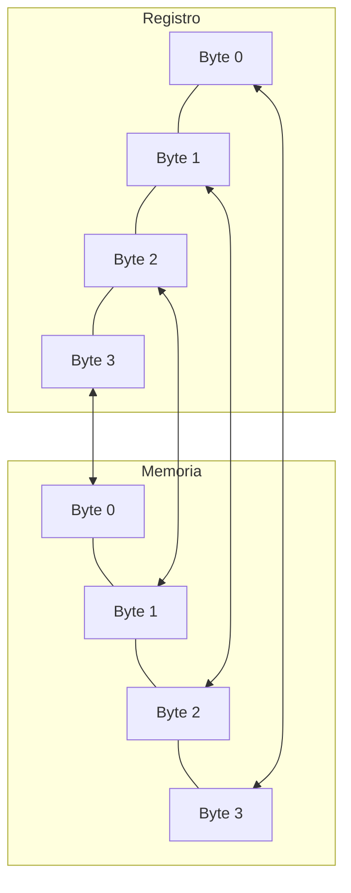
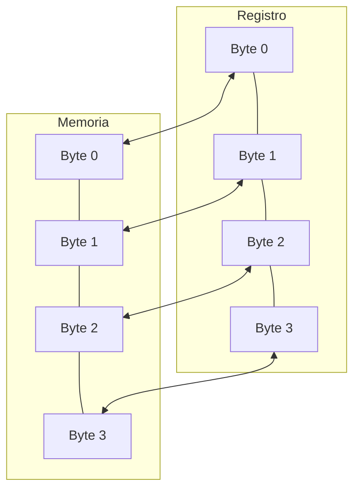

# Capítulo 10. Contando Como una Computadora

## Contando

### Contando Como un Humano

En muchos sentidos, las computadoras cuentan igual que los humanos. Por lo tanto, antes de comenzar a aprender cómo cuentan las computadoras, echemos un vistazo más profundo a cómo contamos nosotros.

¿Cuántos dedos tienes? No, no es una pregunta engañosa. Los humanos (normalmente) tienen diez dedos. ¿Por qué es eso significativo? Mira nuestro sistema de numeración. ¿En qué punto un número de un dígito se convierte en un número de dos dígitos? Así es, en diez. Los humanos cuentan y hacen matemáticas usando un sistema de numeración en [[10-capitulo-10#counting-like-a-human|base diez]]. Base diez significa que agrupamos todo en decenas. Digamos que estamos contando ovejas. 1, 2, 3, 4, 5, 6, 7, 8, 9, 10. ¿Por qué de repente ahora tenemos dos dígitos, y reutilizamos el 1? Eso es porque estamos agrupando nuestros números de a diez, y tenemos 1 grupo de diez ovejas.

Bien, vamos al siguiente número 11. Eso significa que tenemos 1 grupo de diez ovejas, y 1 oveja sin agrupar. Así que continuamos - 12, 13, 14, 15, 16, 17, 18, 19, 20. Ahora tenemos 2 grupos de diez. 21 - 2 grupos de diez, y 1 oveja sin agrupar. 22 - 2 grupos de diez, y 2 ovejas sin agrupar. Entonces, digamos que seguimos contando, y llegamos a 97, 98, 99, y 100. ¡Mira, sucedió otra vez! ¿Qué sucede en 100? Ahora tenemos diez grupos de diez. En 101 tenemos diez grupos de diez, y 1 oveja sin agrupar. Así que podemos ver cualquier número de esta manera. Si contáramos 60879 ovejas, eso significaría que teníamos 6 grupos de diez grupos de diez grupos de diez grupos de diez, 0 grupos de diez grupos de diez grupos de diez, 8 grupos de diez grupos de diez, 7 grupos de diez, y 9 ovejas sin agrupar.

Entonces, ¿hay algo significativo en agrupar cosas de a diez? ¡No! Es solo que agrupar de a diez es cómo lo hemos hecho siempre, porque tenemos diez dedos. Podríamos haber agrupado de a nueve o de a once (en cuyo caso habríamos tenido que inventar un nuevo símbolo). La única diferencia entre las diferentes agrupaciones de números es que tenemos que reaprender nuestras tablas de multiplicación, suma, resta y división para cada agrupación. Las reglas no han cambiado, solo la forma en que las representamos. Además, algunos de nuestros trucos que aprendimos no siempre aplican tampoco. Por ejemplo, digamos que agrupamos de a nueve en lugar de diez. Mover el punto decimal un dígito a la derecha ya no multiplica por diez, ahora multiplica por nueve. En base nueve, 500 es solo nueve veces más grande que 50.

### Contando Como una Computadora

La pregunta es, ¿cuántos dedos tiene la computadora para contar? La computadora solo tiene dos dedos. Eso significa que todos los grupos son grupos de dos. Entonces, contemos en [[10-capitulo-10#counting-like-a-computer|binario]] - 0 (cero), 1 (uno), 10 (dos - un grupo de dos), 11 (tres - un grupo de dos y uno sobrante), 100 (cuatro - dos grupos de dos), 101 (cinco - dos grupos de dos y uno sobrante), 110 (seis - dos grupos de dos y un grupo de dos), y así sucesivamente. En base dos, mover el decimal un dígito a la derecha multiplica por dos, y moverlo a la izquierda divide por dos. La base dos también se conoce como **binario**.

Lo bueno de la base dos es que las tablas matemáticas básicas son muy cortas. En base diez, las tablas de multiplicar tienen diez columnas de ancho y diez columnas de alto. En base dos, es muy simple:

**Tabla de suma binaria**

| + | 0 | 1 |
|---|---|---|
| **0** | 0 | 1 |
| **1** | 1 | 10 |

**Tabla de multiplicación binaria**

| * | 0 | 1 |
|---|---|---|
| **0** | 0 | 0 |
| **1** | 0 | 1 |

Entonces, sumemos los números `10010101` con `1100101`:

```text
  10010101
+  1100101
----------
  11111010
```

Ahora, multipliquémoslos:

```text
      10010101
    *  1100101
    ---------
      10010101
     00000000
    10010101
   00000000
  00000000
 10010101
10010101
--------------
11101011001001
```

## Conversiones Entre Binario y Decimal

Aprendamos cómo convertir números de [[10-capitulo-10#conversions-between-binary-and-decimal|binario (base dos) a decimal (base diez)]]. Este es en realidad un proceso bastante simple. Si recuerdas, cada dígito representa alguna agrupación de dos. Por lo tanto, solo necesitamos sumar lo que representa cada dígito, y tendremos un número decimal. Tomemos el número binario `10010101`. Para averiguar qué es en decimal, lo descomponemos así:

| Dígito Binario | Valor |
| :---: | :--- |
| 1 | 1 grupo de 128 (2^7) |
| 0 | 0 grupos de 64 (2^6) |
| 0 | 0 grupos de 32 (2^5) |
| 1 | 1 grupo de 16 (2^4) |
| 0 | 0 grupos de 8 (2^3) |
| 1 | 1 grupo de 4 (2^2) |
| 0 | 0 grupos de 2 (2^1) |
| 1 | Unidades individuales (2^0) |

Y luego sumamos todas las partes:
1*128 + 0*64 + 0*32 + 1*16 + 0*8 + 1*4 + 0*2 + 1*1 =
128 + 16 + 4 + 1 =
**149**

Así que `10010101` en binario es `149` en decimal. Veamos `1100101`:
1*64 + 1*32 + 0*16 + 0*8 + 1*4 + 0*2 + 1*1 =
64 + 32 + 4 + 1 =
**101**

Así que vemos que `1100101` en binario es `101` en decimal. Veamos un número más, `11101011001001`. Puedes convertirlo a decimal haciendo:
1*8192 + 1*4096 + 1*2048 + 0*1024 + 1*512 + 0*256 + 1*128 + 1*64 + 0*32 + 0*16 + 1*8 + 0*4 + 0*2 + 1*1 =
8192 + 4096 + 2048 + 512 + 128 + 64 + 8 + 1 =
**15049**

Ahora, si has estado prestando atención, habrás notado que los números que acabamos de convertir son los mismos que usamos para multiplicar anteriormente. Entonces, verifiquemos nuestros resultados: 101 * 149 = 15049. ¡Funcionó!

Ahora veamos cómo pasar de decimal a binario. Para hacer la conversión, tienes que dividir el número en grupos de dos. Entonces, digamos que tenías el número 17. Si lo divides por dos, obtienes 8 con 1 de resto. Eso significa que hay 8 grupos de dos, y 1 sin agrupar. Eso significa que el dígito más a la derecha será 1. Ahora, tenemos el dígito más a la derecha resuelto, y 8 grupos de dos restantes. Ahora, veamos cuántos grupos de dos grupos de dos tenemos, dividiendo 8 por 2. Obtenemos 4, sin nada sobrante. Eso significa que todos los grupos de dos pueden dividirse aún más en más grupos de dos. Entonces, tenemos 0 grupos de solo dos. Así que el siguiente dígito a la izquierda es 0. Entonces, dividimos 4 por 2 y obtenemos dos, con 0 sobrante, así que el siguiente dígito es 0. Luego, dividimos 2 por 2 y obtenemos 1, con 0 sobrante. Así que el siguiente dígito es 0. Finalmente, dividimos 1 por 2 y obtenemos 0 con 1 sobrante, así que el siguiente dígito a la izquierda es 1. Ahora, no queda nada, así que hemos terminado. Entonces, el número que obtuvimos es `10001`.

Anteriormente, convertimos el binario `11101011001001` a decimal `15049`. Hagamos el inverso para asegurarnos de que lo hicimos bien:

15049 / 2 = 7524, Resto 1
7524 / 2 = 3762, Resto 0
3762 / 2 = 1881, Resto 0
1881 / 2 = 940, Resto 1
940 / 2 = 470, Resto 0
470 / 2 = 235, Resto 0
235 / 2 = 117, Resto 1
117 / 2 = 58, Resto 1
58 / 2 = 29, Resto 0
29 / 2 = 14, Resto 1
14 / 2 = 7, Resto 0
7 / 2 = 3, Resto 1
3 / 2 = 1, Resto 1
1 / 2 = 0, Resto 1

Luego, juntamos los números restantes, ¡y tenemos el número original! Recuerda que el primer resto de la división va a la extrema derecha, así que de abajo hacia arriba tienes `11101011001001`.

Cada dígito en un número binario se llama un **[[10-capitulo-10#bit|bit]]**, que es una abreviatura de *binary digit* (dígito binario). Recuerda, las computadoras dividen su memoria en ubicaciones de almacenamiento llamadas bytes. Cada ubicación de almacenamiento en un procesador x86 (y en la mayoría de los otros) tiene 8 bits de largo. Anteriormente dijimos que un byte puede contener cualquier número entre 0 y 255. La razón de esto es que el número más grande que puedes caber en 8 bits es 255. Puedes ver esto por ti mismo si conviertes el binario `11111111` a decimal:

`11111111` =
(1 * 2^7) + (1 * 2^6) + (1 * 2^5) + (1 * 2^4) + (1 * 2^3) + (1 * 2^2) + (1 * 2^1) + (1 * 2^0) =
128 + 64 + 32 + 16 + 8 + 4 + 2 + 1 =
**255**

El número más grande que puedes tener en 16 bits es 65535. El número más grande que puedes tener en 32 bits es 4294967295 (4 mil millones). El número más grande que puedes tener en 64 bits es 18,446,744,073,709,551,615. El número más grande que puedes tener en 128 bits es 340,282,366,920,938,463,463,374,607,431,768,211,456. De todos modos, ya ves el panorama. Para procesadores x86, la mayor parte del tiempo tratarás con números de 4 bytes (32 bits), porque ese es el tamaño de los [[15-apendice-B#data-transfer-instructions|registros]].

## Verdad, Falsedad y Números Binarios

Ahora hemos visto que la computadora almacena todo como secuencias de 1's y 0's. Veamos algunos otros usos de esto. ¿Qué pasaría si, en lugar de ver una secuencia de bits como un número, la viéramos como un conjunto de interruptores? Por ejemplo, digamos que hay cuatro interruptores que controlan la iluminación en una casa. Tenemos un interruptor para las luces exteriores, un interruptor para las luces del pasillo, un interruptor para las luces de la sala de estar y un interruptor para las luces del dormitorio. Podríamos hacer una pequeña tabla mostrando cuáles de estos estaban encendidos y apagados, así:

| Exterior | Pasillo | Sala de Estar | Dormitorio |
| :--- | :--- | :--- | :--- |
| Encendido | Apagado | Encendido | Encendido |

Es obvio al mirar esto que todas las luces están encendidas excepto las del pasillo. Ahora, en lugar de usar las palabras "Encendido" y "Apagado", usemos los números 1 y 0. 1 representará encendido, y 0 representará apagado. Entonces, podríamos representar la misma información como:

| Exterior | Pasillo | Sala de Estar | Dormitorio |
| :---: | :---: | :---: | :---: |
| 1 | 0 | 1 | 1 |

Ahora, en lugar de tener etiquetas en los interruptores de luz, digamos que simplemente memorizamos qué posición correspondía a qué interruptor. Entonces, la misma información podría representarse como `1 0 1 1` o como `1011`.

Esta es solo una de las muchas maneras en que puedes usar las ubicaciones de almacenamiento de la computadora para representar más que solo números. La memoria de la computadora solo ve números, pero los programadores pueden usar estos números para representar cualquier cosa que sus imaginaciones puedan crear. Solo a veces tienen que ser creativos al descubrir la mejor representación.

No solo puedes hacer aritmética regular con números binarios, también tienen algunas operaciones propias, llamadas **[[10-capitulo-10#truth-falsehood-and-binary-numbers|operaciones binarias o lógicas]]**. Las operaciones binarias estándar son:

*   AND
*   OR
*   NOT
*   XOR

Antes de ver ejemplos, las describiré para ti. **AND** toma dos bits y devuelve un bit. AND devolverá 1 solo si ambos bits son 1, y 0 en caso contrario. Por ejemplo, 1 AND 1 es 1, pero 1 AND 0 es 0, 0 AND 1 es 0, y 0 AND 0 es 0.

**OR** toma dos bits y devuelve un bit. Devolverá 1 si alguno de los bits originales es 1. Por ejemplo, 1 OR 1 es 1, 1 OR 0 es 1, 0 OR 1 es 1, pero 0 OR 0 es 0.

**NOT** solo toma un bit, y devuelve su opuesto: NOT 1 es 0 y NOT 0 es 1.

Finalmente, **XOR** es como OR, excepto que devuelve 0 si ambos bits son 1.

Las computadoras pueden hacer estas operaciones en registros completos a la vez. Por ejemplo, si un registro tiene `10100010101010010101101100101010` y otro tiene `10001000010101010101010101111010`, puedes ejecutar cualquiera de estas operaciones en los registros completos. Por ejemplo, si hiciéramos AND con ellos, la computadora ejecutará desde el primer bit hasta el 32º y ejecutará la operación AND en ese bit en ambos registros. En este caso:

```text
  10100010101010010101101100101010 AND
  10001000010101010101010101111010
  --------------------------------
  10000000000000010101000100101010
```

Verás que el conjunto de bits resultante solo tiene un uno donde *ambos* números tenían un uno, y en cualquier otra posición tiene un cero. Veamos cómo se ve un OR:

```text
  10100010101010010101101100101010 OR
  10001000010101010101010101111010
  --------------------------------
  10101010111111010101111101111010
```

En este caso, el número resultante tiene un 1 donde cualquier número tiene un 1 en la posición dada. Veamos la operación NOT:

```text
  NOT 10100010101010010101101100101010
  ------------------------------------
      01011101010101101010010011010101
```

Esto simplemente invierte cada dígito. Finalmente, tenemos XOR, que es como un OR, excepto que si ambos dígitos son 1, devuelve 0.

```text
  10100010101010010101101100101010 XOR
  10001000010101010101010101111010
  --------------------------------
  00101010111111000000111001010000
```

Estos son los mismos dos números usados en la operación OR, para que puedas comparar cómo funcionan. Además, si haces XOR de un número consigo mismo, siempre obtendrás 0, así:

```text
  10100010101010010101101100101010 XOR
  10100010101010010101101100101010
  --------------------------------
  00000000000000000000000000000000
```

Estas operaciones son útiles por dos razones:

*   La computadora puede hacerlas extremadamente rápido
*   Puedes usarlas para comparar muchos valores de verdad al mismo tiempo

Puede que no supieras que diferentes instrucciones se ejecutan a diferentes velocidades. Es cierto, lo hacen. Y estas operaciones son las más rápidas en la mayoría de los procesadores. Por ejemplo, viste que hacer XOR de un número consigo mismo produce 0. Bueno, la operación XOR es más rápida que la operación de carga, por lo que muchos programadores la usan para cargar un registro con cero. Por ejemplo, el código

```assembly
movl $0, %eax
```

a menudo se reemplaza por

```assembly
xorl %eax, %eax
```

Discutiremos la velocidad más en el [[12-capitulo-12|Capítulo 12]], pero quiero que veas cómo los programadores a menudo hacen cosas ingeniosas, especialmente con estos operadores binarios, para hacer las cosas rápidas.

Ahora veamos cómo podemos usar estos operadores para manipular valores verdadero/falso. Anteriormente discutimos cómo los números binarios pueden usarse para representar cualquier cantidad de cosas. Usemos números binarios para representar qué cosas le gustan a mi papá y a mí. Primero, veamos las cosas que me gustan a mí:

Comida: sí
Música Heavy Metal: sí
Usar Ropa Elegante: no
Fútbol Americano: sí

Ahora, veamos lo que le gusta a mi papá:

Comida: sí
Música Heavy Metal: no
Usar Ropa Elegante: sí
Fútbol Americano: sí

Ahora, usemos un 1 para decir sí nos gusta algo, y un 0 para decir no nos gusta. Ahora tenemos:

**Yo**
Comida: 1
Música Heavy Metal: 1
Usar Ropa Elegante: 0
Fútbol Americano: 1

**Papá**
Comida: 1
Música Heavy Metal: 0
Usar Ropa Elegante: 1
Fútbol Americano: 1

Ahora, si simplemente memorizamos en qué posición está cada uno, tenemos:
Yo: `1101`
Papá: `1011`

Ahora, digamos que queremos obtener una lista de cosas que a mi papá y a mí nos gustan a ambos. Usarías la operación AND. Entonces:

```text
  1101 AND
  1011
  ----
  1001
```

Que se traduce a:
**Cosas que nos gustan a ambos**
Comida: sí
Música Heavy Metal: no
Usar Ropa Elegante: no
Fútbol Americano: sí

Recuerda, la computadora no tiene idea de qué representan los unos y ceros. Ese es tu trabajo y el trabajo de tu programa. Si escribieras un programa en torno a esta representación, tu programa en algún momento examinaría cada bit y tendría código para decirle al usuario para qué sirve (si le preguntaras a una computadora en qué están de acuerdo dos personas y respondiera 1001, no sería muy útil). De todos modos, digamos que queremos saber las cosas en las que discrepanos. Para eso usaríamos XOR, porque devolverá 1 solo si uno u otro es 1, pero no ambos. Entonces:

```text
  1101 XOR
  1011
  ----
  0110
```

Y te dejaré traducir eso de vuelta.

Las operaciones anteriores: AND, OR, NOT y XOR se llaman **operadores booleanos** porque fueron estudiados por primera vez por George Boole. Por lo tanto, si alguien menciona operadores booleanos o álgebra booleana, ahora sabes de qué están hablando.

Además de las operaciones booleanas, también hay dos operadores binarios que no son booleanos, **desplazamiento (shift)** y **rotación (rotate)**. Los desplazamientos y rotaciones hacen lo que su nombre implica, y pueden hacerlo hacia la derecha o hacia la izquierda. Un desplazamiento a la izquierda mueve cada dígito de un número binario un espacio a la izquierda, pone un cero en la posición de las unidades, y corta el dígito más a la izquierda. Una rotación a la izquierda hace lo mismo, pero toma el dígito más a la izquierda y lo pone en la posición de las unidades. Por ejemplo:

Desplazamiento izquierda `10010111` = `00101110`
Rotación izquierda `10010111` = `00101111`

Observa que si rotas un número por cada dígito que tiene (es decir, rotando un número de 32 bits 32 veces), terminas con el mismo número con el que empezaste. Sin embargo, si *desplazas* un número por cada dígito que tienes, terminas con 0. Entonces, ¿para qué son útiles estos desplazamientos? Bueno, si tienes números binarios representando cosas, usas desplazamientos para examinar cada valor individual. Digamos, por ejemplo, que tuviéramos los gustos de mi papá almacenados en un registro (32 bits). Se vería así:

`00000000000000000000000000001011`

Ahora, como dijimos anteriormente, esto no funciona como salida del programa. Entonces, para poder generar la salida, necesitaríamos hacer **desplazamiento** y **enmascaramiento (masking)**. El enmascaramiento es el proceso de eliminar todo lo que no quieres. En este caso, para cada valor que estamos buscando, desplazaremos el número para que ese valor esté en la posición de las unidades, y luego enmascararemos ese dígito para que sea todo lo que vemos. El enmascaramiento se logra haciendo un AND con un número que tiene los bits que nos interesan establecidos en 1. Por ejemplo, digamos que queríamos imprimir si a mi papá le gusta la ropa elegante o no. Ese dato es el segundo valor desde la derecha. Por lo tanto, tenemos que desplazar el número a la derecha 1 dígito para que se vea así:

`00000000000000000000000000000101`

y luego, solo queremos mirar ese dígito, así que lo enmascaramos haciendo AND con `00000000000000000000000000000001`.

```text
  00000000000000000000000000000101 AND
  00000000000000000000000000000001
  -----------------------------------
  00000000000000000000000000000001
```

Esto hará que el valor del registro sea 1 si a mi papá le gusta la ropa elegante, y 0 si no le gusta. Luego podemos hacer una comparación con 1 e imprimir los resultados. El código se vería así:

```assembly
#NOTA - asume que el registro %ebx contiene
#       las preferencias de mi papá
movl %ebx, %eax #Esto copia la información a %eax para
                #no perder los datos originales
shrl $1, %eax   #Este es el operador de desplazamiento. Significa
                #Shift Right Long (desplazar a la derecha largo).
                #Este primer número es la cantidad de posiciones
                #a desplazar, y el segundo es el registro a desplazar

#Esto hace el enmascaramiento
andl $0b00000000000000000000000000000001, %eax

#Verificar si el resultado es 1 o 0
cmpl $0b00000000000000000000000000000001, %eax

je le_gusta_ropa_elegante
jmp no_le_gusta_ropa_elegante
```

Y luego tendríamos dos etiquetas que imprimirían algo sobre si le gusta o no la ropa elegante y luego saldrían. La notación `0b` significa que lo que sigue es un número binario. En este caso no era necesario, porque 1 es lo mismo en cualquier sistema de numeración, pero lo puse para mayor claridad. Tampoco necesitábamos los 31 ceros, pero los puse para enfatizar que el número que estás usando es de 32 bits.

Cuando un número representa un conjunto de opciones para una función o llamada al sistema, los elementos individuales de verdadero/falso se llaman **[[10-capitulo-10#flags|banderas (flags)]]**. Muchas llamadas al sistema tienen numerosas opciones que se establecen todas en el mismo registro usando un mecanismo como el que hemos descrito. La llamada al sistema `open`, por ejemplo, tiene como segundo parámetro una lista de banderas para decirle al sistema operativo cómo abrir el archivo. Algunas de las banderas incluyen:

**O_WRONLY**
Esta bandera es `0b00000000000000000000000000000001` en binario, o 01 en octal (o cualquier sistema numérico). Esto indica abrir el archivo en modo solo escritura.

**O_RDWR**
Esta bandera es `0b00000000000000000000000000000010` en binario, o 02 en octal. Esto indica abrir el archivo tanto para lectura como para escritura.

**O_CREAT**
Esta bandera es `0b00000000000000000000000001000000` en binario, o 0100 en octal. Significa crear el archivo si no existe.

**O_TRUNC**
Esta bandera es `0b00000000000000000000001000000000` en binario, o 01000 en octal. Significa borrar el contenido del archivo si el archivo ya existe.

**O_APPEND**
Esta bandera es `0b00000000000000000000010000000000` en binario, o 02000 en octal. Significa comenzar a escribir al final del archivo en lugar de al principio.

Para usar estas banderas, simplemente las combinas con OR en la combinación que desees. Por ejemplo, para abrir un archivo en modo solo escritura, y hacer que cree el archivo si no existe, usaría `O_WRONLY` (01) y `O_CREAT` (0100). Combinados con OR, tendría `0101`.

Ten en cuenta que si no estableces ni `O_WRONLY` ni `O_RDWR`, entonces el archivo se abre automáticamente en modo solo lectura (`O_RDONLY`, excepto que realmente no es una bandera ya que es cero).

Muchas funciones y llamadas al sistema usan banderas para opciones, ya que permite que una sola palabra contenga hasta 32 opciones posibles si cada opción está representada por un solo bit.

## El Registro de Estado del Programa

Hemos visto cómo los bits en un registro pueden usarse para dar respuestas de sí/no y declaraciones de verdadero/falso. En tu computadora, hay un registro llamado el **[[15-apendice-B|registro de estado del programa]]**. Este registro contiene mucha información sobre lo que sucede en un cálculo. Por ejemplo, ¿alguna vez te has preguntado qué pasaría si sumaras dos números y el resultado fuera más grande de lo que cabría en un registro? El registro de estado del programa tiene una bandera llamada la **bandera de acarreo (carry flag)**. Puedes probarla para ver si el último cálculo desbordó el registro. Hay banderas para varios estados diferentes. De hecho, cuando haces una instrucción de comparación (`cmpl`), el resultado se almacena en este registro. Las instrucciones de salto condicional (`jge`, `jne`, etc.) usan estos resultados para saber si deben saltar o no. `jmp`, el salto incondicional, no le importa lo que haya en el registro de estado, ya que es incondicional.

Digamos que necesitaras almacenar un número más grande de 32 bits. Entonces, digamos que el número tiene 2 registros de ancho, o 64 bits. ¿Cómo podrías manejar esto? Si quisieras sumar dos números de 64 bits, sumarías los registros menos significativos primero. Luego, si detectabas un acarreo, podrías sumar 1 al registro más significativo. De hecho, esta es probablemente la forma en que aprendiste a hacer sumas decimales. Si el resultado en una columna es más de 9, simplemente llevabas el número a la columna siguiente más significativa. Si sumabas 65 y 37, primero sumabas 7 y 4 para obtener 12. Mantenías el 2 en la columna derecha, y llevabas el uno a la siguiente columna. Allí sumabas 6, 3, y el 1 que llevaste. Esto resulta en 10. Por lo tanto, mantienes el cero en esa columna y llevas el uno a la siguiente columna más significativa, que está vacía, así que simplemente pones el uno allí. Afortunadamente, 32 bits suele ser suficientemente grande para contener los números que usamos regularmente.

Las banderas adicionales del registro de estado del programa se examinan en el [[15-apendice-B|Apéndice B]].

## Otros Sistemas de Numeración

Lo que hemos estudiado hasta ahora solo aplica a enteros positivos. Sin embargo, los números del mundo real no siempre son enteros positivos. También se usan números negativos y números con decimales.

### Números de Punto Flotante

Hasta ahora, los únicos números con los que hemos tratado son enteros - números sin punto decimal. Las computadoras tienen un problema general con números con punto decimal, porque las computadoras solo pueden almacenar valores de tamaño fijo y finito. Los números decimales pueden tener cualquier longitud, incluyendo longitud infinita (piensa en un decimal repetitivo, como el resultado de 1 / 3).

La forma en que una computadora maneja los decimales es almacenándolos con una precisión fija (número de bits significativos). Una computadora almacena números decimales en dos partes - el **exponente** y la **mantisa**. La mantisa contiene los dígitos reales que se usarán, y el exponente es la magnitud del número. Por ejemplo, `12345.2` se almacena como 1.23452 * 10^4. La mantisa es `1.23452` y el exponente es `4`. Todos los números se almacenan como `X.XXXXX * 10^XXXX`. El número 1 se almacena como `1.00000 * 10^0`.

Ahora, la mantisa y el exponente tienen una longitud limitada, lo que lleva a algunos problemas interesantes. Por ejemplo, cuando una computadora almacena un entero, si le sumas 1, el número resultante es uno más grande. Esto no sucede necesariamente con números de punto flotante. Si el número es suficientemente grande, como 5.234 * 10^5000, sumarle 1 podría ni siquiera registrarse en la mantisa (recuerda, ambas partes tienen longitud limitada). Esto afecta varias cosas, especialmente el orden de las operaciones. Digamos que sumo 1 a 5.234 * 10^5000 unos pocos miles de millones o billones de veces. Adivina qué - el número no cambiará en absoluto. Sin embargo, si sumo 1 a sí mismo suficientes veces, y luego lo sumo al número original, podría hacer una mella.

Debes notar que a la mayoría de las computadoras les toma mucho más tiempo hacer aritmética de punto flotante que aritmética de enteros. Por lo tanto, para programas que realmente necesitan velocidad, se usan principalmente enteros.

### Números Negativos

¿Cómo crees que podrían representarse los números negativos en una computadora? Una idea podría ser usar el primer dígito de un número como el signo, así que `00000000000000000000000000000001` representaría el número 1, y `10000000000000000000000000000001` representaría -1. Esto tiene mucho sentido, y de hecho algunos procesadores antiguos funcionan de esta manera. Sin embargo, tiene algunos problemas. En primer lugar, se necesita mucha más circuitería para sumar y restar números con signo representados de esta manera. Aún más problemático, esta representación tiene un problema con el número 0. En este sistema, podrías tener tanto un 0 negativo como uno positivo. Esto lleva a muchas preguntas, como "¿debería el cero negativo ser igual al cero positivo?", y "¿Cuál debería ser el signo de cero en varias circunstancias?".

Estos problemas se superaron usando una representación de números negativos llamada **representación en complemento a dos (two's complement)**. Para obtener la representación negativa de un número en forma de complemento a dos, debes realizar los siguientes pasos:

1. Realizar una operación NOT en el número
2. Sumar uno al número resultante

Entonces, para obtener el negativo de `00000000000000000000000000000001`, primero harías una operación NOT, que da `11111111111111111111111111111110`, y luego sumar uno, dando `11111111111111111111111111111111`. Para obtener el negativo de dos, primero toma `00000000000000000000000000000010`. El NOT de ese número es `11111111111111111111111111111101`. Sumar uno da `11111111111111111111111111111110`. Con esta representación, puedes sumar números como si fueran positivos, y obtener las respuestas correctas. Por ejemplo, si sumas uno más uno negativo en binario, notarás que todos los números se vuelven cero. Además, el primer dígito sigue siendo el bit de signo, lo que hace simple determinar si el número es positivo o negativo. Los números negativos siempre tendrán un 1 en el bit más a la izquierda. Esto también cambia qué números son válidos para un número dado de bits. Con números con signo, la magnitud posible de los valores se divide para permitir tanto números positivos como negativos. Por ejemplo, un byte normalmente puede tener valores hasta 255. Un byte con signo, sin embargo, puede almacenar valores de -128 a 127.

Una cosa a tener en cuenta sobre la representación en complemento a dos de números con signo es que, a diferencia de las cantidades sin signo, si aumentas el número de bits, no puedes simplemente añadir ceros a la izquierda del número. Por ejemplo, digamos que estamos tratando con cantidades de cuatro bits y tuviéramos el número -3, `1101`. Si extendiéramos esto a un registro de ocho bits, no podríamos representarlo como `00001101` ya que esto representaría 13, no -3. Cuando aumentas el tamaño de una cantidad con signo en representación de complemento a dos, tienes que realizar una **extensión de signo (sign extension)**. La extensión de signo significa que tienes que rellenar el lado izquierdo de la cantidad con el dígito que está en el dígito de signo cuando añades bits. Por lo tanto, si extendemos un número negativo en 4 dígitos, deberíamos llenar los nuevos dígitos con un 1. Si extendemos un número positivo en 4 dígitos, deberíamos llenar los nuevos dígitos con un 0. Por lo tanto, la extensión de -3 de cuatro a ocho bits producirá `11111101`.

El procesador x86 tiene diferentes formas de varias instrucciones dependiendo de si esperan que las cantidades sobre las que operan tengan signo o no. Estas se listan en el [[15-apendice-B|Apéndice B]]. Por ejemplo, el procesador x86 tiene tanto un desplazamiento a la derecha que preserva el signo, `sarl`, como un desplazamiento a la derecha que no preserva el bit de signo, `shrl`.

## Números Octales y Hexadecimales

Los sistemas de numeración discutidos hasta ahora han sido decimal y binario. Sin embargo, otros dos se usan comúnmente en informática: octal y hexadecimal. De hecho, probablemente se escriben más a menudo que el binario. **[[10-capitulo-10#octal-and-hexadecimal-numbers|Octal]]** es una representación que solo usa los números del 0 al 7. Por lo tanto, el número octal 10 es en realidad 8 en decimal porque es un grupo de ocho. El octal 121 es el decimal 81 (un grupo de 64 (8^2), dos grupos de 8, y uno sobrante). Lo que hace bueno al octal es que cada 3 dígitos binarios forman un dígito octal (no existe tal agrupación de dígitos binarios en decimal). Por lo tanto, 0 es 000, 1 es 001, 2 es 010, 3 es 011, 4 es 100, 5 es 101, 6 es 110, y 7 es 111.

Los permisos en Linux se hacen usando octal. Esto se debe a que los permisos de Linux se basan en la capacidad de leer, escribir y ejecutar. El primer bit es el permiso de lectura, el segundo bit es el permiso de escritura, y el tercer bit es el permiso de ejecución. Por lo tanto, 0 (000) no da permisos, 6 (110) da permiso de lectura y escritura, y 5 (101) da permiso de lectura y ejecución. Estos números se usan luego para los tres conjuntos diferentes de permisos - el propietario, el grupo, y todos los demás. El número `0644` significa lectura y escritura para el primer conjunto de permisos, y solo lectura para el segundo y tercer conjunto. El primer conjunto de permisos es para el propietario del archivo. El tercer conjunto de permisos es para el grupo propietario del archivo. El último conjunto de permisos es para todos los demás. Por lo tanto, `0751` significa que el propietario del archivo puede leer, escribir y ejecutar el archivo, los miembros del grupo pueden leer y ejecutar el archivo, y todos los demás solo pueden ejecutar el archivo.

De todos modos, como puedes ver, el octal se usa para agrupar bits (dígitos binarios) de a tres. La forma en que el ensamblador sabe que un número es octal es porque los números octales se prefijan con un cero. Por ejemplo, `010` significa 10 en octal, que es 8 en decimal. Si escribes `10` eso significa 10 en decimal. El cero al principio es lo que diferencia a los dos. Por lo tanto, ten cuidado de no poner ceros a la izquierda en números decimales, ¡o serán interpretados como números octales!

Los números **hexadecimales** (también llamados simplemente "hex") usan los números 1-15 para cada dígito. Sin embargo, como 10-15 no tienen sus propios números, el hexadecimal usa las letras `a` a `f` para representarlos. Por ejemplo, la letra `a` representa 10, la letra `b` representa 11, y así sucesivamente. 10 en hexadecimal es 16 en decimal. En octal, cada dígito representaba tres bits. En hexadecimal, cada dígito representa cuatro bits. Cada dos dígitos es un byte completo, y ocho dígitos es una palabra de 32 bits. Por lo tanto, ves que es considerablemente más fácil escribir un número hexadecimal que escribir un número binario, porque tiene solo una cuarta parte de los dígitos. El número más importante para recordar en hexadecimal es `f`, que significa que todos los bits están establecidos. Por lo tanto, si quiero establecer todos los bits de un registro a 1, puedo simplemente hacer:

```assembly
movl $0xFFFFFFFF, %eax
```

Lo cual es considerablemente más fácil y menos propenso a errores que escribir:

```assembly
movl $0b11111111111111111111111111111111, %eax
```

Observa también que los números hexadecimales se prefijan con `0x`. Por lo tanto, cuando hacemos `int $0x80`, estamos llamando a la interrupción número 128 (8 grupos de 16), o interrupción `0b00000000000000000000000010000000`.

Los números hexadecimales y octales requieren un tiempo para acostumbrarse, pero se usan mucho en programación de computadoras. Podría valer la pena inventar algunos números en hex e intentar convertirlos de ida y vuelta a binario, decimal y octal.

## Orden de los Bytes en una Palabra

Una cosa que confunde a muchas personas cuando trabajan con bits y bytes a bajo nivel es que, cuando los bytes se escriben desde los registros a la memoria, sus bytes se escriben primero con la parte menos significativa.<sup>1</sup> Lo que la mayoría de la gente espera es que si tienen una palabra en un registro, digamos `0x5d 23 ef ee` (el espaciado es para que puedas ver dónde están los bytes), los bytes se escribirán en la memoria en ese orden. Sin embargo, en procesadores x86, los bytes se escriben en realidad en orden inverso. En la memoria, los bytes serían `0xee ef 23 5d` en procesadores x86. Los bytes se escriben en orden inverso de lo que aparecerían conceptualmente, pero los bits dentro de los bytes están ordenados normalmente.

No todos los procesadores se comportan de esta manera. El procesador x86 es un procesador **[[10-capitulo-10#order-of-bytes-in-a-word|little-endian]]**, lo que significa que almacena el "extremo pequeño", o el byte menos significativo de sus palabras primero.

---
<sup>1</sup> La significancia en este contexto se refiere a qué dígito representan. Por ejemplo, en el número 294, el dígito 2 es el más significativo porque representa las centenas, 9 es el siguiente más significativo, y 4 es el menos significativo.

### Transferencias de registro a memoria en sistemas little-endian



Otros procesadores son procesadores **big-endian**, lo que significa que almacenan el "extremo grande", o el byte más significativo, de sus palabras primero, de la manera en que naturalmente leeríamos un número.

### Transferencias de registro a memoria en sistemas big-endian



Esta diferencia no es normalmente un problema (aunque ha provocado muchas controversias técnicas a lo largo de los años). Debido a que los bytes se invierten nuevamente (o no, si es un procesador big-endian) al ser leídos de vuelta a un registro, el programador normalmente nunca nota en qué orden están los bytes. La magia de intercambio de bytes ocurre automáticamente detrás de escena durante las transferencias de registro a memoria. Sin embargo, el orden de los bytes puede causar problemas en varios casos:

*   Si intentas leer varios bytes a la vez usando `movl` pero los tratas byte por byte usando el byte menos significativo (es decir, usando `%al` y/o desplazamiento del registro), esto estará en un orden diferente al que aparecen en la memoria.
*   Si lees o escribes archivos escritos para diferentes arquitecturas, puede que tengas que tener en cuenta el orden en que escriben sus bytes.
*   Si lees o escribes en sockets de red, puede que tengas que tener en cuenta un orden de bytes diferente en el protocolo.

Mientras seas consciente del problema, generalmente no es un gran problema. Para una mirada más profunda a los problemas de orden de bytes, deberías leer el FAQ de DAV sobre Endian en http://www.rdrop.com/~cary/html/endian_faq.html, especialmente el artículo "On Holy Wars and a Plea for Peace" de Daniel Cohen.

## Convirtiendo Números para Mostrar

Hasta ahora, hemos sido incapaces de mostrar ningún número almacenado al usuario, excepto por los medios extremadamente limitados de pasarlo a través de códigos de salida. En esta sección, discutiremos la conversión de números positivos en cadenas para su visualización.

La función se llamará `integer2string`, y tomará dos parámetros - un entero para convertir y un búfer de cadena lleno de caracteres nulos (ceros). Se asumirá que el búfer es suficientemente grande para almacenar el número completo como una cadena (al menos 11 caracteres de largo, para incluir un carácter nulo final).

Recuerda que la forma en que vemos los números es en base 10. Por lo tanto, para acceder a los dígitos decimales individuales de un número, necesitamos dividir por 10 y mostrar el resto para cada dígito. Por lo tanto, el proceso se verá así:

*   Dividir el número por diez
*   El resto es el dígito actual. Convertirlo a un carácter y almacenarlo.
*   Terminamos si el cociente es cero.
*   De lo contrario, tomar el cociente y la siguiente ubicación en el búfer y repetir el proceso.

El único problema es que como este proceso trata con la posición de las unidades primero, dejará el número al revés. Por lo tanto, tendremos que terminar invirtiendo los caracteres. Haremos esto almacenando los caracteres en la pila a medida que los calculamos. De esta manera, a medida que los sacamos para llenar el búfer, estarán en el orden inverso al que los empujamos.

El código de la función debe colocarse en un archivo llamado `integer-to-string.s` y debe ingresarse de la siguiente manera:

```assembly
#PROPÓSITO: Convertir un número entero a una cadena decimal
#         para mostrarlo
#
#ENTRADA:  Un búfer suficientemente grande para contener el número
#         más grande posible
#         Un entero para convertir
#
#SALIDA:   El búfer será sobrescrito con la cadena decimal
#
#Variables:
#
# %ecx contendrá el conteo de caracteres procesados
# %eax contendrá el valor actual
# %edi contendrá la base (10)
#
.equ ST_VALUE, 8
.equ ST_BUFFER, 12

.globl integer2string
.type integer2string, @function
integer2string:
#Inicio normal de función
pushl %ebp
movl %esp, %ebp

#Conteo actual de caracteres
movl $0, %ecx

#Mover el valor a su posición
movl ST_VALUE(%ebp), %eax

#Cuando dividimos por 10, el 10
#debe estar en un registro o ubicación de memoria
movl $10, %edi

conversion_loop:
#La división se realiza realmente en el
#registro combinado %edx:%eax, así que primero
#limpiamos %edx
movl $0, %edx

#Dividir %edx:%eax (que están implícitos) por 10.
#Almacenar el cociente en %eax y el resto
#en %edx (ambos están implícitos).
divl %edi

#El cociente está en el lugar correcto. %edx tiene
#el resto, que ahora necesita ser convertido
#a un número. Por lo tanto, %edx tiene un número que es
#0 a 9. También podrías interpretar esto como
#un índice en la tabla ASCII comenzando desde el
#carácter '0'. El código ASCII de '0' más cero
#sigue siendo el código ASCII de '0'. El código ASCII
#de '0' más 1 es el código ASCII del
#carácter '1'. Por lo tanto, la siguiente
#instrucción nos dará el carácter para el
#número almacenado en %edx
addl $'0', %edx

#Ahora tomaremos este valor y lo empujaremos a la
#pila. De esta manera, cuando hayamos terminado, podemos simplemente
#sacar los caracteres uno por uno y estarán
#en el orden correcto. Observa que estamos empujando
#el registro completo, pero solo necesitamos el byte
#en %dl (el último byte del registro %edx) para
#el carácter.
pushl %edx

#Incrementar el conteo de dígitos
incl %ecx

#Verificar si %eax ya es cero, ir al siguiente
#paso si es así.
cmpl $0, %eax
je end_conversion_loop

#%eax ya tiene su nuevo valor.
jmp conversion_loop

end_conversion_loop:
#La cadena está ahora en la pila, si la sacamos
#un carácter a la vez podemos copiarla en
#el búfer y terminar.

#Obtener el puntero al búfer en %edx
movl ST_BUFFER(%ebp), %edx

copy_reversing_loop:
#Empujamos un registro completo, pero solo necesitamos
#el último byte. Así que vamos a sacar
#el registro %eax completo, pero luego solo mover
#la parte pequeña (%al) a la cadena de caracteres.
popl %eax
movb %al, (%edx)

#Decrementar %ecx para saber cuándo hemos terminado
decl %ecx

#Incrementar %edx para que apunte al siguiente byte
incl %edx

#Verificar si hemos terminado
cmpl $0, %ecx
#Si es así, saltar al final de la función
je end_copy_reversing_loop

#De lo contrario, repetir el bucle
jmp copy_reversing_loop

end_copy_reversing_loop:
#Terminado de copiar. Ahora escribir un byte nulo y regresar
movb $0, (%edx)

movl %ebp, %esp
popl %ebp
ret
```

Para mostrar esto usado en un programa completo, usa el siguiente código, junto con las funciones `count_chars` y `write_newline` escritas en capítulos anteriores. El código debe estar en un archivo llamado `conversion-program.s`.

```assembly
.include "linux.s"

.section .data
#Aquí es donde se almacenará
tmp_buffer:
.ascii "\0\0\0\0\0\0\0\0\0\0\0"

.section .text
.globl _start
_start:
movl %esp, %ebp

#Almacenamiento para el resultado
pushl $tmp_buffer
#Número a convertir
pushl $824
call integer2string
addl $8, %esp

#Obtener el conteo de caracteres para nuestra llamada al sistema
pushl $tmp_buffer
call count_chars
addl $4, %esp

#El conteo va en %edx para SYS_WRITE
movl %eax, %edx

#Hacer la llamada al sistema
movl $SYS_WRITE, %eax
movl $STDOUT, %ebx
movl $tmp_buffer, %ecx
int $LINUX_SYSCALL

#Escribir un retorno de carro
pushl $STDOUT
call write_newline

#Salir
movl $SYS_EXIT, %eax
movl $0, %ebx
int $LINUX_SYSCALL
```

Para construir el programa, emite los siguientes comandos:

```bash
as integer-to-string.s -o integer-to-number.o
as count-chars.s -o count-chars.o
as write-newline.s -o write-newline.o
as conversion-program.s -o conversion-program.o
ld integer-to-number.o count-chars.o write-newline.o conversion-program.o -o conversion-program
```

Para ejecutar, simplemente escribe `./conversion-program` y la salida debería decir `824`.

## Revisión

### Conoce los Conceptos

*   Convierte el número decimal 5,294 a binario.
*   ¿Qué número representa `0x0234aeff`? Especifica en binario, octal y decimal.
*   Suma los números binarios `10111001` y `101011`.
*   Multiplica los números binarios `1100` y `1010110`.
*   Convierte los resultados de los dos problemas anteriores a decimal.
*   Describe cómo funcionan AND, OR, NOT y XOR.
*   ¿Para qué sirve el enmascaramiento?
*   ¿Qué número usarías para las banderas de la llamada al sistema `open` si quisieras abrir el archivo para escritura, y crear el archivo si no existe?
*   ¿Cómo representarías -55 en un registro de treinta y dos bits?
*   Extiende con signo la cantidad anterior a un registro de 64 bits.
*   Describe la diferencia entre el almacenamiento little-endian y big-endian de palabras en memoria.

### Usa los Conceptos

*   Vuelve a programas anteriores que devolvían resultados numéricos a través del código de estado de salida, y reescríbelos para que impriman los resultados usando nuestra función de conversión de entero a cadena.
*   Modifica el código de `integer2string` para devolver resultados en octal en lugar de decimal.
*   Modifica el código de `integer2string` para que la base de conversión sea un parámetro en lugar de estar fija.
*   Escribe una función llamada `is_negative` que tome un solo entero como parámetro y devuelva 1 si el parámetro es negativo, y 0 si el parámetro es positivo.

### Yendo Más Allá

*   Modifica el código de `integer2string` para que la base de conversión pueda ser mayor que 10 (esto requiere que uses letras para números mayores de 9).
*   Crea una función que haga lo inverso de `integer2string` llamada `number2integer` que tome una cadena de caracteres y la convierta a un entero del tamaño de un registro. Pruébalo ejecutando ese entero de vuelta a través de la función `integer2string` y mostrando los resultados.
*   Escribe un programa que almacene gustos y disgustos en una sola palabra de máquina, y luego compare dos conjuntos de gustos y disgustos en busca de puntos en común.
*   Escribe un programa que lea una cadena de caracteres desde STDIN y la convierta a un número.
