# Los Gráficos de la NES — Parte 1: Tiles, Paletas, Sprites y Fondos

> Basado en la transcripción del video homónimo.  
> Cómo se construían los gráficos en la era de los 8 bits, cuando 8 KB eran la panacea.

---

## Índice

1. [Introducción](#1-introducción)
2. [El Píxel: el átomo gráfico](#2-el-píxel-el-átomo-gráfico)
3. [Tiles: los ladrillos del mundo 2D](#3-tiles-los-ladrillos-del-mundo-2d)
4. [Tile Set y Tile Map](#4-tile-set-y-tile-map)
5. [Ventajas del sistema de tiles](#5-ventajas-del-sistema-de-tiles)
6. [El Color en la NES](#6-el-color-en-la-nes)
   - [6.1 True Color vs. Paletas](#61-true-color-vs-paletas)
   - [6.2 Paletas indexadas en la NES](#62-paletas-indexadas-en-la-nes)
   - [6.3 La paleta universal de 64 colores](#63-la-paleta-universal-de-64-colores)
   - [6.4 Paletas activas: 4 + 4](#64-paletas-activas-4--4)
7. [El Fondo (Background)](#7-el-fondo-background)
   - [7.1 Tile map gigante](#71-tile-map-gigante)
   - [7.2 Scrolling](#72-scrolling)
8. [Los Sprites](#8-los-sprites)
   - [8.1 Características](#81-características)
   - [8.2 Límite de 8 por línea](#82-límite-de-8-por-línea)
   - [8.3 El parpadeo como solución](#83-el-parpadeo-como-solución)
9. [Conclusión](#9-conclusión)

---

## 1. Introducción

Los gráficos modernos se construyen con **motores 3D basados en polígonos**. En las generaciones de 8 y 16 bits el paradigma era completamente distinto: **tiles, sprites y fondos**.

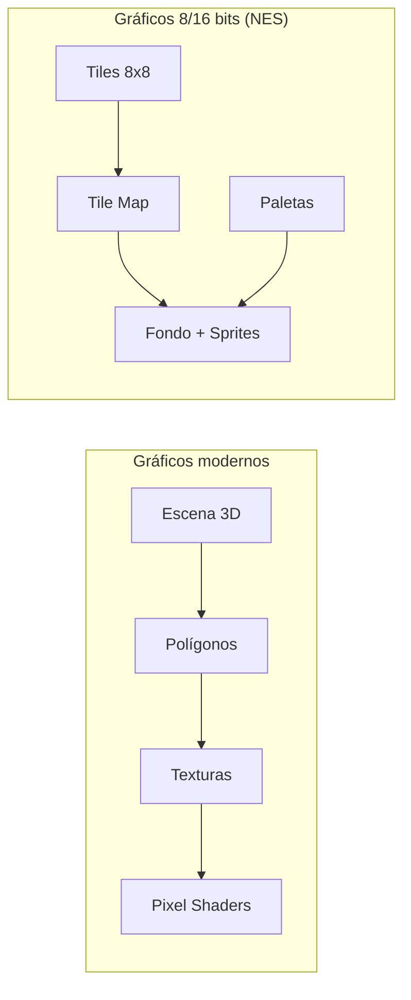

La NES (Nintendo Entertainment System), conocida como **Family Game** en Argentina y **Famicom** en Japón, corría a una resolución de **256 × 240 píxeles** (área visible típica: 256 × 224 por overscan de las teles de tubo).

---

## 2. El Píxel: el átomo gráfico

**Píxel** = abreviatura de *Picture Element*. Es el elemento mínimo para representar una imagen y tiene una sola cualidad: **un color**.

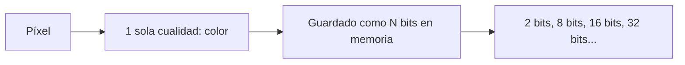

Juntando píxeles se construye todo lo demás.

---

## 3. Tiles: los ladrillos del mundo 2D

Un **tile** es una imagen pequeña de **tamaño fijo**. En la NES: **8 × 8 píxeles**.

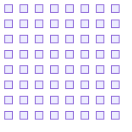

> Tile de 8×8 = 64 píxeles.  
> Cada pixel ocupa 2 bits → 64 × 2 = 128 bits = **16 bytes por tile**.

Los tiles son la base con la que se construyen todos los gráficos. Por ejemplo, Mario se forma juntando **4 tiles** (2×2).

---

## 4. Tile Set y Tile Map

### Tile Set

Conjunto de tiles **únicos** con un **identificador numérico** cada uno.

```
Tile Set: [Tile #0] [Tile #1] [Tile #2] ... [Tile #N]
```

### Tile Map

Grilla de números que indica **qué tile va en cada posición** para reconstruir la imagen.

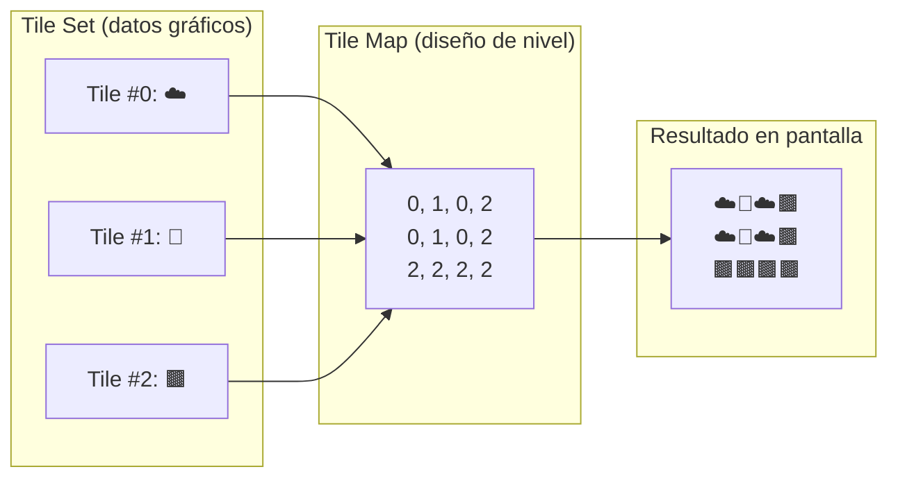

Cada referencia en el tile map ocupa **1 byte** (permite direccionar hasta 256 tiles distintos).

---

## 5. Ventajas del sistema de tiles

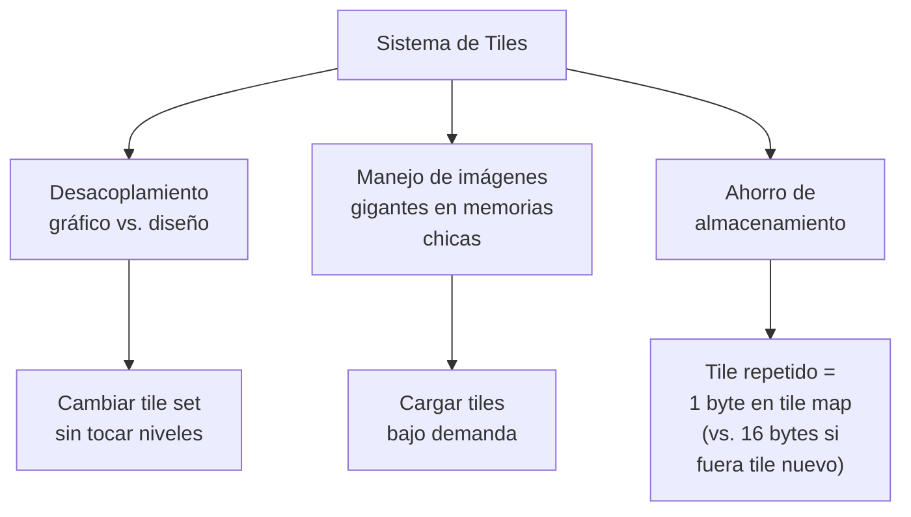

### Desacoplamiento

Se separa:
- **Tile set** → la información gráfica (los píxeles)
- **Tile map** → el diseño del nivel / construcción de objetos

Si Miyamoto se despertaba y quería cambiar el piso de nieve a pasto, solo tocaba el **tile set**. Los niveles (tile maps) no había que modificarlos.

### Ahorro de almacenamiento

| Elemento | Tamaño |
|---|---|
| 1 tile (8×8, 2 bits/pixel) | **16 bytes** |
| 1 referencia en tile map | **1 byte** |
| Por cada tile repetido | Se ahorran **15 bytes** |

Los 16 bytes por tile se explican porque cada píxel usa 2 bits (64 píxeles × 2 bits = 128 bits = 16 bytes). Y cada píxel usa 2 bits por la forma en que la NES manejaba el color, que vemos a continuación.

---

## 6. El Color en la NES

### 6.1 True Color vs. Paletas

Hoy en día lo común es **True Color**: 4 valores de 8 bits (R, G, B, A) → más de 16 millones de colores.

```
En True Color:
  - 1 tile (8×8) = 64 × 4 bytes = 256 bytes
  - Mario completo (4 tiles) = 1 KB
  - Memoria de video total de la NES = 8 KB
  → IMPOSIBLE
```

Solución: **paletas indexadas**.

### 6.2 Paletas indexadas en la NES

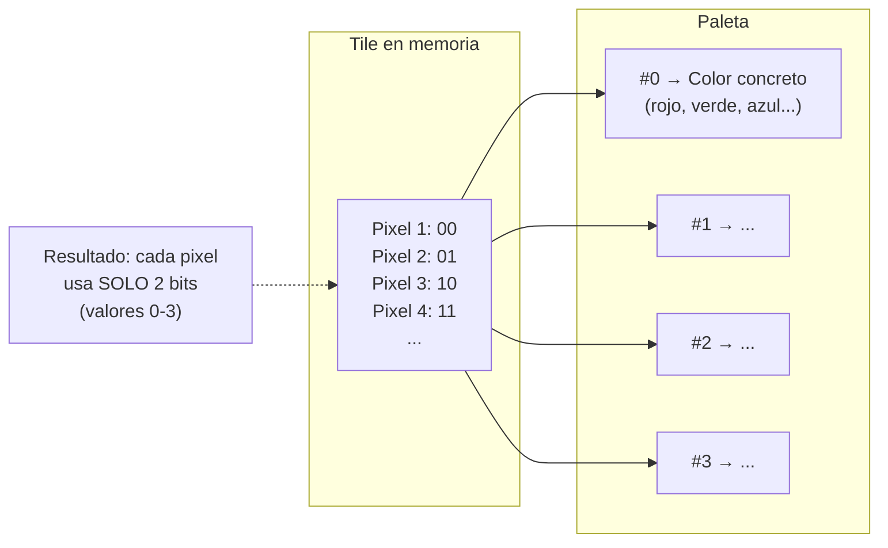

- Cada píxel del tile ocupa **2 bits** → puede referenciar 4 colores (0, 1, 2, 3)
- Esos 4 colores se definen en una **paleta**
- La paleta guarda **referencias** a otra paleta (no colores concretos)

### 6.3 La paleta universal de 64 colores

La NES tenía una **paleta universal** de **64 colores fijos**. Todos los juegos debían elegir sus colores de aquí.

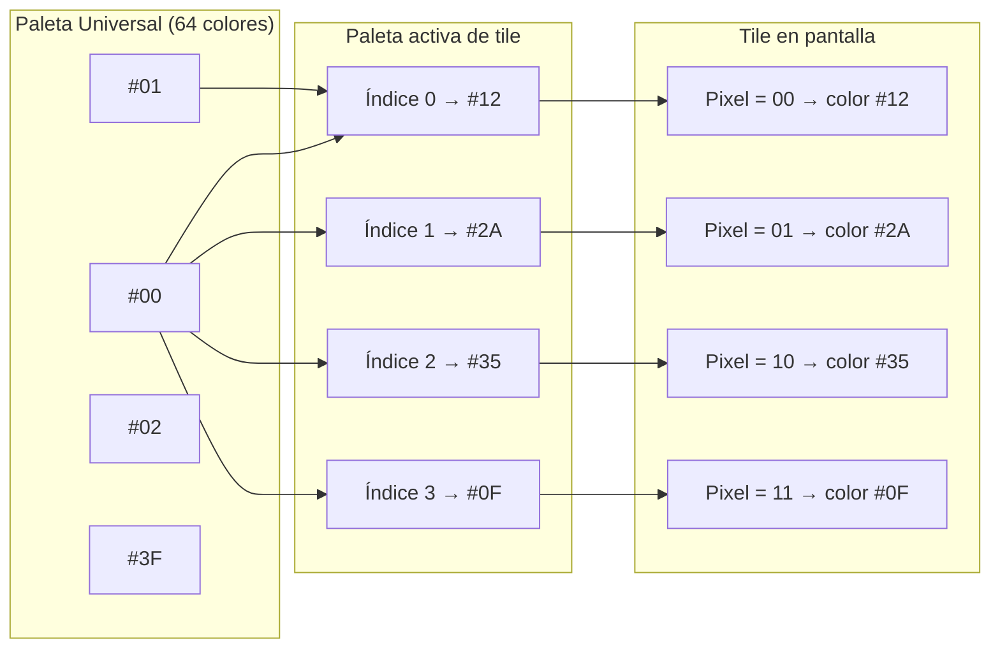

Cada tile tiene **solamente 3 colores visibles** + 1 transparente. Si ves un tile con más colores, es porque se superponían objetos (ej: el ojito de un personaje se lograba con un tile extra encima).

### 6.4 Paletas activas: 4 + 4

La NES tenía **8 paletas activas** en total:

| Grupo | Cantidad | Destino |
|---|---|---|
| **Fondo** | 4 paletas | Para tiles del escenario |
| **Sprites** | 4 paletas | Para sprites |

En teoría: 8 paletas × 3 colores cada una = **32 colores** en pantalla.  
En la práctica: **25 colores** (el color #0 de cada paleta de fondo se comparte, y hay limitaciones adicionales que se explican en la Parte 2).

Ventaja clave de las paletas: **reutilización de tiles**.

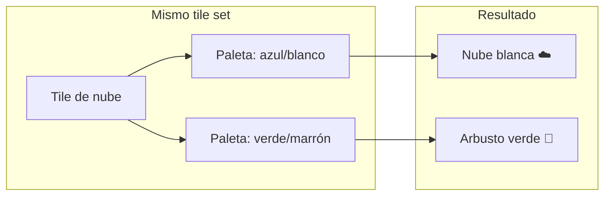

La nube y el arbusto en Super Mario Bros. usan **los mismos tiles**, solo cambia la paleta. Esto también permitía efectos como Mario con estrella (rotación de colores) o convertir a Mario en Luigi sin cambiar ni un píxel del sprite.

---

## 7. El Fondo (Background)

### 7.1 Tile map gigante

El fondo es un **tile map de gran tamaño** que se mueve en conjunto.

### 7.2 Scrolling

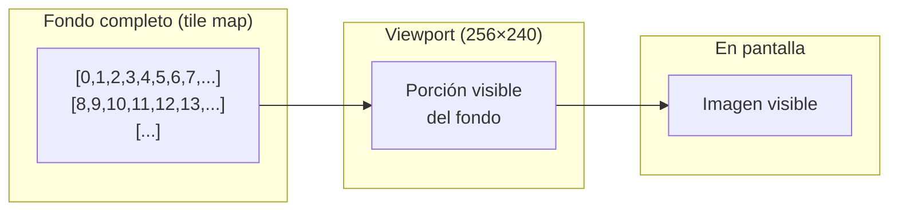

La interpretación correcta es que el **viewport se mueve sobre el fondo**, no el fondo sobre la pantalla.

Tipos de scrolling en la NES:

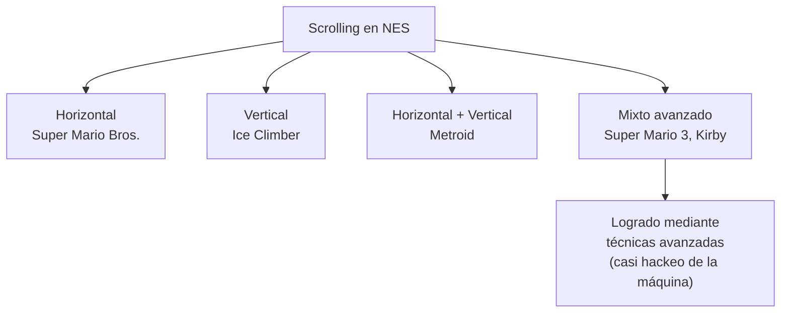

---

## 8. Los Sprites

### 8.1 Características

Los sprites son entidades dinámicas que se mueven **individualmente** con una **posición relativa al viewport** (como si flotaran sobre la pantalla).

| Propiedad | Valor |
|---|---|
| Tamaño (modo más común) | **8 × 8** píxeles |
| Tamaño alternativo | 8 × 16 (usado en juegos avanzados como SMB3) |
| Máximo en pantalla | **64** sprites |
| Máximo por línea horizontal | **8** sprites |

Un personaje como Mario en realidad son **4 sprites de 8×8 moviéndose en conjunto**.

### 8.2 Límite de 8 por línea

La NES podía tener hasta **64 sprites** en pantalla, pero el límite más crítico era de **8 sprites por línea de dibujado** (línea horizontal de la imagen).

```mermaid
flowchart LR
    subgraph "Línea de dibujado individual"
        SP1[Sprite 1] SP2[Sprite 2] SP3[...] SP4[...] SP5[...] SP6[...] SP7[...] SP8[Sprite 8] SP9["Sprite 9<br/>✗ INVISIBLE"]
    end
```

Si en una misma línea horizontal hay 9 o más sprites, el noveno (y siguientes) **no se dibuja** — queda invisible.

### 8.3 El parpadeo como solución

Para evitar que un sprite desaparezca por completo (como un enemigo que te hace daño), los desarrolladores rotaban el orden de los sprites en memoria **cada frame (60 fps)**:

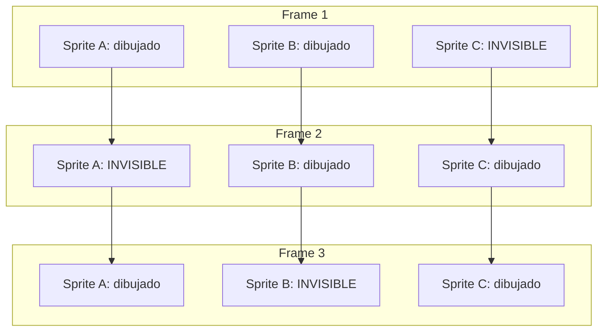

Rotando posiciones a 60 fps, los sprites que desaparecen van cambiando constantemente. El ojo humano percibe esto como **parpadeo**.

> **El parpadeo no es un defecto de la consola, sino un efecto colateral de la estrategia de los desarrolladores** para evitar que un sprite quede permanentemente invisible.

---

## 9. Conclusión

El sistema de tiles de la NES era una solución de ingeniería brillante para las limitaciones de la época:

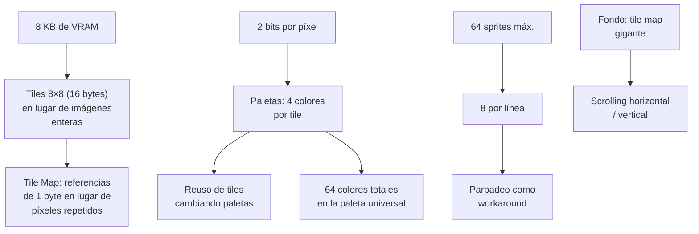

Todo estaba gobernado por una **economía de recursos furiosa**: cada byte contaba, cada límite tenía una razón de hardware.

---

> **Próximo video (Parte 2):** Especificaciones técnicas a nivel hardware, la señal de TV, y cómo la consola construía estos gráficos desde el punto de vista electrónico.
>
> **Fuente:** Transcripción del video *"Los GRÁFICOS de la NES - PARTE 1 - Tiles, Paletas, Sprites y Fondos"* (YouTube)
