# Los Gráficos de la NES — Parte 2: Los Sprites

> Basado en la transcripción del video homónimo.  
> Cómo la PPU manejaba los sprites a nivel hardware, con sus memorias, tablas y limitaciones.

---

## Índice

1. [Arquitectura de la NES](#1-arquitectura-de-la-nes)
   - [1.1 CPU y PPU](#11-cpu-y-ppu)
   - [1.2 Memorias](#12-memorias)
   - [1.3 División de responsabilidades](#13-división-de-responsabilidades)
2. [La CHR ROM y las Pattern Tables](#2-la-chr-rom-y-las-pattern-tables)
3. [La OAM — Object Attribute Memory](#3-la-oam--object-attribute-memory)
   - [3.1 Estructura de la OAM](#31-estructura-de-la-oam)
   - [3.2 El byte de atributos](#32-el-byte-de-atributos)
4. [Prioridades](#4-prioridades)
   - [4.1 Prioridad sprite vs. fondo](#41-prioridad-sprite-vs-fondo)
   - [4.2 Prioridad sprite vs. sprite](#42-prioridad-sprite-vs-sprite)
5. [Modo 8×16](#5-modo-8x16)
6. [La OAM Secundaria y el límite de 8 sprites por línea](#6-la-oam-secundaria-y-el-límite-de-8-sprites-por-línea)
   - [6.1 Cómo surge el límite](#61-cómo-surge-el-límite)
   - [6.2 El parpadeo como workaround](#62-el-parpadeo-como-workaround)
   - [6.3 Uso creativo del límite: sprites fantasma](#63-uso-creativo-del-límite-sprites-fantasma)
7. [Conclusión](#7-conclusión)

---

## 1. Arquitectura de la NES

Para entender los sprites hay que entender el hardware sobre el que corrían.

### 1.1 CPU y PPU

| Chip | Función | Análogo moderno |
|---|---|---|
| **CPU** (Central Processing Unit) | Ejecuta el código del juego | CPU de PC / celular |
| **PPU** (Picture Processing Unit) | Genera la señal de video hacia la tele | GPU |

### 1.2 Memorias

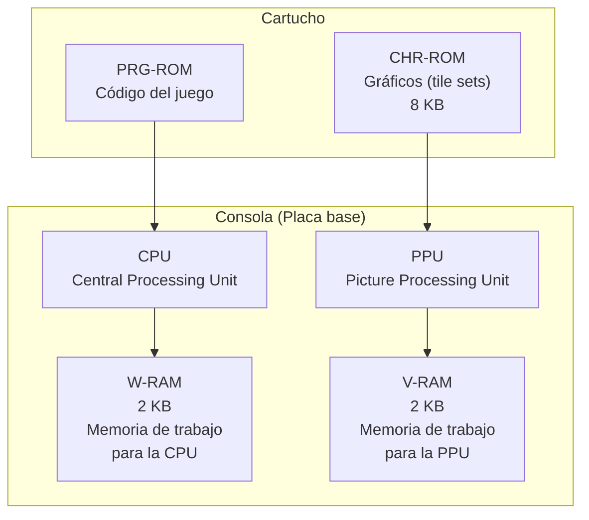

| Memoria | Ubicación | Capacidad | Contenido |
|---|---|---|---|
| **W-RAM** | Consola | **2 KB** | Memoria de trabajo de la CPU |
| **V-RAM** | Consola | **2 KB** | Memoria de trabajo de la PPU |
| **PRG-ROM** | Cartucho | Variable | Código del juego |
| **CHR-ROM** | Cartucho | **8 KB** (base) | Gráficos (tile sets) |
| **OAM** | Interna de PPU | **256 bytes** | Datos de sprites |

### 1.3 División de responsabilidades

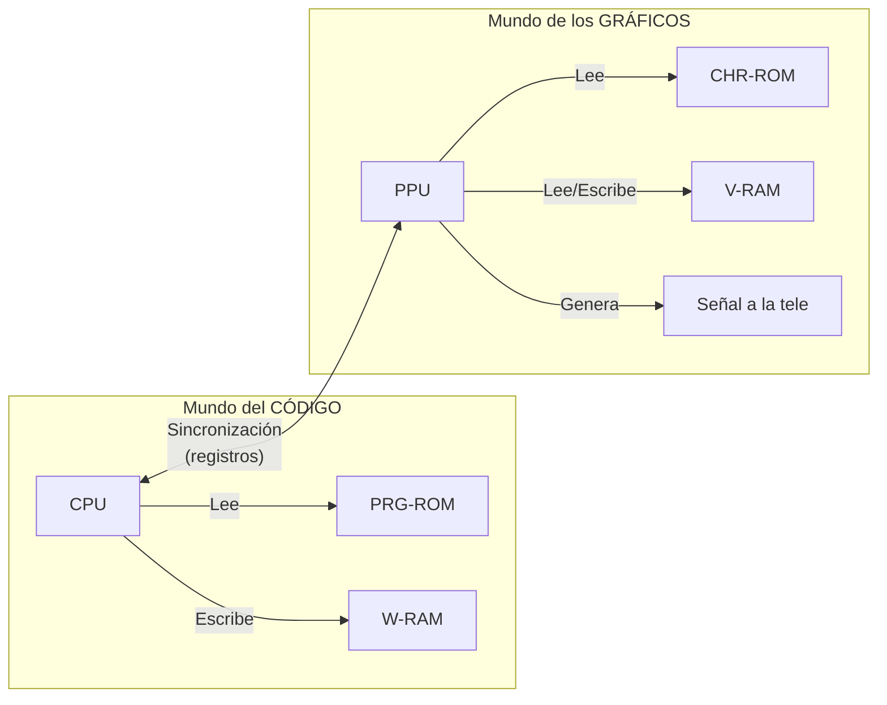

La CPU maneja el código, la PPU maneja los gráficos. Trabajan en **estricta sincronía** mediante registros compartidos. La CPU decide posiciones de sprites, scrolling, actualización de tiles, y la PPU lo ejecuta.

---

## 2. La CHR ROM y las Pattern Tables

La CHR ROM del cartucho contiene **los tile sets**, que en terminología NES se llaman **Pattern Tables**.

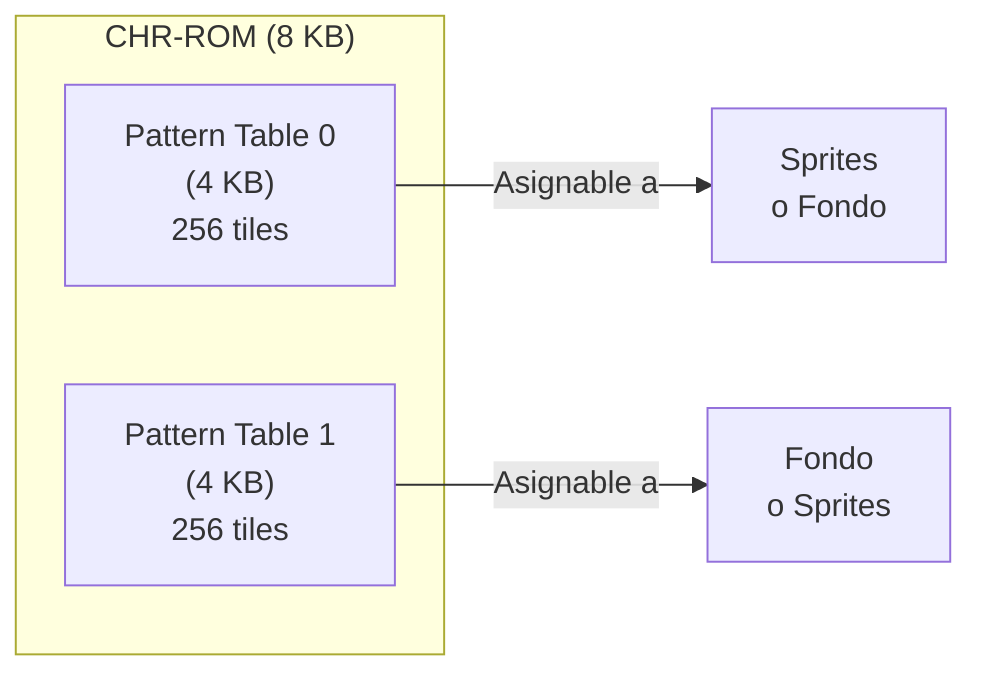

| Propiedad | Valor |
|---|---|
| Tiles por pattern table | **256** (0–255) |
| Tamaño por tile | **16 bytes** (8×8 px, 2 bits/px) |
| Tamaño por pattern table | 256 × 16 = **4 KB** |
| Total CHR-ROM base | **8 KB** (2 pattern tables) |

Cada tile se referencia con **1 byte** (8 bits → valores 0–255). Esto no es casualidad: es todo lo que la PPU puede direccionar.

> Los primeros juegos tenían CHR-ROM de 8 KB porque era todo lo que la PPU podía direccionar. Luego vinieron los **mappers** y expandieron esto con magia negra, pero la arquitectura base es esta.

---

## 3. La OAM — Object Attribute Memory

La **OAM** (*Object Attribute Memory*) es una memoria interna de la PPU de **256 bytes** donde se guardan los datos de los sprites.

### 3.1 Estructura de la OAM

La OAM es una tabla con **64 filas** de **4 bytes** cada una:

```
OAM: [Sprite 0] [Sprite 1] [Sprite 2] ... [Sprite 63]
       4 bytes     4 bytes     4 bytes         4 bytes
```

| Byte | Campo | Descripción |
|---|---|---|
| **0** | Tile Index | Índice del tile en la Pattern Table (0–255) |
| **1** | Y | Posición vertical del sprite en la pantalla |
| **2** | X | Posición horizontal del sprite en la pantalla |
| **3** | Attributes | Flip, prioridad, paleta (usado a nivel de bit) |

Con 1 byte para X y 1 byte para Y, se puede posicionar a nivel de píxel en una pantalla de 256×240.

### 3.2 El byte de atributos

Los 8 bits del byte de atributos se desglosan así:

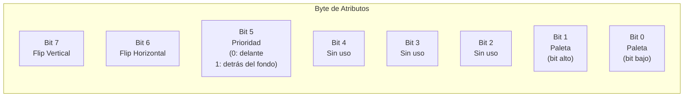

| Bits | Campo | Valores |
|---|---|---|
| 7 | Flip Vertical | 0 = normal, 1 = espejado vertical |
| 6 | Flip Horizontal | 0 = normal, 1 = espejado horizontal |
| 5 | Prioridad (fondo) | 0 = sprite delante del fondo, 1 = sprite detrás |
| 4–2 | Sin uso | Siempre 0 |
| 1–0 | Paleta | 00–03 (elige una de las 4 paletas de sprite) |

---

## 4. Prioridades

Cuando múltiples elementos ocupan el mismo píxel en pantalla, hay que decidir **cuál se muestra**.

### 4.1 Prioridad sprite vs. fondo

Controlada por el **bit 5** del byte de atributos:

| Bit 5 | Comportamiento |
|---|---|
| **0** | Sprite se muestra **delante** del fondo |
| **1** | Sprite se muestra **detrás** del fondo |

**Ejemplo 1 — Super Mario Bros.: el hongo del bloque**

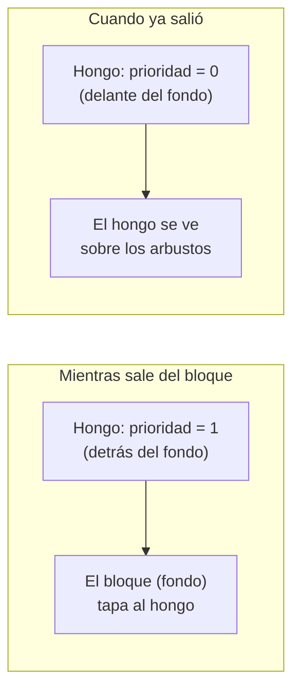

Por esto arriba del bloque del hongo nunca hay nubes ni monedas: si las hubiera, taparían al hongo mientras sale.

**Ejemplo 2 — The Legend of Zelda: las puertas**

Link tiene prioridad 0 normalmente. Al entrar a una puerta, cambia a prioridad 1 para ocultarse detrás de la puerta (que es mayormente transparente). El cambio no se nota porque la puerta tiene píxeles transparentes justo donde está Link.

**Ejemplo 3 — Super Mario Bros. 3: el Easter Egg**

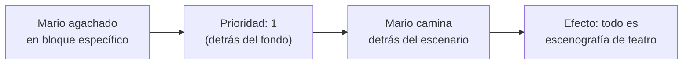

### 4.2 Prioridad sprite vs. sprite

No hay un campo explícito en la OAM. La prioridad entre sprites está **implícita en el orden de la OAM**:

> **Los primeros sprites en la OAM se muestran por sobre los últimos.**

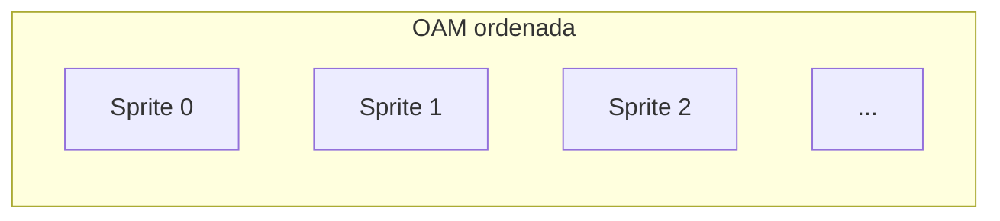

En Super Mario 3, Mario está siempre al inicio de la OAM, por eso se ve por encima de enemigos y objetos. Cuando Mario pasa a estar detrás del fondo (Easter Egg), los sprites con menor prioridad (enemigos) dibujan su silueta sobre Mario, creando un **efecto fantasmal**.

---

## 5. Modo 8×16

La NES tenía un modo alternativo donde los sprites medían **8×16 píxeles** en lugar de 8×8.

### Cómo funciona

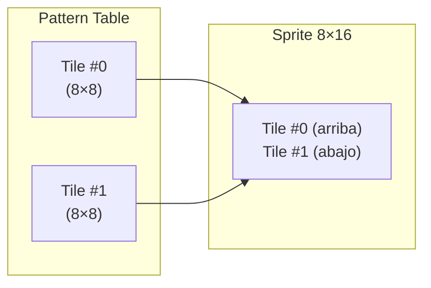

La PPU toma **dos tiles consecutivos** de la Pattern Table y los apila verticalmente.

### Consecuencias

| Aspecto | Modo 8×8 | Modo 8×16 |
|---|---|---|
| Tamaño de sprite | 8×8 | **8×16** |
| Tile index | 8 bits → 0–255 | **7 bits** → 0–127 (solo pares) |
| Pattern tables usables | 1 | **2** (el bit libre elige tabla) |

El bit libre del tile index (ahora de 7 bits) se usa para elegir entre las dos Pattern Tables. Esto significa que en modo 8×16, los sprites pueden usar **ambas** pattern tables (una la comparten con el fondo).

Por esta razón no se usaba tanto en juegos tempranos: reduce la variedad de tiles disponible para sprites, o fuerza a resignar tiles del fondo.

**Ejemplo — Galaga**: usa modo 8×16 porque no tiene fondo tradicional. Los enemigos son sprites mientras se mueven y se convierten en fondo cuando están en formación. Al ser todo "lo mismo", compartir pattern tables no es problema.

---

## 6. La OAM Secundaria y el límite de 8 sprites por línea

### 6.1 Cómo surge el límite

La PPU tiene una **segunda memoria interna** de solo **32 bytes** llamada **OAM Secundaria**.

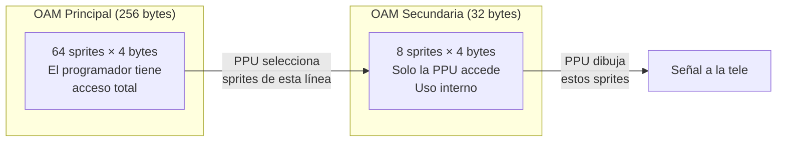

La tele de tubo (**CRT**) dibuja la imagen **línea por línea** (*scanline*). Por cada scanline, la PPU:

1. Recorre la OAM principal en orden
2. Busca los sprites que caen en esa línea
3. Los copia a la **OAM secundaria** (32 bytes)
4. Dibuja los sprites de la OAM secundaria

32 bytes ÷ 4 bytes por sprite = **8 sprites por línea**.

> **De ahí surge el límite de 8 sprites por scanline.** No es caprichoso: es el tamaño de la OAM secundaria.

### 6.2 El parpadeo como workaround

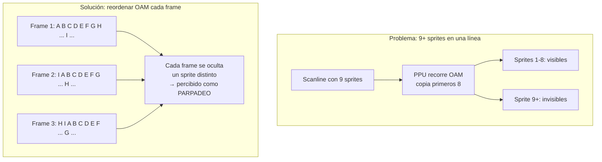

Los desarrolladores rotaban el orden de los sprites en la **OAM principal** cada frame (60 fps). Así, el sprite que quedaba fuera de la OAM secundaria iba cambiando constantemente, y en lugar de desaparecer por completo, **parpadeaba**.

### 6.3 Uso creativo del límite: sprites fantasma

Algunos desarrolladores **usaban el límite a propósito** para ocultar sprites. Ponían **8 sprites transparentes o detrás del fondo** en las primeras posiciones de la OAM, saturando las líneas donde no querían que se viera algo.

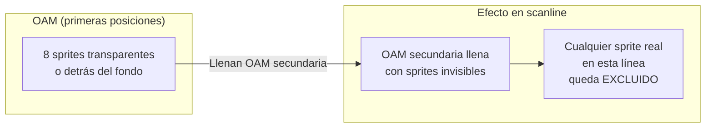

**Ejemplo 1 — Castlevania 2: pantano**

Cuando el personaje entra al pantano, 8 sprites transparentes en la OAM saturan las líneas de las piernas. Las piernas del personaje (sprites reales) quedan ocultas → **efecto de estar sumergido en agua**.

**Ejemplo 2 — The Legend of Zelda: puertas de mazmorras**

16 sprites invisibles (detrás del fondo) en la OAM: 8 para la línea de arriba y 8 para la de abajo. Ocultan parcialmente a Link al atravesar las puertas.

---

## 7. Conclusión

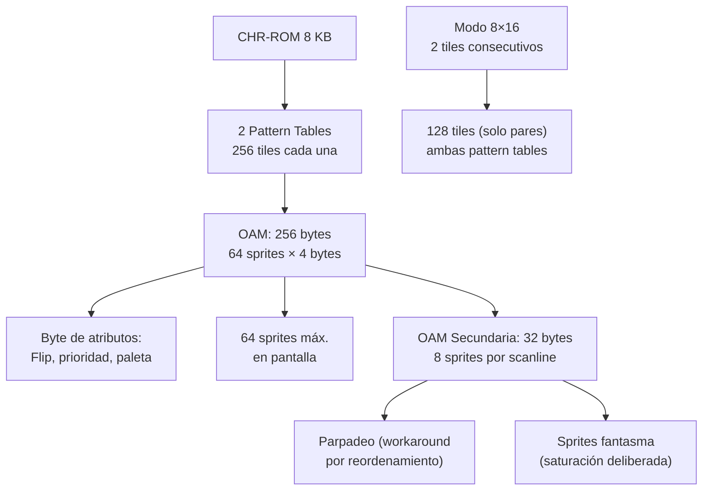

Cada limitación técnica de la NES tiene una **razón de hardware concreta**:

| Límite | Causa física |
|---|---|
| 64 sprites en pantalla | 256 bytes de OAM ÷ 4 bytes/sprite |
| 8 sprites por scanline | 32 bytes de OAM secundaria ÷ 4 bytes/sprite |
| 256 tiles por pattern table | 1 byte de direccionamiento (0–255) |
| 8 KB de CHR-ROM base | 2 pattern tables × 4 KB |

El **parpadeo** no es un defecto de la consola: es un **workaround creativo** de los desarrolladores. Y el límite de 8 sprites por línea incluso se explotaba creativamente para ocultar partes del personaje (pantanos, puertas, bordes).

---

> **Próximo video (Parte 3):** El fondo — mirroring, scrolling avanzado y la magia negra de la PPU.
>
> **Fuente:** Transcripción del video *"Los GRÁFICOS de la NES - PARTE 2: Los SPRITES"* (YouTube)
