# Los Gráficos de la NES — Parte 3: Fondos y Mirroring

> Basado en la transcripción del video homónimo.  
> Cómo la PPU construía los fondos, el scrolling, y el mirroring como solución de ingeniería brillante a la escasez de memoria.

---

## Índice

1. [Introducción](#1-introducción)
2. [Direccionamiento de Memoria](#2-direccionamiento-de-memoria)
   - [2.1 Direcciones lógicas vs. físicas](#21-direcciones-lógicas-vs-físicas)
   - [2.2 Mapa de memoria de la PPU](#22-mapa-de-memoria-de-la-ppu)
3. [Name Tables](#3-name-tables)
   - [3.1 Tamaño y resolución](#31-tamaño-y-resolución)
   - [3.2 El problema del scroll con 2 KB de VRAM](#32-el-problema-del-scroll-con-2-kb-de-vram)
4. [Mirroring](#4-mirroring)
   - [4.1 Vertical Mirroring (scroll horizontal)](#41-vertical-mirroring-scroll-horizontal)
   - [4.2 Horizontal Mirroring (scroll vertical)](#42-horizontal-mirroring-scroll-vertical)
   - [4.3 Cómo se configuraba](#43-cómo-se-configuraba)
5. [Scrolling Avanzado](#5-scrolling-avanzado)
   - [5.1 Scroll a nivel de píxel](#51-scroll-a-nivel-de-píxel)
   - [5.2 Actualización proactiva de tiles](#52-actualización-proactiva-de-tiles)
   - [5.3 Four-Screen Mode](#53-four-screen-mode)
6. [Super Mario 3 y el Scroll Mixto Hacker](#6-super-mario-3-y-el-scroll-mixto-hacker)
   - [6.1 El problema de cargar tiles a la derecha](#61-el-problema-de-cargar-tiles-a-la-derecha)
   - [6.2 Overscan al rescate](#62-overscan-al-rescate)
   - [6.3 Felix the Cat: sprite negro como parche](#63-felix-the-cat-sprite-negro-como-parche)
7. [Attribute Tables](#7-attribute-tables)
   - [7.1 El problema del color en las name tables](#71-el-problema-del-color-en-las-name-tables)
   - [7.2 Grouping de 2×2 tiles](#72-grouping-de-2×2-tiles)
   - [7.3 El glitch de color de Super Mario 3](#73-el-glitch-de-color-de-super-mario-3)
8. [Conclusión](#8-conclusión)

---

## 1. Introducción

En los videos anteriores vimos que los gráficos de la NES se dividen en **sprites** y **fondo**, ambos formados por tiles de 8×8 con colores definidos en paletas. Ahora toca el **fondo** — el tema más interesante y complejo de la consola, dominado por el **mirroring**, una técnica que parece magia negra pero es pura ingeniería con recursos mínimos.

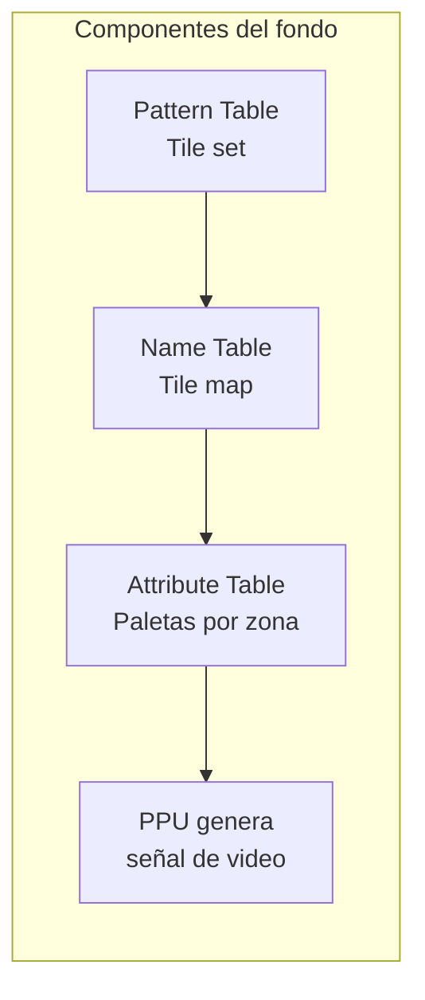

---

## 2. Direccionamiento de Memoria

### 2.1 Direcciones lógicas vs. físicas

La memoria se organiza como una grilla de celdas de **1 byte** cada una. Cada celda tiene una **dirección** (un número). En la NES las direcciones eran de **16 bits**, aunque en la PPU solo se usaban **14 bits** en la práctica.

> 14 bits → 2¹⁴ = 16,384 = **16 KB** de direccionamiento máximo

Pero en la NES no hay un solo chip de 16 KB. Hay **múltiples memorias pequeñas** distribuidas. Las direcciones de 14 bits son **direcciones lógicas** (lo que la PPU "ve"). Un **mapeo de memoria** convierte esas direcciones lógicas en direcciones **físicas** hacia los chips reales.

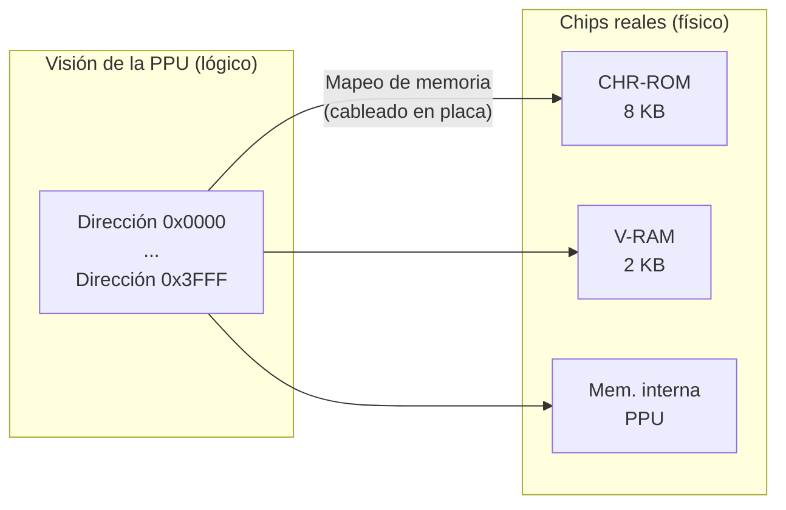

### 2.2 Mapa de memoria de la PPU

```
0x0000 ─────────────────────────────
         Pattern Table 0 (4 KB) ── CHR-ROM
0x0FFF ─────────────────────────────
0x1000 ─────────────────────────────
         Pattern Table 1 (4 KB) ── CHR-ROM
0x1FFF ─────────────────────────────
0x2000 ─────────────────────────────
         Name Table 0 (1 KB)
0x23FF ─────────────────────────────
0x2400 ─────────────────────────────
         Name Table 1 (1 KB)
0x27FF ─────────────────────────────
0x2800 ─────────────────────────────
         Name Table 2 (1 KB)
0x2BFF ─────────────────────────────
0x2C00 ─────────────────────────────
         Name Table 3 (1 KB)
0x2FFF ─────────────────────────────
0x3000 ─────────────────────────────
         (Espejo de 0x2000–0x2EFF)
0x3EFF ─────────────────────────────
0x3F00 ─────────────────────────────
         Paletas (32 bytes)
0x3F1F ─────────────────────────────
0x3F20 ─────────────────────────────
         (Espejo de paletas)
0x3FFF ─────────────────────────────
```

| Rango | Tamaño | Contenido | Ubicación física |
|---|---|---|---|
| 0x0000–0x0FFF | 4 KB | Pattern Table 0 | CHR-ROM del cartucho |
| 0x1000–0x1FFF | 4 KB | Pattern Table 1 | CHR-ROM del cartucho |
| **0x2000–0x2FFF** | **4 KB** | **4 Name Tables** | **V-RAM + mirroring** |
| 0x3F00–0x3F1F | 32 bytes | Paletas | Interna de la PPU |

Las **4 name tables** son el corazón del fondo y ocupan direcciones 0x2000–0x2FFF.

---

## 3. Name Tables

Una **name table** es un **tile map**: una grilla de referencias de 1 byte que indica qué tile de la Pattern Table va en cada posición.

### 3.1 Tamaño y resolución

| Propiedad | Cálculo | Valor |
|---|---|---|
| Tiles por fila | 256 px ÷ 8 px/tile | **32 tiles** |
| Filas por pantalla | 240 px ÷ 8 px/tile | **30 tiles** |
| Total tiles por name table | 32 × 30 | **960 tiles** |
| Tamaño por name table | 960 × 1 byte | **960 bytes** |

### 3.2 El problema del scroll con 2 KB de VRAM

La V-RAM tiene solo **2 KB**, pero se necesitan **4 name tables** para scrolling en todas direcciones (4 × 960 = 3,840 bytes, casi el doble).

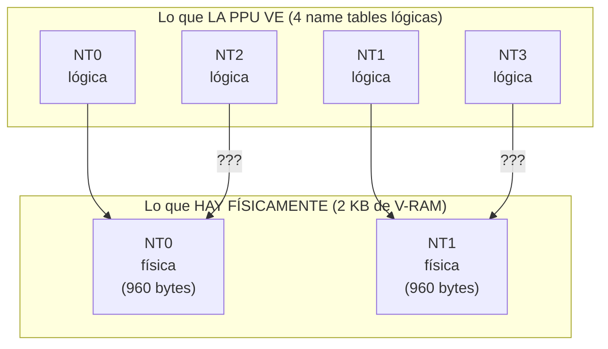

**Solución: Mirroring.** Las name tables lógicas que no tienen memoria física detrás **apuntan (espejan) a las que sí tienen**.

---

## 4. Mirroring

El **mirroring** es un mecanismo de cableado en el cartucho que determina cómo se mapean las 4 name tables lógicas a las 2 físicas.

### 4.1 Vertical Mirroring (scroll horizontal)

Usado en juegos con **scroll horizontal** (Super Mario Bros., Mega Man, Castlevania).

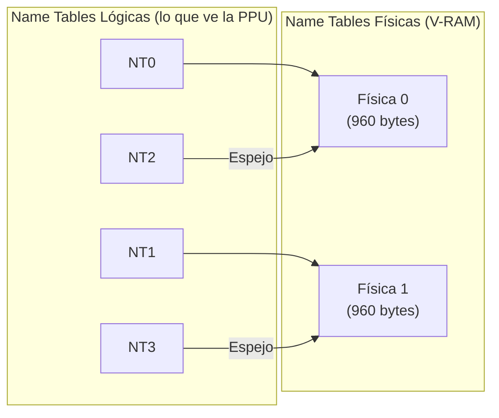

```
        L0 ── Física 0         L2 ── (espejo de Física 0)
        L1 ── Física 1         L3 ── (espejo de Física 1)
```

**Consecuencia:** Las tablas se espejan **arriba y abajo**. Ideal para scroll horizontal porque las dos tablas horizontales son independientes, mientras que las verticales se repiten.

**Problema:** Si modificas NT2 (lógica), impacta en la misma Física 0 que NT0 → el cambio aparece en ambos lugares.

### 4.2 Horizontal Mirroring (scroll vertical)

Usado en juegos con **scroll vertical** (Ice Climber, Kid Icarus, Super Mario Bros. 3).

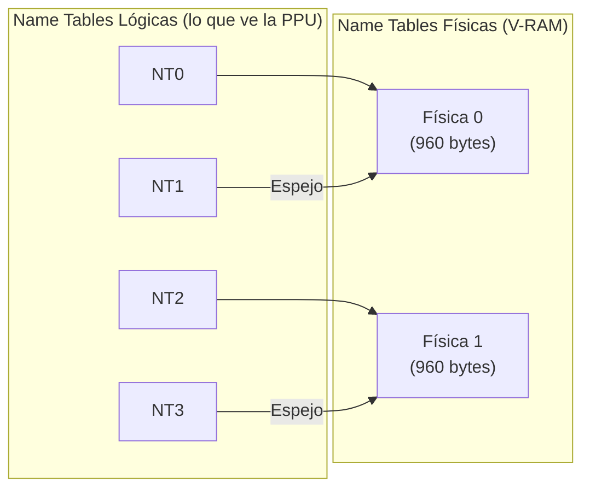

```
        L0 ── Física 0         L1 ── (espejo de Física 0)
        L2 ── Física 1         L3 ── (espejo de Física 1)
```

**Consecuencia:** Las tablas se espejan **a izquierda y derecha**. Ideal para scroll vertical porque las dos tablas verticales son independientes.

### 4.3 Cómo se configuraba

En los primeros cartuchos de la NES, el mirroring se configuraba **soldando uno de dos pines** en el cartucho:

```
        ┌───┐
        │ H │ ← Horizontal (scroll vertical)
        │ B │ ← Vertical   (scroll horizontal)
        └───┘
```

H = Horizontal mirroring, B = Vertical mirroring. No había software de por medio: era **cableado físico**.

---

## 5. Scrolling Avanzado

### 5.1 Scroll a nivel de píxel

La PPU usaba un **offset** (desplazamiento) para posicionar el viewport sobre las name tables. El offset se cambia entre frames para lograr scroll fluido.

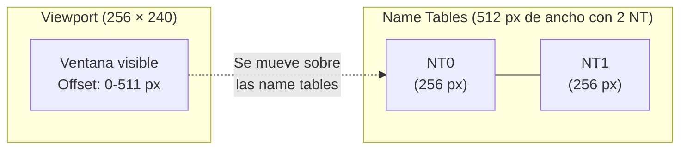

- Offset de **8 bits** (0–255) + 1 bit para elegir name table
- Permite scroll a **nivel de píxel** — el más fluido posible
- Al llegar al final de NT1, el offset se reinicia a 0 → **scroll infinito**

### 5.2 Actualización proactiva de tiles

El scroll infinito repite el mismo fondo. Para tener niveles largos, los desarrolladores **actualizaban tiles fuera del viewport** mientras el jugador avanzaba:

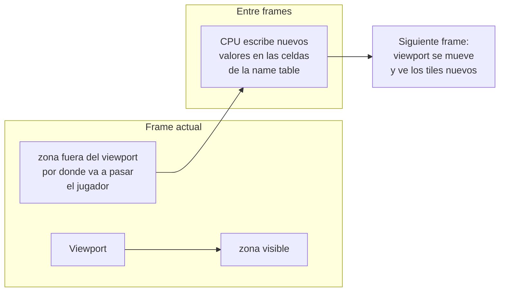

No se están moviendo tiles en memoria; solo se **cambian los números** en el tile map. Es barato y rápido.

### 5.3 Four-Screen Mode

Algunos cartuchos incorporaban **su propia RAM extra** para tener **4 name tables físicas** reales. El cartucho mapeaba 2 name tables a la V-RAM de la consola + 2 a su propia RAM.

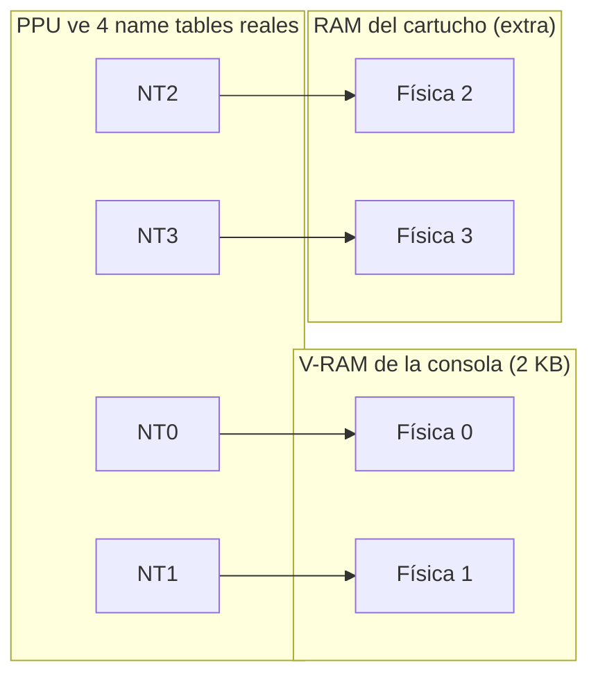

Esto permitía **scroll mixto fluido** sin los problemas del mirroring. Pero era costoso (RAM extra en el cartucho), por lo que pocos juegos lo usaron.

---

## 6. Super Mario 3 y el Scroll Mixto Hacker

Super Mario Bros. 3 (y Kirby's Adventure, Felix the Cat, Castlevania 2) lograban **scroll mixto** (horizontal + vertical) sin RAM extra, usando **mirroring horizontal** y técnicas ingeniosas para ocultar los defectos.

### 6.1 El problema de cargar tiles a la derecha

Con mirroring horizontal, las name tables se espejan a izquierda y derecha. Si intentas cargar tiles a la derecha del viewport:

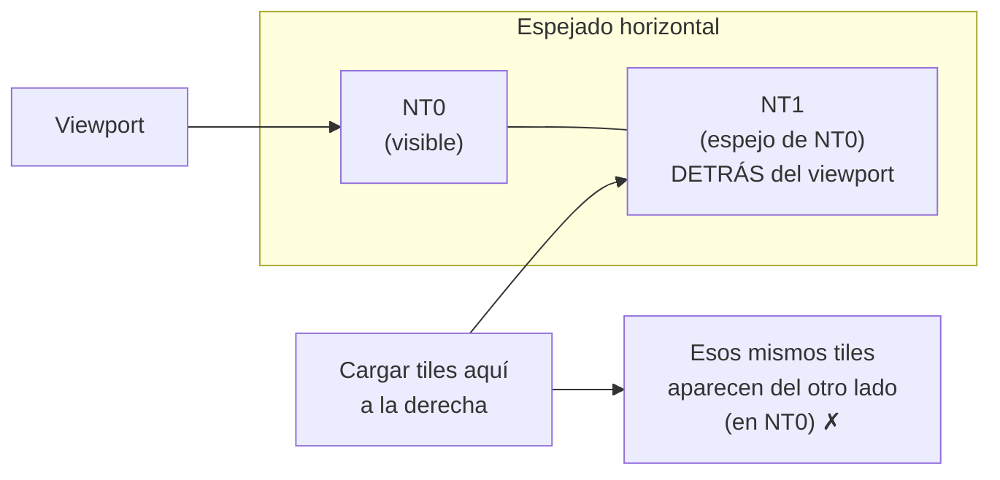

**Causa:** NT0 y NT1 son la misma memoria física. Cualquier cambio en NT1 se refleja inmediatamente en NT0.

### 6.2 Overscan al rescate

En las **teles de tubo (CRT)**, el borde de la imagen se recortaba naturalmente — esto se llama **overscan**.

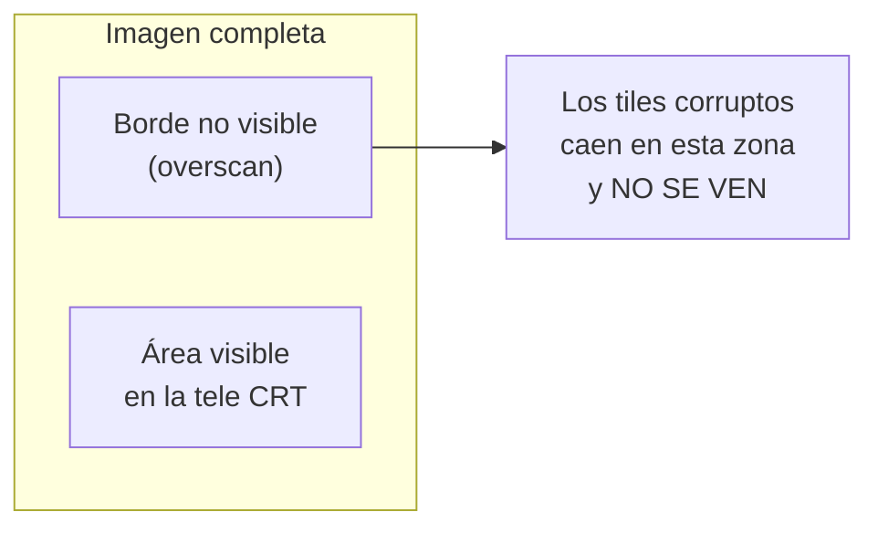

Nintendo **contaba con esto**: los defectos de carga de tiles y paletas quedaban en el overscan, invisibles para el jugador en una tele de tubo. En emuladores modernos (sin overscan) se ven claramente.

### 6.3 Felix the Cat: sprite negro como parche

Felix the Cat iba un paso más allá: además del overscan, ocultaba los defectos del borde derecho con **una columna de sprites negros**.

```
    ┌──────────────────────┐
    │     ÁREA VISIBLE      │▓▓▓▓▓▓ ← sprites negros
    │                        │▓▓▓▓▓▓
    │        FELIX          │▓▓▓▓▓▓
    │                        │▓▓▓▓▓▓
    └──────────────────────┘
```

Esto consumía sprites (8 por línea), pero lograba un resultado limpio.

Castlevania 2 usaba mirroring vertical con el mismo enfoque: los defectos aparecían arriba/abajo en lugar de izquierda/derecha.

---

## 7. Attribute Tables

### 7.1 El problema del color en las name tables

Las name tables solo guardan **el índice del tile** (1 byte). El **color** no está ahí. Pero entonces, ¿cómo sabe la PPU qué paleta aplicar a cada tile?

Solución: **Attribute Tables** — tablas más pequeñas que asignan paletas a grupos de tiles.

### 7.2 Grouping de 2×2 tiles

La V-RAM tiene 2 KB, y cada name table ocupa 960 bytes. Eso deja ~64 bytes libres por name table. Con 64 bytes no se puede asignar 2 bits de paleta a cada uno de los 960 tiles, así que se creó una tabla de **16 × 16 = 64 celdas**, donde cada celda asigna la paleta a un **grupo de 4 tiles (2×2)**.

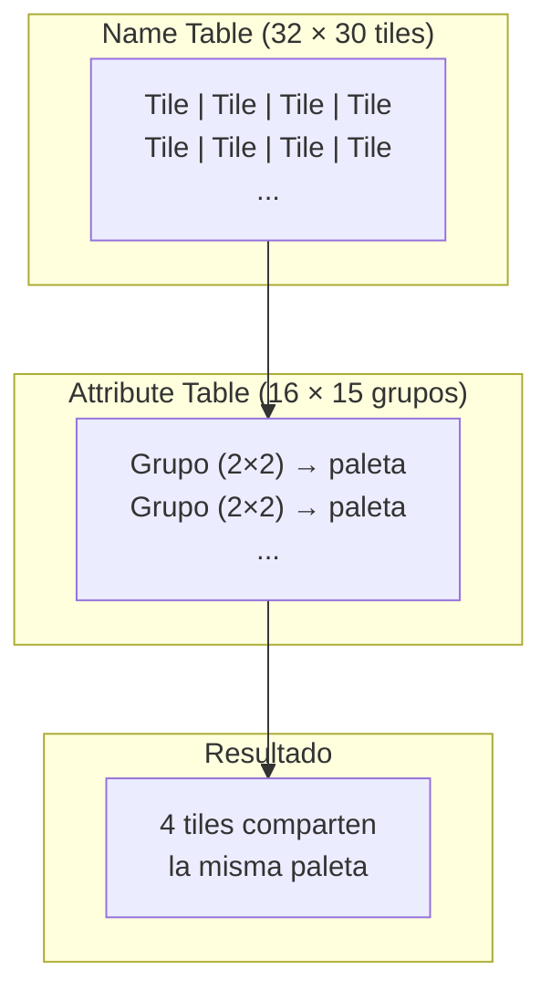

| Tabla | Dimensiones | Celdas | Cada celda abarca |
|---|---|---|---|
| Name Table | 32 × 30 | 960 tiles | 1 tile |
| **Attribute Table** | **16 × 15** | **64** | **4 tiles (2×2)** |

Cada celda de la attribute table tiene 2 bits → selecciona una de las **4 paletas de fondo**.

### 7.3 El glitch de color de Super Mario 3

Al scrollear horizontalmente con mirroring horizontal, se cargan tiles a la derecha. Pero la attribute table actualiza paletas en bloques de **2 columnas** (porque trabaja con grupos de 2 tiles de ancho).

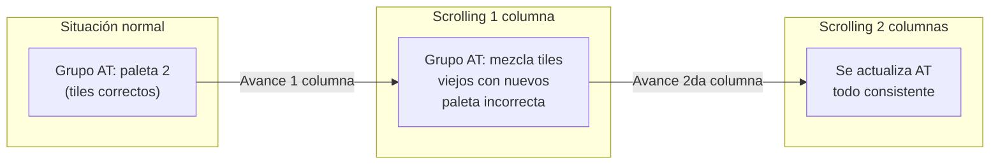

**El glitch ocurre por una columna a la vez**, cuando los tiles nuevos caen en una celda de attribute table que todavía tiene la paleta del grupo anterior. Al cargar la segunda columna, la attribute table se actualiza y todo vuelve a la normalidad.

Es por esto que SMB3 actualiza tiles de a **muy poquito** (una columna a la vez) para minimizar el defecto visual.

---

## 8. Conclusión

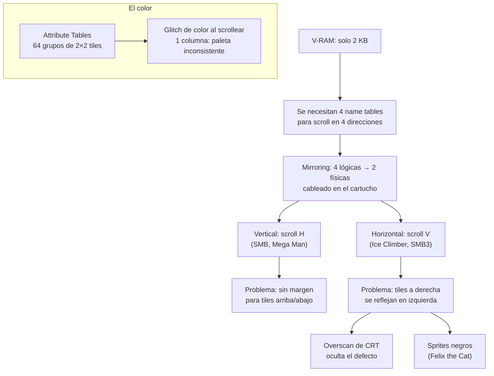

El sistema de fondos de la NES es una obra maestra de ingeniería con recursos mínimos:

- **4 name tables lógicas** mapeadas a **2 físicas** mediante mirroring
- **Mirroring configurable por cableado** (pin H o B en el cartucho)
- **Scroll a nivel de píxel** con offset de 8 bits
- **Attribute tables** para paletas en grupos de 2×2 tiles
- **Overscan** como aliado para ocultar defectos de borde
- **Four-screen mode** con RAM extra para scroll mixto real

Las limitaciones que parecen defectos (glitches de borde, color inconsistente) son en realidad **trade-offs deliberados**: los desarrolladores conocían estas limitaciones y diseñaban sus juegos para minimizar su impacto visual en las teles CRT de la época.

---

> **Próximo video (Parte 4):** Efectos avanzados — parallax de Ninja Gaiden, transparencias, y los últimos trucos que los desarrolladores exprimieron de la NES.
>
> **Fuente:** Transcripción del video *"Los GRÁFICOS de la NES - PARTE 3: Fondos y Mirroring"* (YouTube)
