# La NES a Fondo — Parte 4: El Bucle de Juego y el Slowdown

> Basado en la transcripción del video homónimo.  
> Cómo la CPU, la PPU y la tele de tubo bailaban al mismo ritmo… y qué pasaba cuando perdían el paso.

---

## Índice

1. [Los tres protagonistas](#1-los-tres-protagonistas)
2. [La tele de tubo y el barrido](#2-la-tele-de-tubo-y-el-barrido)
   - [2.1 Scanlines](#21-scanlines)
   - [2.2 NTSC vs. PAL](#22-ntsc-vs-pal)
   - [2.3 Blanking](#23-blanking)
3. [La CPU](#3-la-cpu)
   - [3.1 Program Counter y ciclos](#31-program-counter-y-ciclos)
4. [La PPU](#4-la-ppu)
5. [Coordinación: el reloj maestro](#5-coordinación-el-reloj-maestro)
6. [Comunicación CPU ↔ PPU](#6-comunicación-cpu--ppu)
   - [6.1 Registros de PPU](#61-registros-de-ppu)
   - [6.2 Shadow OAM y OAM DMA](#62-shadow-oam-y-oam-dma)
   - [6.3 La regla de oro: actualizar en VBlank](#63-la-regla-de-oro-actualizar-en-vblank)
7. [La NMI — Non-Maskable Interrupt](#7-la-nmi--non-maskable-interrupt)
8. [El bucle de juego ideal](#8-el-bucle-de-juego-ideal)
9. [El slowdown: cuando el bucle falla](#9-el-slowdown-cuando-el-bucle-falla)
   - [9.1 La pérdida de la NMI](#91-la-pérdida-de-la-nmi)
   - [9.2 Frame rate atado a la lógica](#92-frame-rate-atado-a-la-lógica)
   - [9.3 Delta Time](#93-delta-time)
10. [Estrategias de los desarrolladores](#10-estrategias-de-los-desarrolladores)
    - [10.1 Ghosts 'n Goblins: actualización parcial](#101-ghosts-n-goblins-actualización-parcial)
    - [10.2 Teenage Mutant Ninja Turtles: 30 fps fijos](#102-teenage-mutant-ninja-turtles-30-fps-fijos)
11. [El problema de PAL](#11-el-problema-de-pal)
12. [Conclusión](#12-conclusión)

---

## 1. Los tres protagonistas

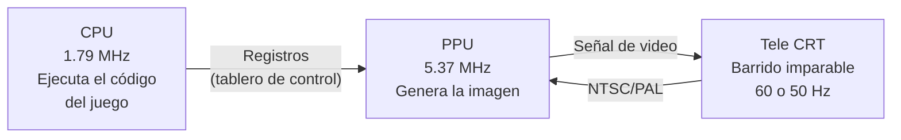

| Componente | Rol | Frecuencia |
|---|---|---|
| **CPU** | Ejecuta el código del juego (lógica, físicas, colisiones, decisiones gráficas) | **1.79 MHz** |
| **PPU** | Genera la señal de video usando las memorias gráficas (tile sets, OAM, name tables) | **5.37 MHz** |
| **CRT** | Muestra la imagen mediante barrido de electrones; impone el ritmo | **60 Hz (NTSC)** / 50 Hz (PAL) |

---

## 2. La tele de tubo y el barrido

### 2.1 Scanlines

La tele de tubo no muestra una imagen completa de golpe. Un **rayo de electrones** barre la pantalla de izquierda a derecha, línea por línea:

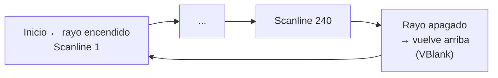

Cada línea horizontal se llama **scanline** (o línea de dibujado). Al terminar un scanline, el rayo se apaga brevemente y se reposiciona al inicio de la siguiente (**HBlank**). Al terminar el último scanline, se apaga por un periodo más largo y vuelve arriba (**VBlank**).

### 2.2 NTSC vs. PAL

| Estándar | Frecuencia | Regiones |
|---|---|---|
| **NTSC** | ~**60 Hz** (≈60 fps) | Japón, Estados Unidos |
| **PAL** | **50 Hz** (50 fps) | Europa, Argentina |

La NES original (Japón/USA) estaba diseñada para NTSC.

### 2.3 Blanking

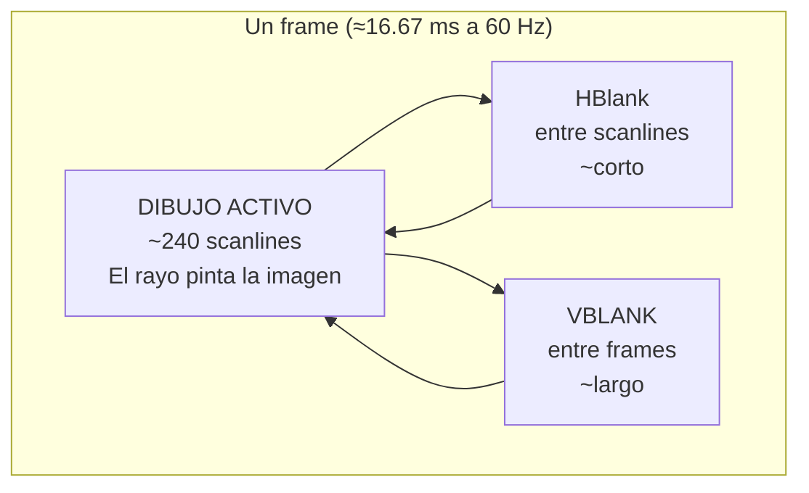

| Periodo | Ocurre | Duración (CPU) | Utilidad |
|---|---|---|---|
| **HBlank** | Entre scanlines | Corto | Reposicionar rayo |
| **VBlank** | Entre frames | **2,273 ciclos de CPU** | **Actualizar memoria de PPU** |

El VBlank es la **ventana de tiempo** donde la CPU puede actualizar las memorias de la PPU sin romper la imagen.

---

## 3. La CPU

La CPU ejecuta el código del juego almacenado en la **PRG-ROM** del cartucho. Son instrucciones simples (sumas, escrituras en memoria) ejecutadas muy rápido.

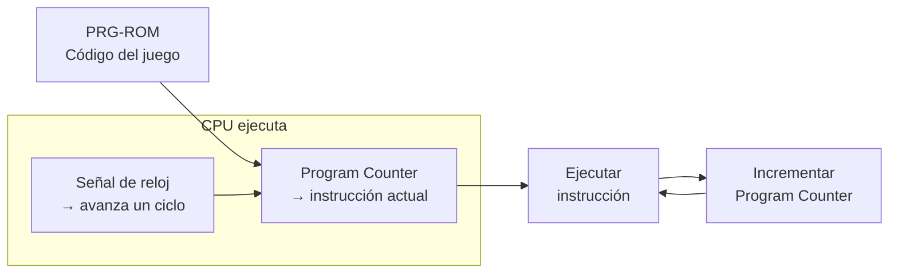

### 3.1 Program Counter y ciclos

- Cada ciclo de CPU ejecuta **parte de una instrucción** (las instrucciones llevan varios ciclos)
- La CPU avanza cuando recibe la **señal de reloj**
- Frecuencia de CPU: **1.79 MHz** (1,790,000 ciclos por segundo)

---

## 4. La PPU

La PPU genera la señal de video. En **cada ciclo de PPU** (llamado **dot**) pinta **un píxel** en pantalla.

> Frecuencia PPU: 5.37 MHz → 5,370,000 dots por segundo

---

## 5. Coordinación: el reloj maestro

La NES tiene un **reloj maestro** que corre a **21.47727 MHz**. De ahí se derivan todas las frecuencias:

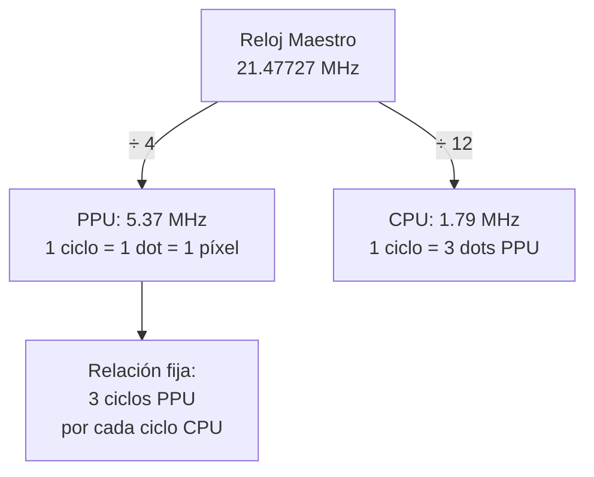

| Chip | División | Frecuencia |
|---|---|---|
| Reloj maestro | — | **21.47727 MHz** |
| PPU | ÷ 4 | **5.37 MHz** (1 dot = 1 píxel) |
| CPU | ÷ 12 | **1.79 MHz** |

**Cada ciclo de CPU ocurre exactamente cada 3 dots de PPU.** Esta relación constante permite una coreografía a nivel de píxel entre ambos chips. En el emulador Mesen se puede ver cómo los dots se dibujan en grupos de 3.

---

## 6. Comunicación CPU ↔ PPU

CPU y PPU tienen **mundos de memoria separados**. La CPU no accede directamente a las memorias de la PPU. En su lugar, usa **registros de PPU** expuestos en su propio mapa de direcciones — como un tablero de control.

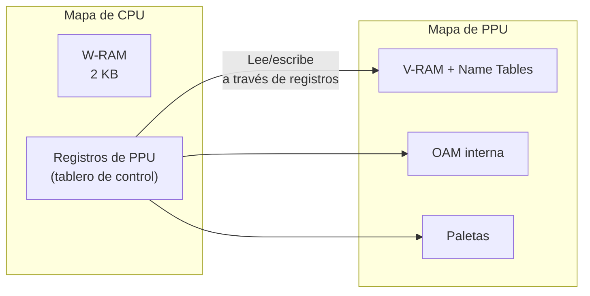

### 6.1 Registros de PPU

| Registro | Función |
|---|---|
| **PPU Address** + **PPU Data** | Leer/escribir en el mapa de direcciones de la PPU (VRAM, name tables, paletas) |
| **OAM Address** + **OAM Data** | Leer/escribir en la OAM (sprite por sprite) |
| **OAM DMA** | Copiar la **OAM entera** desde la W-RAM de la CPU |
| **PPU Scroll** | Actualizar el offset de scrolling |
| **PPU Mask** | Activar/desactivar dibujado de sprites y fondo |
| **PPU Control** | Configurar NMI, modo de sprites, etc. |

### 6.2 Shadow OAM y OAM DMA

Como los sprites se mueven constantemente, la CPU mantiene una **copia exacta de la OAM en la W-RAM** (llamada **Shadow OAM**):

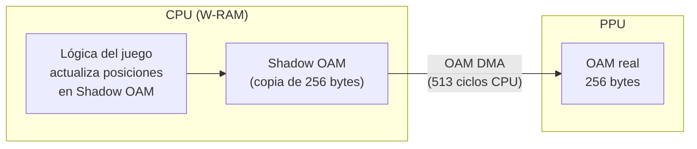

El registro **OAM DMA** permite copiar los 256 bytes de la Shadow OAM a la OAM real en **513 ciclos de CPU** (~15 scanlines). Esta copia debe hacerse durante el VBlank.

### 6.3 La regla de oro: actualizar en VBlank

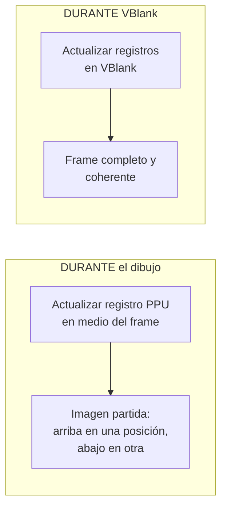

Si la CPU actualiza el scroll o la OAM en medio de un scanline, la imagen se **parte** — la mitad superior se dibuja con un estado y la inferior con otro.

---

## 7. La NMI — Non-Maskable Interrupt

La PPU necesita avisarle a la CPU que el VBlank está por empezar. Usa una **interrupción**: la **NMI** (Non-Maskable Interrupt).

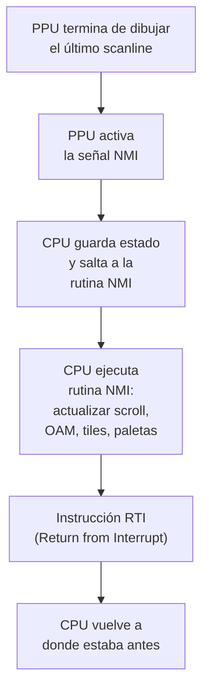

```
Sin NMI:
  PPU dibuja → PPU dibuja → PPU dibuja → ... (la CPU nunca se entera del VBlank)

Con NMI:
  PPU dibuja → ¡VBlank! → PPU: "NMI!" → CPU: "Actualizo gráficos" → PPU dibuja siguiente frame
```

La NMI se puede **desactivar** mediante el registro **PPU Control**. ¿Para qué querría un desarrollador desactivarla? Lo veremos en el bucle de juego.

---

## 8. El bucle de juego ideal

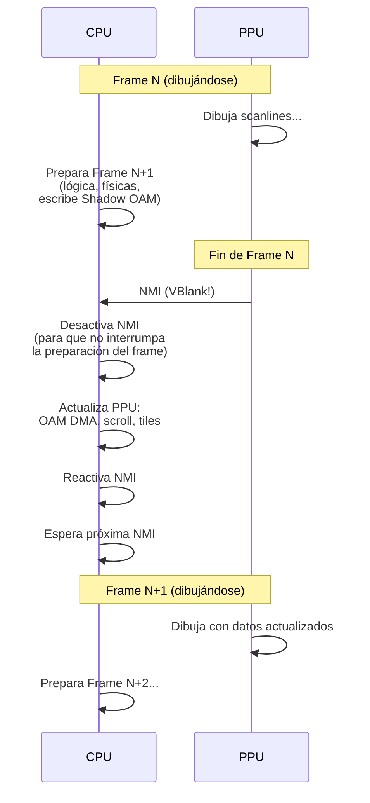

**Flujo ideal (60 fps):**

1. La PPU dibuja el Frame N (toma ~16.67 ms)
2. **Mientras tanto**, la CPU prepara el Frame N+1: ejecuta lógica de juego, escribe posiciones en la Shadow OAM, prepara actualizaciones de tiles
3. Al terminar el dibujo, la PPU entra en VBlank y **dispara la NMI**
4. La CPU **desactiva la NMI** (para que no haya interrupciones durante la preparación del frame)
5. La CPU copia los datos preparados a la PPU (OAM DMA, tiles, scroll, paletas)
6. La CPU **reactiva la NMI** y se pone en espera hasta la próxima
7. La PPU dibuja el Frame N+1 con los datos actualizados

La CPU apaga la NMI mientras prepara el frame para que el VBlank del frame anterior no interrumpa la preparación. La vuelve a activar **solo cuando ya tiene todo listo**.

---

## 9. El slowdown: cuando el bucle falla

### 9.1 La pérdida de la NMI

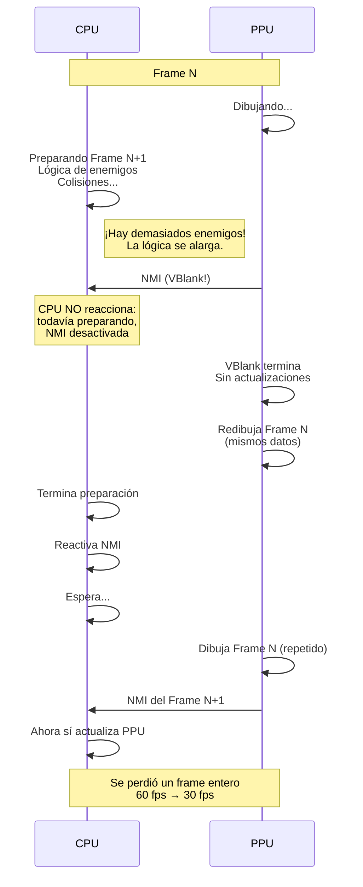

**Cuando la CPU no termina de preparar el frame antes del VBlank:**

1. La CPU todavía tiene la NMI desactivada (sigue preparando)
2. La NMI se **pierde** — la PPU no recibe actualizaciones
3. La PPU redibuja el **mismo frame de antes** (los datos no cambiaron)
4. La CPU termina su preparación, reactiva la NMI y **espera un frame entero**
5. **El frame rate se reduce a la mitad: 60 → 30 fps**

### 9.2 Frame rate atado a la lógica

**Los juegos de la NES ataban la lógica al frame rate.** La posición de los personajes, el temporizador, todo se calculaba como "por frame", no como "por unidad de tiempo real":

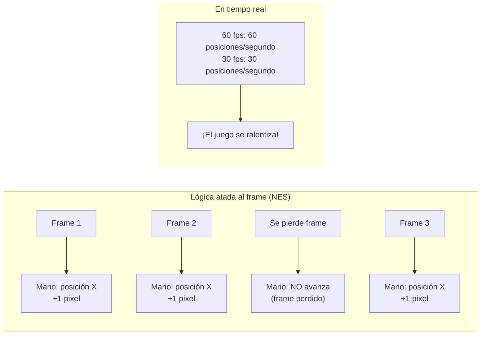

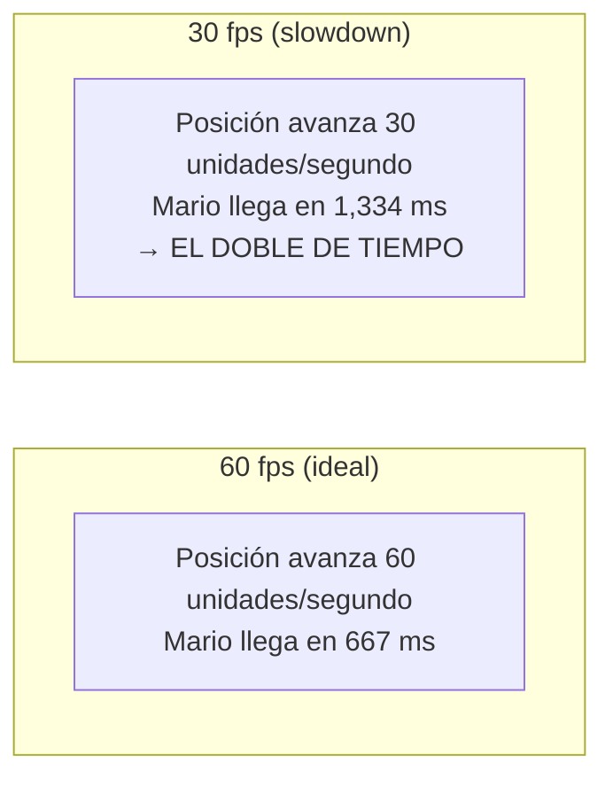

**Consecuencia:** el juego no solo se ve entrecortado, sino que **todo se mueve más lento** — personajes, enemigos, proyectiles, temporizadores.

### 9.3 Delta Time

Los juegos modernos usan un enfoque diferente: **Delta Time** — el tiempo real transcurrido entre frames.

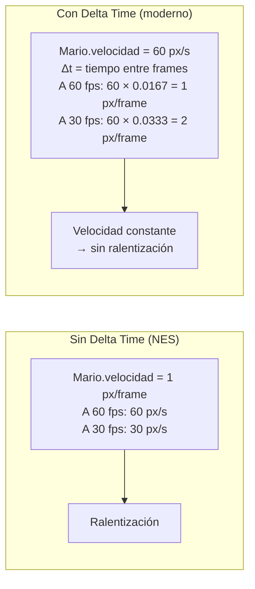

| Método | 60 fps | 30 fps | Resultado |
|---|---|---|---|
| **Frame-based (NES)** | 60 px/s | 30 px/s | Ralentización |
| **Delta Time (moderno)** | 60 px/s | 60 px/s | **Velocidad constante** |

Con Delta Time, cuando el frame rate cae, el personaje avanza **el doble por frame** para compensar, manteniendo la velocidad real constante.

---

## 10. Estrategias de los desarrolladores

### 10.1 Ghosts 'n Goblins: actualización parcial

Ghosts 'n Goblins no actualizaba todo en VBlank. Actualizaba el scroll en un punto del frame y los sprites en otro, generando una imagen **parcialmente rota** pero funcional. El juego se ve "trabado" pero no es un slowdown clásico — son **actualizaciones escalonadas** por diseño.

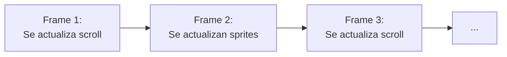

### 10.2 Teenage Mutant Ninja Turtles: 30 fps fijos

TMNT sabía que la pantalla se llenaría de enemigos y el bucle colapsaría. En lugar de lidiar con slowdowns impredecibles, **apuntaba directamente a 30 fps**:

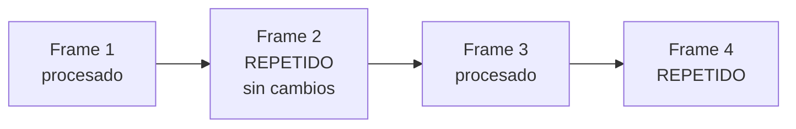

Al repetir siempre un frame intermedio, la carga se distribuía en **dos ciclos de CPU** y se garantizaba que nunca se cayeran más frames de la cuenta. La experiencia era consistente, aunque a mitad de velocidad.

---

## 11. El problema de PAL

Las regiones PAL corren a **50 Hz** (50 fps). Si un juego desarrollado para NTSC (60 fps) se ejecuta en una consola PAL sin adaptar:

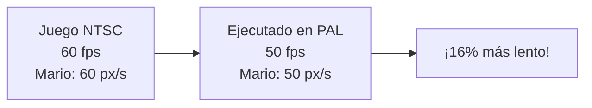

| Región | Frecuencia | Velocidad del juego |
|---|---|---|
| NTSC (Japón/USA) | 60 Hz | 100% (original) |
| PAL (Europa) sin adaptar | 50 Hz | **~83%** (16% más lento) |
| PAL con adaptación de código | 50 Hz | 100% (movimiento ajustado por frame) |

La corrección requería **modificar el código del juego** para que moviera más distancia por frame. También se cambiaba el reloj maestro y se usaban variantes de PPU y CPU para PAL.

El hardware se adaptaba con un cristal de reloj diferente y cambios en la división de frecuencia:

```
NTSC: Reloj maestro 21.47727 MHz → CPU ÷ 12 = 1.79 MHz
PAL:  Reloj maestro 21.28137 MHz → CPU ÷ 12 = 1.77 MHz (ligeramente distinto)
```

---

## 12. Conclusión

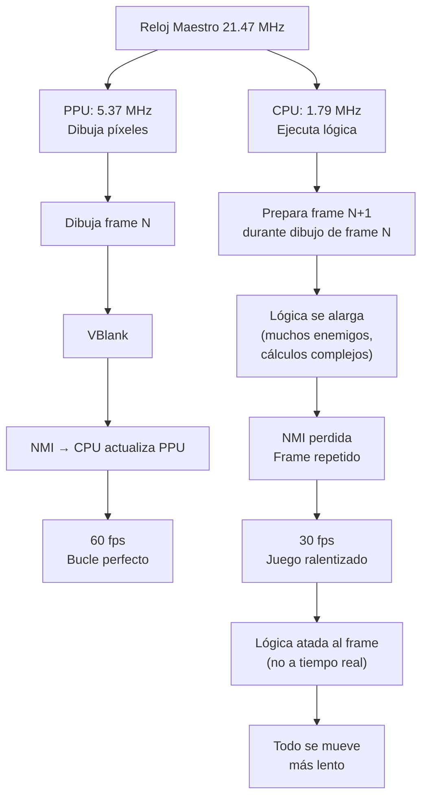

### Resumen

| Concepto | Clave |
|---|---|
| **Coordinación** | Reloj maestro único → CPU y PPU sincronizadas a nivel de píxel (3:1) |
| **VBlank** | Única ventana segura para actualizar memoria de PPU (2,273 ciclos CPU) |
| **NMI** | Interrupción que avisa a la CPU que empezó el VBlank |
| **Slowdown** | CPU no termina preparación → se pierde NMI → frame repetido → 30 fps |
| **Frame-based** | Lógica atada a frames, no a tiempo real → velocidad depende del frame rate |
| **Delta Time** | Solución moderna que desacopla velocidad del frame rate |
| **PAL** | 50 Hz vs 60 Hz → juegos NTSC corren 16% más lento sin adaptación |
| **Estrategias** | Ghosts 'n Goblins (actualización parcial), TMNT (30 fps fijos) |

---

> **Fuente:** Transcripción del video *"La NES a FONDO - Parte 4: El bucle de Juego y el SLOWDOWN"* (YouTube)
