# La NES a Fondo — Parte 5: El Trucazo de la NES (Raster Effects)

> Basado en la transcripción del video *"El TRUCAZO de la NES que no conocías"*.  
> Cómo los desarrolladores modificaban los gráficos en el medio del barrido para lograr efectos imposibles.

---

## Índice

1. [Introducción](#1-introducción)
2. [El problema del HUD](#2-el-problema-del-hud)
   - [2.1 HUD con sprites vs. fondo](#21-hud-con-sprites-vs-fondo)
3. [Raster Effects: partir la pantalla](#3-raster-effects-partir-la-pantalla)
   - [3.1 El truco: cambiar scroll en el HBlank](#31-el-truco-cambiar-scroll-en-el-hblank)
4. [Técnica 1: Cycle Counting](#4-técnica-1-cycle-counting)
   - [4.1 Problema: la NMI llega en momentos distintos](#41-problema-la-nmi-llega-en-momentos-distintos)
   - [4.2 La línea loca](#42-la-línea-loca)
5. [Técnica 2: Sprite Zero Hit](#5-técnica-2-sprite-zero-hit)
   - [5.1 Cómo funciona](#51-cómo-funciona)
   - [5.2 En Super Mario Bros.](#52-en-super-mario-bros)
6. [Espera activa y limitaciones](#6-espera-activa-y-limitaciones)
   - [6.1 Un solo split por frame (sin mapper)](#61-un-solo-split-por-frame-sin-mapper)
   - [6.2 Excepciones: Chaos World y Battletoads](#62-excepciones-chaos-world-y-battletoads)
7. [Bonus Track: PPU Mask](#7-bonus-track-ppu-mask)
   - [7.1 Bits de énfasis (color)](#71-bits-de-énfasis-color)
   - [7.2 Render de sprites y fondo](#72-render-de-sprites-y-fondo)
   - [7.3 Máscara de columna izquierda](#73-máscara-de-columna-izquierda)
   - [7.4 Escala de grises](#74-escala-de-grises)
8. [Conclusión](#8-conclusión)

---

## 1. Introducción

En los videos anteriores vimos la operatoria **normal** de la NES: tiles, sprites, fondos, paletas, el bucle de juego. Pero hay efectos que **no se pueden explicar** con esa operatoria normal:

```
❓ Battletoads → parallax con múltiples capas
❓ Chaos World → scroll loco en la introducción
❓ Felix the Cat → imagen más oscura
❓ "Línea loca" que aparece en varios juegos
❓ ¿Cómo se mantiene el HUD fijo mientras el fondo scrollea?
```

**Respuesta:** modificando los gráficos **en el medio del barrido**, entre scanlines. Esto se llama **Raster Effects**.

---

## 2. El problema del HUD

### 2.1 HUD con sprites vs. fondo

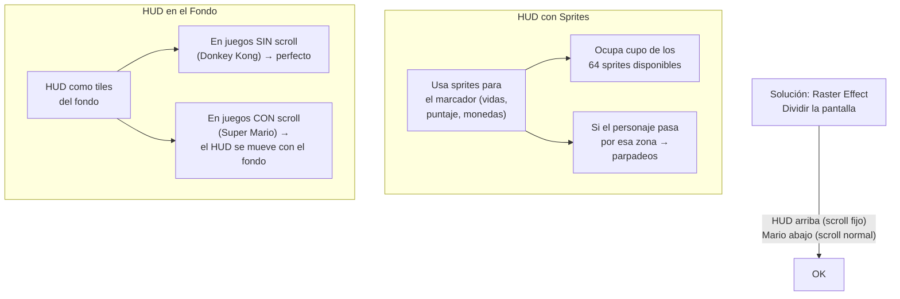

**Solución ideal:** que el HUD esté en el fondo (para no gastar sprites), pero que **no se mueva al scrollear**. Para eso hay que **partir la pantalla**.

---

## 3. Raster Effects: partir la pantalla

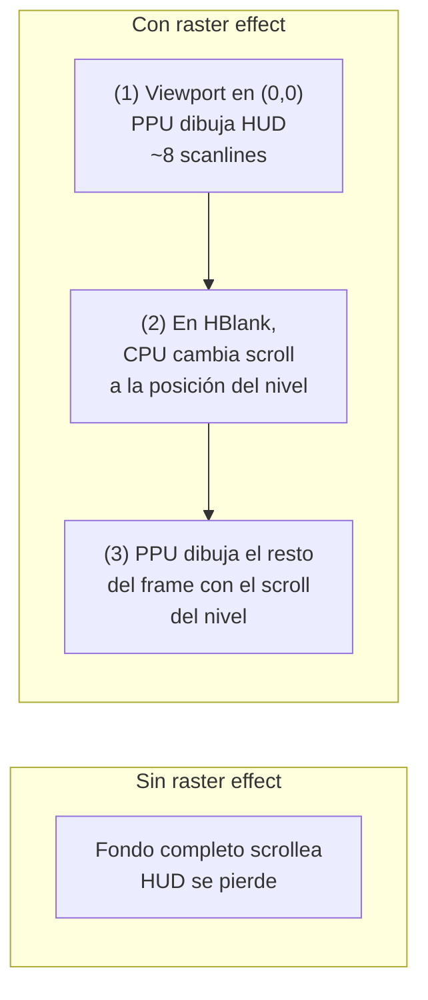

### 3.1 El truco: cambiar scroll en el HBlank

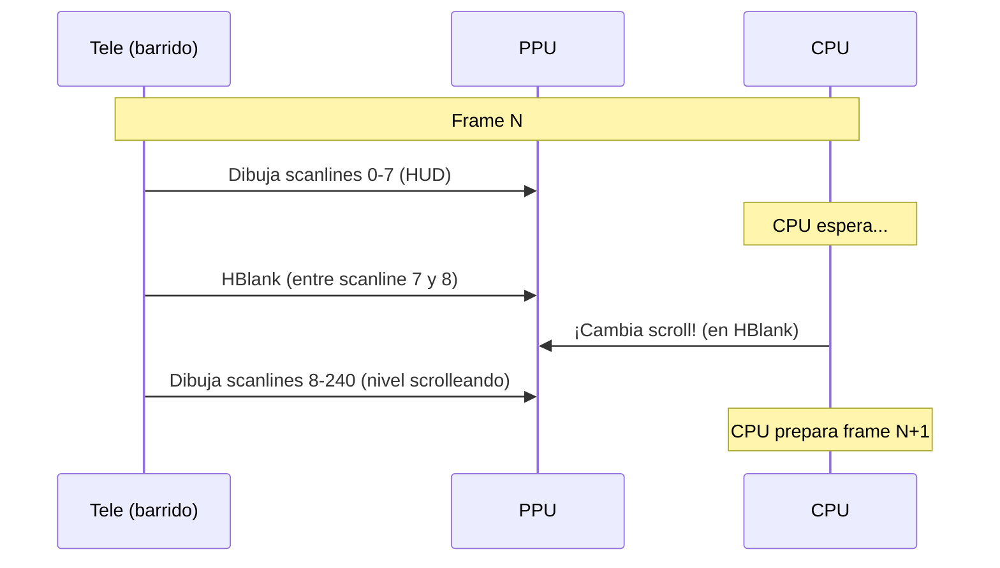

El **HBlank** (periodo entre scanlines donde el rayo está apagado) es la ventana perfecta para cambiar el scroll sin que se note.

**Resultado:** el HUD se mantiene fijo arriba, el nivel scrollea abajo — aunque todo es el mismo fondo.

---

## 4. Técnica 1: Cycle Counting

La forma más directa de partir la pantalla: **contar ciclos de CPU**.

Como la CPU y la PPU comparten el mismo reloj maestro (relación 3:1 — 3 dots PPU por cada ciclo CPU), se puede calcular exactamente cuántos ciclos de CPU tardan las primeras scanlines:

```
1 scanline = 341 dots PPU ≈ 113.67 ciclos CPU

Si queremos 8 scanlines de HUD:
  8 × 113.67 ≈ 909 ciclos CPU
```

El desarrollador escribe código cuya duración en ciclos sea **exactamente** la necesaria para llegar a la scanline deseada, y ahí ejecuta el cambio de scroll:

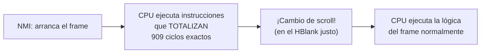

**City Connection** usaba esta técnica.

### 4.1 Problema: la NMI llega en momentos distintos

La NMI no interrumpe a la CPU **inmediatamente**. Tiene que esperar a que termine la instrucción actual, y las instrucciones tienen distinta duración (2, 3, 4, 5, 6, 7 ciclos...).

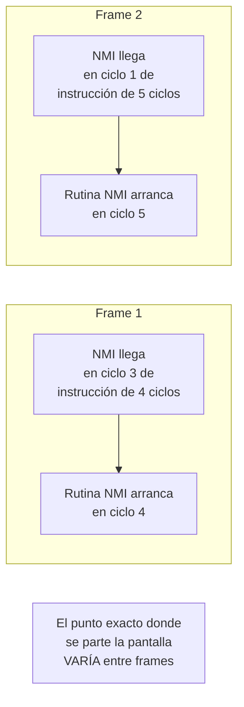

### 4.2 La línea loca

Esta variación causa un efecto visible: **la línea donde se parte la pantalla se mueve ligeramente** entre frames.

```
Frame 1: split en el píxel 42 de la scanline 8
Frame 2: split en el píxel 38 de la scanline 8
Frame 3: split en el píxel 44 de la scanline 8
...
```

Como el split ocurre **en el medio de una scanline** (no entre scanlines), y la posición varía, se ve una **línea "bailando"** — la famosa **línea loca** de la NES.

> Si querés contarlo en un asado: "se está partiendo la pantalla en el medio de la línea de dibujado, y como la NMI no cae siempre en el mismo ciclo, la línea se mueve."

Este glitch es más visible en juegos complejos (los que más se acercan al límite de la máquina).

---

## 5. Técnica 2: Sprite Zero Hit

### 5.1 Cómo funciona

La PPU tiene un registro **PPU Status** que contiene un bit especial: **Sprite Zero Hit**.

```
PPU Status:
  Bit 6: Sprite Zero Hit (se pone a 1 cuando...)
  
  El primer sprite de la OAM (Sprite 0) colisiona
  con un píxel de color del fondo.
```

**Sprite 0 "fantasma" en Super Mario Bros.:**

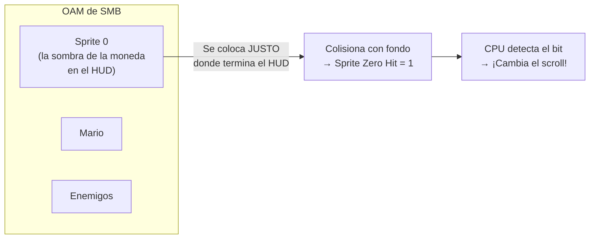

### 5.2 En Super Mario Bros.

SMB no cuenta ciclos. En su lugar:

1. Coloca el **Sprite 0** (primer sprite de la OAM) en la posición exacta donde termina el HUD
2. El sprite 0 tiene un píxel de color justo donde el fondo también tiene color
3. Cuando la PPU dibuja esa scanline, el Sprite 0 colisiona con el fondo → **Sprite Zero Hit = 1**
4. La CPU detecta el cambio del bit y **ejecuta el cambio de scroll**

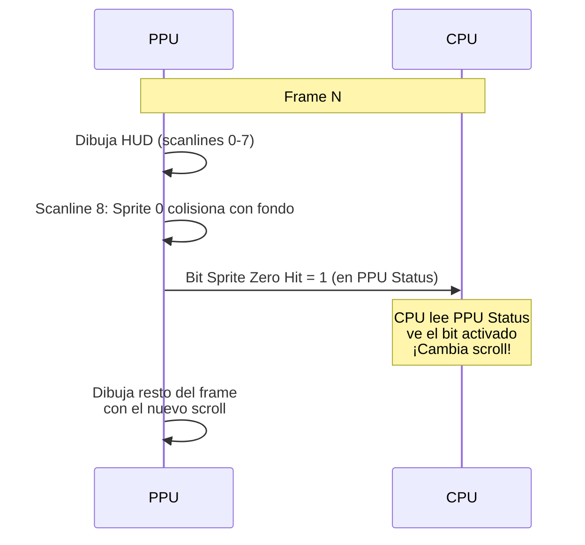

Ventaja sobre cycle counting: **no importa cuándo arrancó la NMI**. El Sprite Zero Hit es un punto de sincronización **absoluto** determinado por la posición del sprite, no por el timing de la CPU.

---

## 6. Espera activa y limitaciones

### 6.1 Un solo split por frame (sin mapper)

Partir la pantalla requiere que la CPU esté en **espera activa** (*busy waiting*): ejecutando instrucciones que no hacen nada solo para contar tiempo.

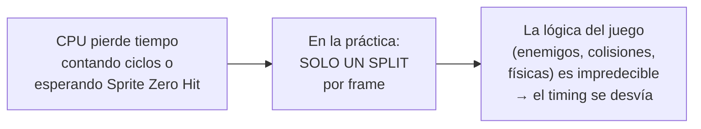

El HUD está arriba precisamente porque es la zona más fácil: el frame arranca, se cuentan las primeras scanlines (predecibles), y después se suelta el scroll.

### 6.2 Excepciones: Chaos World y Battletoads

**Chaos World — introducción:**

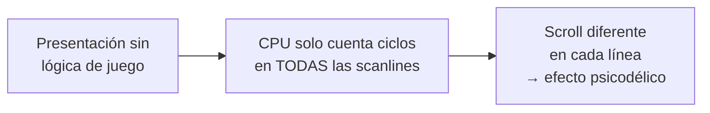

Como no hay juego (no hay enemigos, colisiones, input del jugador), la CPU puede dedicarse **100% a contar ciclos**, scanline por scanline.

**Battletoads — parallax:**

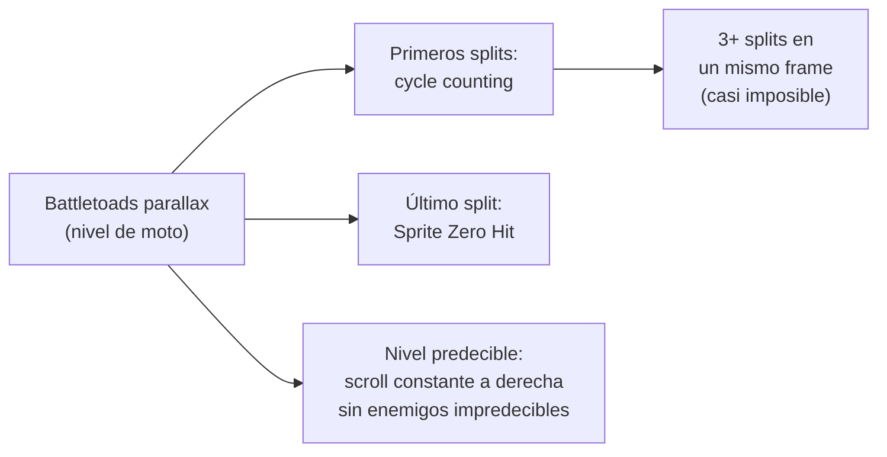

Battletoads lograba múltiples splits porque:
1. El nivel tiene un comportamiento **muy predecible** (scroll constante a la derecha)
2. Usaban **todas las técnicas combinadas**: cycle counting + Sprite Zero Hit
3. Los desarrolladores eran **cracks**

Pero esto era la excepción. La regla era: **un solo split por frame**... hasta que llegaron los **mappers** con su IRQ por scanline.

---

## 7. Bonus Track: PPU Mask

El registro **PPU Mask** de la PPU tiene 8 bits que activan funciones de enmascaramiento.

```
PPU Mask ($2001):
  Bit 7: Énfasis azul
  Bit 6: Énfasis verde
  Bit 5: Énfasis rojo
  Bit 4: Renderizar sprites
  Bit 3: Renderizar fondo
  Bit 2: Máscara sprites (columna izquierda)
  Bit 1: Máscara fondo (columna izquierda)
  Bit 0: Escala de grises
```

### 7.1 Bits de énfasis (color)

Los bits 5, 6, 7 **no resaltan** el color indicado, sino que **bajan la intensidad de los otros dos**:

| Bits RGB | Efecto real |
|---|---|
| Énfasis azul | Baja intensidad de rojo y verde → imagen más azulada |
| Énfasis verde | Baja intensidad de rojo y azul → imagen más verdosa |
| Énfasis rojo | Baja intensidad de verde y azul → imagen más rojiza |
| **Todos activos** | **Atenúan los 3 componentes → imagen menos saturada, más oscura** |

**Felix the Cat** y otros juegos usaban los 3 bits de énfasis activos, dando una imagen **más oscura**. En teles CRT se veía como colores desaturados (todavía se veía bien). En emuladores modernos se nota mucho más.

### 7.2 Render de sprites y fondo

| Bit | Función | Uso común |
|---|---|---|
| 4 | Activar/desactivar render de sprites | Pantalla negra durante carga masiva |
| 3 | Activar/desactivar render de fondo | Pantalla negra durante carga masiva |

### 7.3 Máscara de columna izquierda

| Bit | Función |
|---|---|
| 2 | Ocultar sprites en los primeros **8 píxeles** de la pantalla |
| 1 | Ocultar fondo en los primeros **8 píxeles** de la pantalla |

Estos bits ocultaban defectos gráficos en el borde izquierdo, especialmente en juegos con scroll mixto. Por eso casi todos los juegos avanzados tienen esa **columna oscura a la izquierda** — son 8 píxeles enmascarados.

### 7.4 Escala de grises

Bit 0: pone **toda la imagen en escala de grises**. Pocos juegos lo usaban, pero algunos lo aprovechaban para efectos especiales.

---

## 8. Conclusión

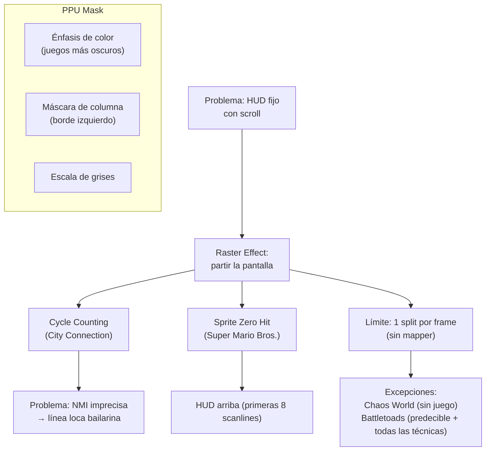

| Técnica | Cómo funciona | Usado por |
|---|---|---|
| **Cycle Counting** | CPU cuenta ciclos exactos para cambiar scroll en el HBlank preciso | City Connection |
| **Sprite Zero Hit** | Sprite 0 colisiona con fondo → PPU Status bit → CPU cambia scroll | **Super Mario Bros.** (y la mayoría) |
| **PPU Mask énfasis** | Atenúa colores → imagen más oscura | Felix the Cat |
| **PPU Mask columna** | Oculta primeros 8 px (borde izquierdo) | Juegos con scroll mixto |

El mayor limitante: la CPU tenía que estar en **espera activa**, perdiendo tiempo de procesamiento. Por eso el HUD siempre está **arriba** (se cuenta al inicio del frame y después se libera la CPU para el juego).

**Todo esto cambió con los mappers**, que aportaron una IRQ por scanline sin que la CPU tuviera que contar nada.

---

> **Próximo video:** Los Mappers — cómo un chip en el cartucho revolucionó los gráficos de la NES.
>
> **Fuente:** Transcripción del video *"El TRUCAZO de la NES que no conocías"* (YouTube)
