# La NES a Fondo — Parte 6: Mappers

> Basado en la transcripción del video *"El CHIP que REVOLUCIONÓ los GRÁFICOS de la NES"*.  
> Cómo unos chips en los cartuchos transformaron los gráficos de la NES de básicos a extraordinarios.

---

## Índice

1. [Introducción](#1-introducción)
2. [El cartucho básico](#2-el-cartucho-básico)
   - [2.1 Limitaciones](#21-limitaciones)
3. [Bank Switching — El origen de los mappers](#3-bank-switching--el-origen-de-los-mappers)
   - [3.1 City Connection y Jaleco](#31-city-connection-y-jaleco)
   - [3.2 Ventanas: bancos más chicos, más control](#32-ventanas-bancos-más-chicos-más-control)
4. [Animación de tiles con mappers](#4-animación-de-tiles-con-mappers)
   - [4.1 La forma tradicional: cambiar el tile map](#41-la-forma-tradicional-cambiar-el-tile-map)
   - [4.2 Con mappers: cambiar el tile set](#42-con-mappers-cambiar-el-tile-set)
   - [4.3 Comparativa: SMB1 vs SMB3](#43-comparativa-smb1-vs-smb3)
5. [Comunicación CPU ↔ Mapper](#5-comunicación-cpu--mapper)
6. [Bank Switching en PRG ROM](#6-bank-switching-en-prg-rom)
7. [Mirroring Dinámico](#7-mirroring-dinámico)
   - [7.1 Metroid: scroll que cambia sobre la marcha](#71-metroid-scroll-que-cambia-sobre-la-marcha)
8. [La IRQ del Mapper — Scanline Counting](#8-la-irq-del-mapper--scanline-counting)
   - [8.1 Cómo cuenta scanlines](#81-cómo-cuenta-scanlines)
   - [8.2 Split screen sin que la CPU se involucre](#82-split-screen-sin-que-la-cpu-se-involucre)
   - [8.3 Efectos posibles](#83-efectos-posibles)
9. [CHR RAM — Escribir tiles en tiempo real](#9-chr-ram--escribir-tiles-en-tiempo-real)
   - [9.1 Battletoads: parallax por sprite](#91-battletoads-parallax-por-sprite)
   - [9.2 Elite: 3D en la NES](#92-elite-3d-en-la-nes)
10. [Famicom Disk System](#10-famicom-disk-system)
11. [Filosofía de diseño](#11-filosofía-de-diseño)
12. [Conclusión](#12-conclusión)

---

## 1. Introducción

En 1983 se lanzó la Famicom en Japón (1985 como NES en EE.UU.). En sus 10 años de vida, los juegos pasaron de **esto** a **esto**:

```
1983: Circus Charlie, Popeye
    → Fondos estáticos, pocas tiles, cambios de paleta
    
1993: Kirby's Adventure, Battletoads, Ninja Gaiden 3
    → Scroll variable, fondos animados, parallax, ¡y hasta 3D!
```

El causante: el **Mapper** — un chip auxiliar dentro del cartucho que expandía las capacidades de la consola.

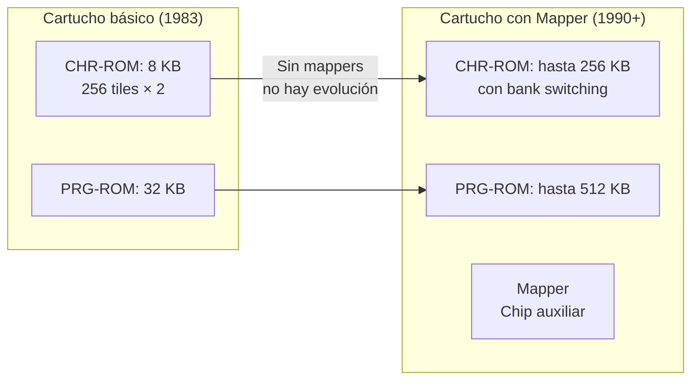

---

## 2. El cartucho básico

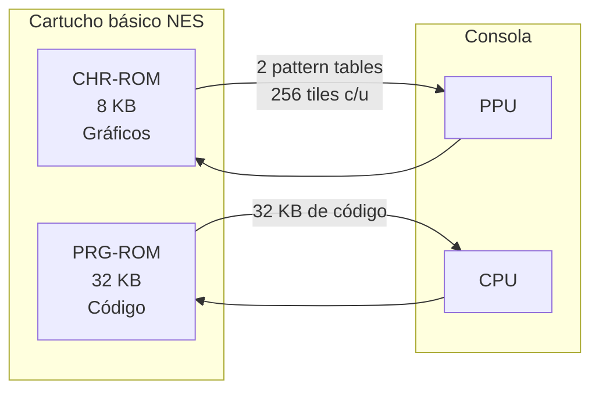

| Memoria | Tamaño máx. | Conectada a | Contenido |
|---|---|---|---|
| **CHR-ROM** | 8 KB | PPU | 2 pattern tables × 256 tiles (8×8 px, 4 colores) |
| **PRG-ROM** | 32 KB | CPU | Código del juego |

### 2.1 Limitaciones

La CHR-ROM está **rígidamente estructurada**:

```
CHR-ROM (8 KB):
  ├─ Pattern Table 0 (4 KB): 256 tiles → sprites o fondo
  └─ Pattern Table 1 (4 KB): 256 tiles → fondo o sprites
  Total: 512 tiles fijas. Sin importar cuánta memoria metas.
```

La PPU asigna **8 KB de direcciones** a la CHR-ROM (2 rangos de 4 KB). La CPU asigna **32 KB** a la PRG-ROM. No se puede direccionar más sin ayuda externa.

---

## 3. Bank Switching — El origen de los mappers

### 3.1 City Connection y Jaleco

Jaleco decidió meter una **CHR-ROM de 16 KB** en City Connection, el doble de lo que la PPU podía direccionar. Para ello agregó **chips lógicos (chips TTL)** que permitían seleccionar qué parte de la memoria se le mostraba a la PPU:

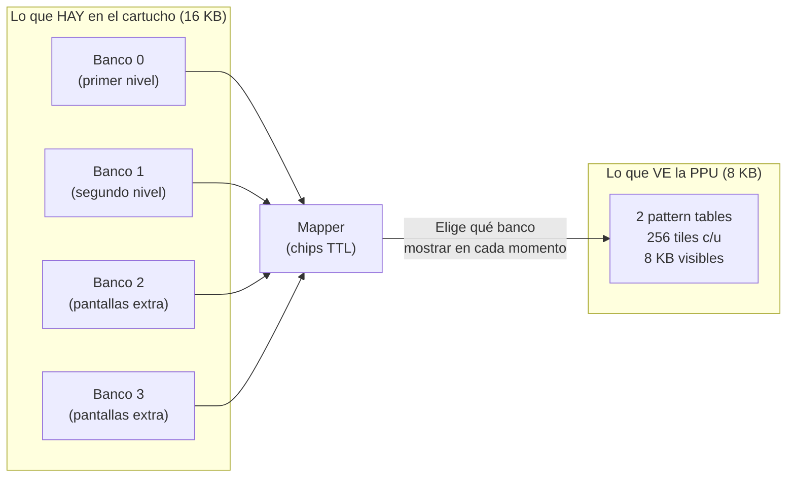

**Bank switching**: tomar una memoria más grande y mostrar solo una parte (un "banco") en el rango de direcciones fijo de la PPU/CPU.

**Impacto inmediato:**

| Sin mapper | Con mapper |
|---|---|
| 512 tiles para TODO el juego | 512 tiles POR NIVEL |
| Variedad solo por cambio de paleta | Cada nivel tiene su propio tile set |
| Circus Charlie, Popeye | City Connection, Contra |

### 3.2 Ventanas: bancos más chicos, más control

Pronto aparecieron **ASICs** (Application-Specific ICs) como el **VRC de Konami**, que permitían dividir las pattern tables en **ventanas** más pequeñas:

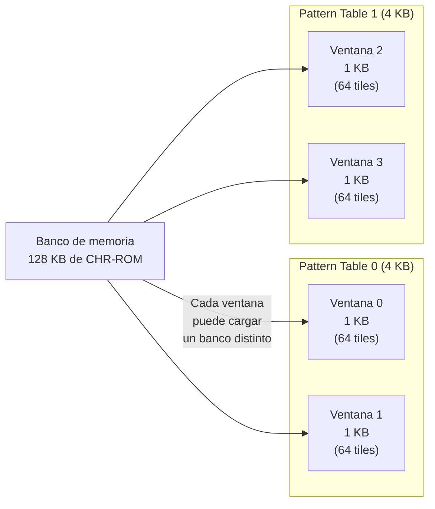

Cada ventana se podía cargar con un banco de memoria diferente **de forma independiente**. De este modo se podía mantener parte de la pattern table estática mientras se cambiaba solo una ventana (por ejemplo, para animación).

---

## 4. Animación de tiles con mappers

### 4.1 La forma tradicional: cambiar el tile map

Para animar el fondo sin mapper, había que **reescribir el tile map** (name table):

```
Frame 1: tile #10 en posición (5,5) → hoja verde
Frame 2: tile #11 en posición (5,5) → hoja amarilla
```

Cada cambio requería una escritura en los registros de PPU **por cada tile**. Y solo cambiaba **esa instancia** de la tile.

### 4.2 Con mappers: cambiar el tile set

Con bank switching, se cambia **la tile en la pattern table**:

```
Frame 1: banco A → tile #10 = hoja verde
Frame 2: banco B → tile #10 = hoja amarilla
```

**Una sola escritura al mapper** cambia **todas las hojas del nivel a la vez**.

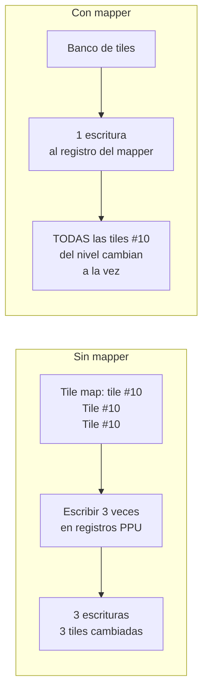

### 4.3 Comparativa: SMB1 vs SMB3

| Juego | Técnica | Cómo se ve |
|---|---|---|
| **Super Mario Bros. (1985)** — Sin mapper | Cambio de **paleta** en tiles específicas | Bloque de interrogación parpadea cambiando colores |
| **Super Mario Bros. 3 (1988)** — Con mapper | **Bank switching** por frame | Animaciones complejas de bloques, tuberías, decorados |

Cada frame se cambiaban los bancos de CHR-ROM, generando ciclos de animación fluidos en los decorados del fondo.

---

## 5. Comunicación CPU ↔ Mapper

El mapper se asigna **las primeras direcciones del rango de la PRG-ROM** (originalmente para el código del juego). Escribir en esas direcciones **no escribe en memoria, sino en los registros internos del mapper**:

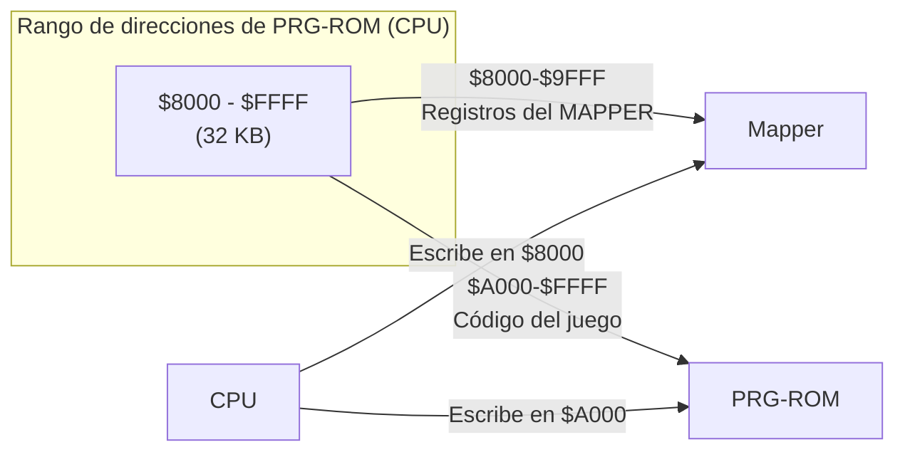

Si ves en un depurador que un juego escribe en direcciones como `$8000`, `$8001`, está **interactuando con el mapper**.

**Ejemplo:** escribir en `$8000` para cambiar el banco de la ventana 0.

---

## 6. Bank Switching en PRG-ROM

El bank switching también se aplicó a la **PRG-ROM** para meter más código. Los 32 KB originales se quedaron cortos:

| Juego | Tamaño de PRG-ROM |
|---|---|
| Super Mario Bros. | 32 KB |
| Super Mario Bros. 3 | 256 KB |
| **Kirby's Adventure** | **512 KB de código** + 256 KB de tiles |

Kirby's Adventure: **17 veces más código** que SMB1.

---

## 7. Mirroring Dinámico

En los cartuchos básicos, el **mirroring** (horizontal o vertical) se definía soldando un pin:

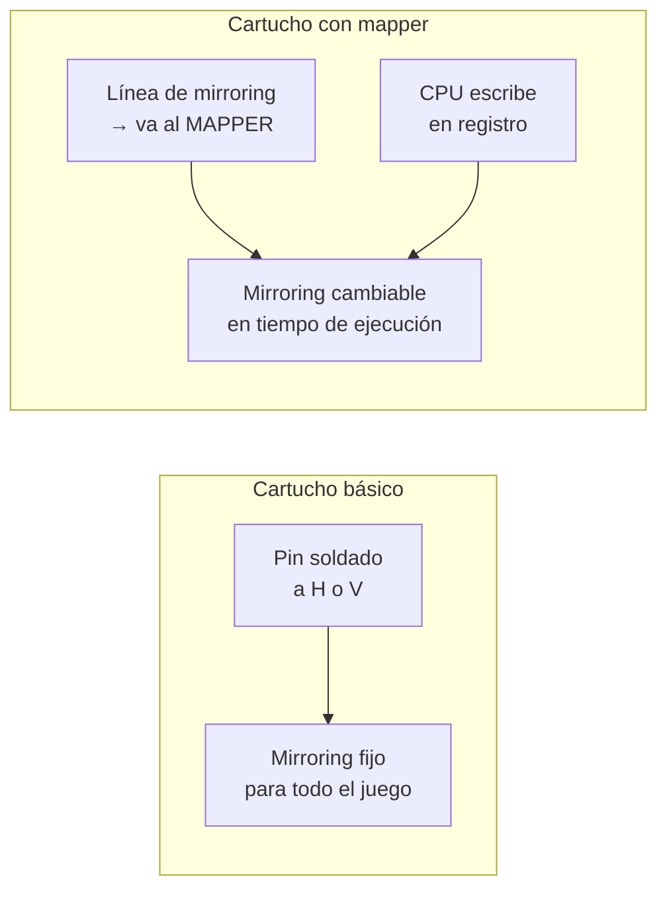

### 7.1 Metroid: scroll que cambia sobre la marcha

Metroid cambia constantemente entre scroll horizontal (pasillos anchos) y vertical (habitaciones altas). Con el mirroring dinámico, el mapper cambia el tipo de mirroring **en el medio del juego** cuando el jugador atraviesa una puerta.

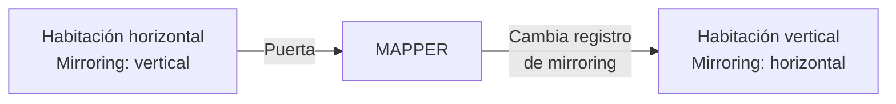

---

## 8. La IRQ del Mapper — Scanline Counting

### 8.1 Cómo cuenta scanlines

El mapper monitoriza dos señales de la consola:

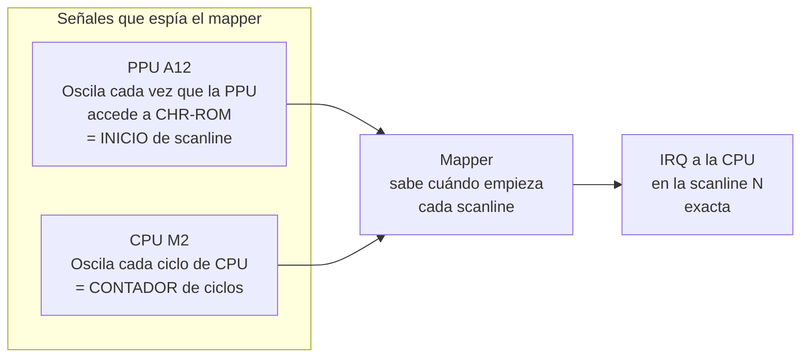

El mapper puede **contar scanlines** sin que la CPU tenga que hacerlo. Cuando llega a la línea configurada, dispara una **IRQ** a la CPU.

### 8.2 Split screen sin que la CPU se involucre

Antes de los mappers, partir la pantalla requería que la CPU **contara ciclos manualmente** para saber en qué scanline estaba. Esto:
- Consumía tiempo de CPU
- Solo permitía partir la pantalla **una vez** (para el HUD)
- Era propenso a errores

Con la IRQ del mapper:

```
CPU: "Mapper, avísame en la scanline #80."
Mapper: (cuenta 80 scanlines) → ¡IRQ!
CPU: (en la IRQ) → cambio scroll / paleta / lo que sea
```

### 8.3 Efectos posibles

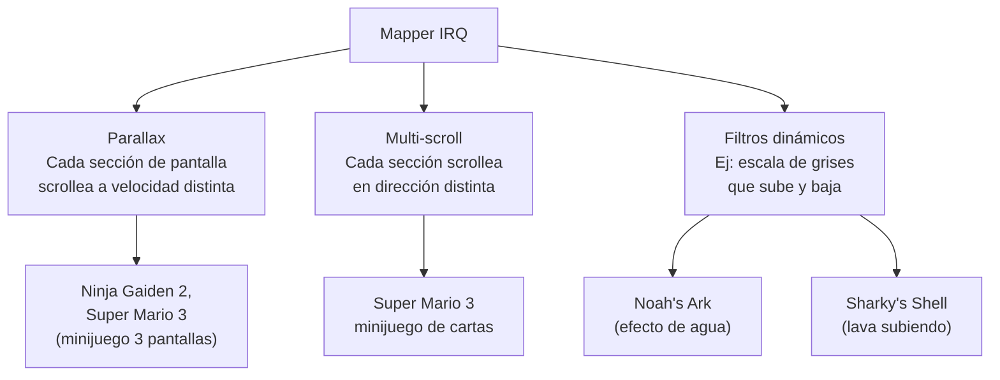

**Ninja Gaiden 2** y su parallax: en cada scanline específico, el mapper dispara una IRQ, la CPU cambia el scroll, y se generan **3 o más capas de parallax** a distintas velocidades, todo con un solo fondo.

**Super Mario 3 — minijuego:** la pantalla se parte en 3 secciones, cada una scrolleando horizontal y verticalmente de forma independiente.

---

## 9. CHR RAM — Escribir tiles en tiempo real

Hasta ahora hablamos de **CHR-ROM** (Read Only Memory). Pero algunos cartuchos usaban **CHR-RAM** — memoria RAM en lugar de ROM en el espacio de direcciones de la PPU.

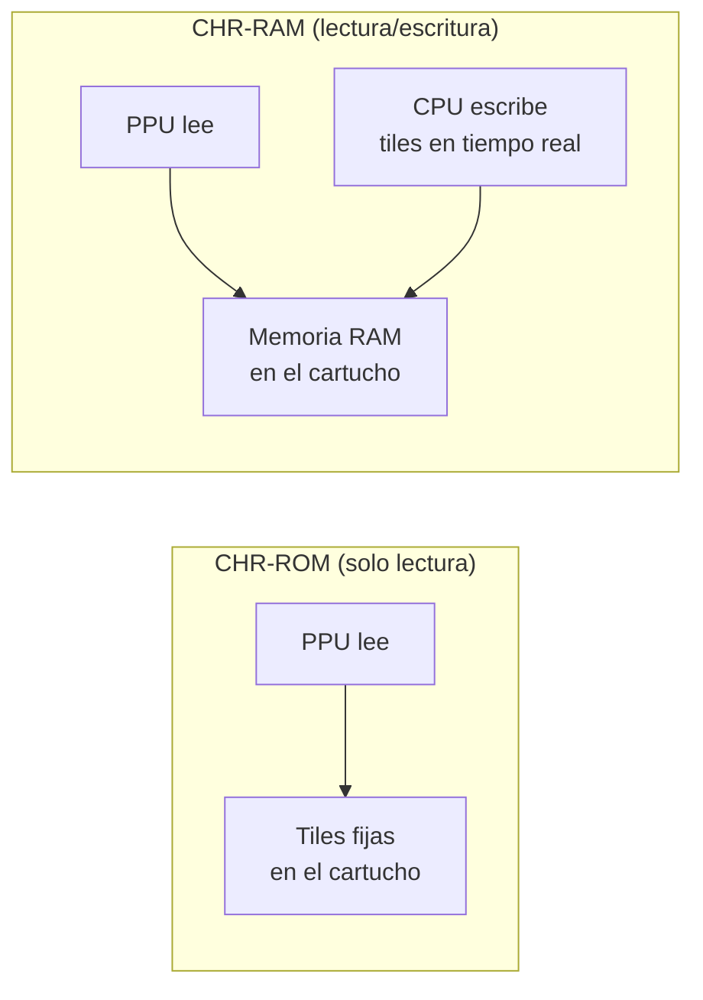

La CPU escribe en la CHR-RAM usando los registros **PPU Address** + **PPU Data** (los mismos que para name tables y paletas). Los datos pueden venir de la PRG-ROM o de la W-RAM.

### 9.1 Battletoads: parallax por sprite

Battletoads usa CHR-RAM para generar dos efectos de parallax **imposibles** con el hardware estándar:

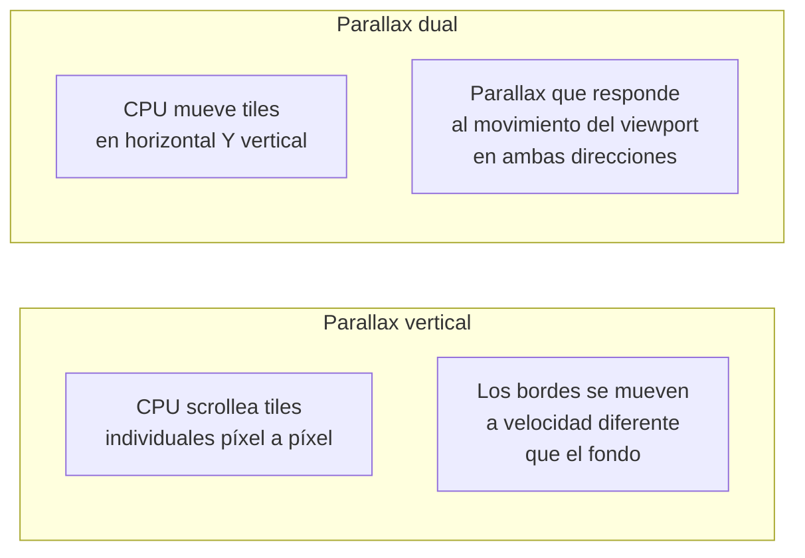

La CPU **no usa el scroll de la PPU**. La CPU misma mueve píxel a píxel las tiles escritas en CHR-RAM, creando un scroll paralelo independiente.

### 9.2 Elite: 3D en la NES

Elite es un juego de PC con gráficos 3D de alambre portado a la NES. El truco:

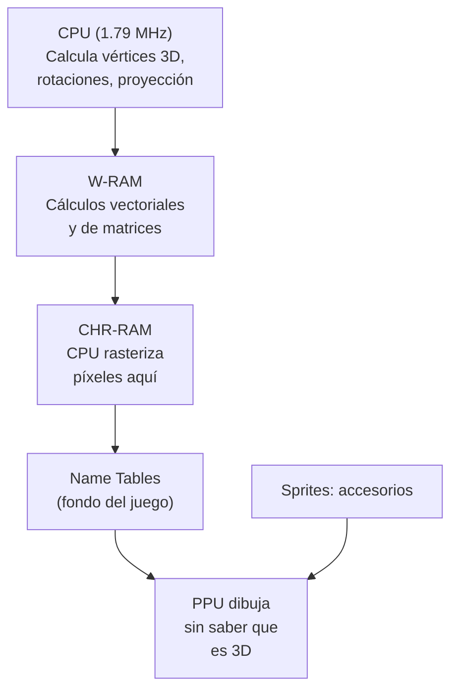

**Pipeline del 3D en NES:**

1. CPU calcula vértices 3D, rotaciones, transformaciones → en W-RAM
2. CPU aplica clipping y proyección (matemática de punto fijo)
3. CPU rasteriza: escribe los píxeles de los triángulos proyectados en la **CHR-RAM** (convertidos a tiles)
4. El fondo del juego (name tables) referencia esas tiles → la PPU dibuja el "3D" sin enterarse

> **[ ]** La PPU no sabe nada de 3D. Solo dibuja tiles. La CPU hace todo el trabajo de rasterización.

Todo esto corriendo en una CPU de 1.79 MHz. Los desarrolladores dejaron documentadas todas las optimizaciones en un sitio web.

---

## 10. Famicom Disk System

Antes de que los mappers explotaran, Nintendo intentó otra vía: el **Famicom Disk System** (1986, solo Japón).

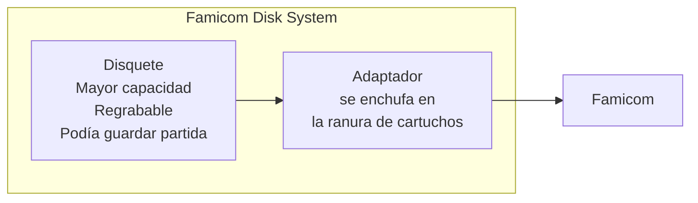

Ventajas del Disk System:
- Disquetes más baratos de producir que cartuchos
- Mayor capacidad de almacenamiento
- Permitía guardar la partida en el propio disquete
- El **mirroring dinámico** se originó aquí (el tipo de mirroring se almacenaba en el disquete)

Pero fracasó:
- Nintendo quería controlar la producción y cobrar regalías
- Los desarrolladores preferían mantener el control con cartuchos
- La tecnología de chips avanzó rápido → los cartuchos con mappers superaron al Disk System
- **Nunca salió de Japón**

Para lanzar Zelda, Metroid y SMB2 en EE.UU., Nintendo desarrolló su propio mapper: el **MMC** (Memory Management Controller). Y como Nintendo controlaba la producción de cartuchos en EE.UU. (por el sello de calidad post-crisis del 83), las third parties como Konami tenían que adaptarse al MMC si querían lanzar juegos con mapper en ese mercado.

---

## 11. Filosofía de diseño

La NES fue diseñada para ser **barata**, con el sobrecoste de juegos más complejos recayendo en los **cartuchos**:

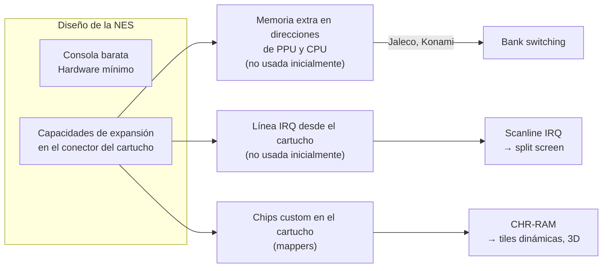

> No es que la NES "sin los chips extra no funcionaba". La consola **estaba diseñada** para que los cartuchos pudieran expandir sus capacidades.
>
> *"Tampoco es que metían un Ryzen en el cartucho y salían dando el Call of Duty."*

---

## 12. Conclusión

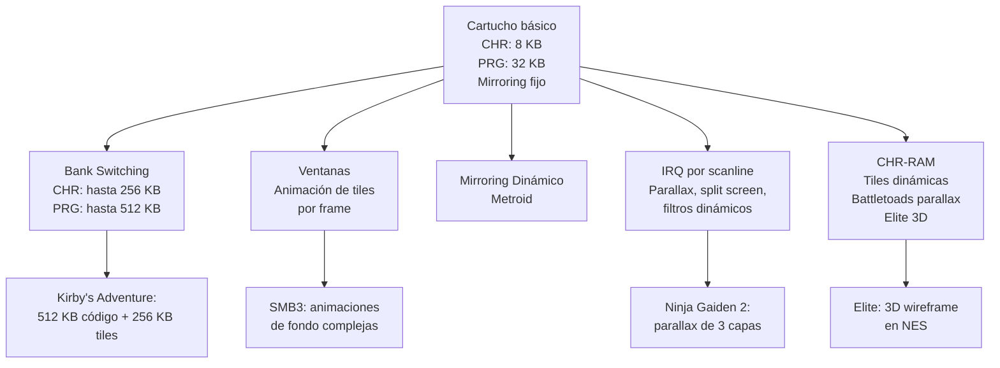

### Evolución de los mappers

| Generación | Característica | Juego representativo |
|---|---|---|
| **TTL discreto** | Bank switching básico (CHR-ROM mayor) | City Connection (Jaleco) |
| **ASIC (VRC, MMC)** | Ventanas, mirroring dinámico, IRQ | Contra (Konami), SMB3 (Nintendo) |
| **Avanzado (MMC3, VRC6)** | Scanline IRQ precisa, CHR-RAM | Ninja Gaiden 2, Battletoads |
| **Último grito** | CHR-RAM + CPU haciendo 3D | Elite |

Los mappers fueron la conjunción de:
1. **Ingenio descomunal** de los desarrolladores
2. **Arquitectura expandible** de la NES
3. Una época donde "se le sacaba jugo a las piedras"

---

> **Fin de la saga NES.**  
> Próximos temas posibles: Super Nintendo, Game Boy (arquitectura similar a NES), comparativas con Sega.
>
> **Fuente:** Transcripción del video *"El CHIP que REVOLUCIONÓ los GRÁFICOS de la NES"* (YouTube)
