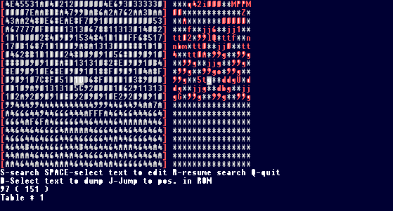
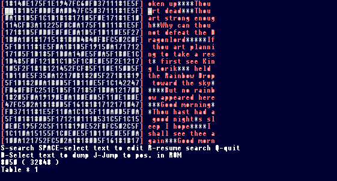
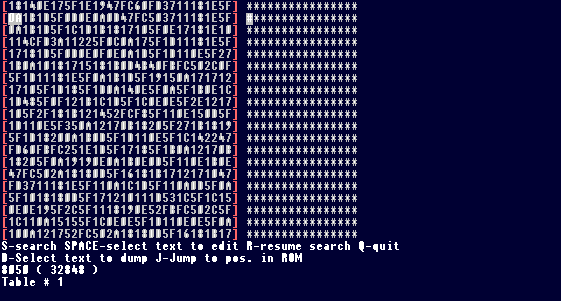
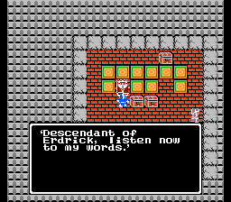
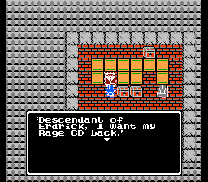
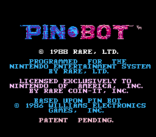
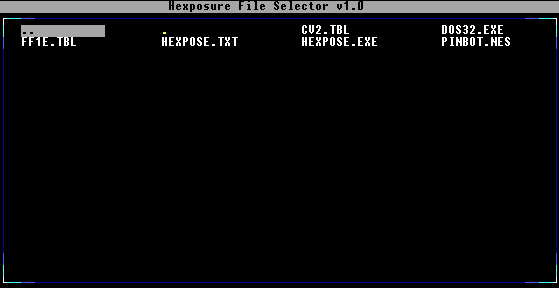
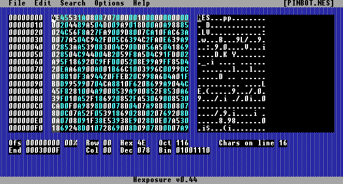
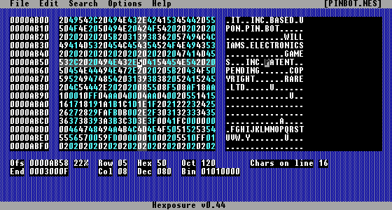

## Alteración de Texto

Cambiar el texto de un juego es un poco más complicado de lo que se podría pensar al principio. Cambiar los gráficos de las letras en las Pattern Tables o Tile Layer por otras letras definitivamente no es el camino a seguir, ya que no cambia el orden de las letras y hace que la mayoría de las palabras se conviertan en galimatías. Se pueden encontrar algunos ejemplos realmente malos de esto en algunos de los primeros hacks de ROMs de NES. Además, abrir una ROM en un editor de texto como el Bloc de notas normalmente no servirá de nada, ya que la mayoría de los juegos de NES no usan el estándar ASCII para almacenar el texto. Entonces, ¿cómo se hace? Primero necesitas conseguir un programa llamado Thingy, que también puedes encontrar en la sección de [Recursos](#RESOURCE) al final de este documento. Sin embargo, todavía no necesitas hacer nada con él. Es hora de volver a encender NESticle, y para este ejemplo vamos a usar un juego con más texto que Super Mario Brothers: Dragon Warrior 1.

Lo que necesitas:

- NESticle  
- Thingy  
- Una ROM de Dragon Warrior 1  
- Un editor de texto, como el Bloc de notas

Carga Dragon Warrior en NESticle y pulsa F2 para que aparezcan las tablas de patrones (pattern tables). En la tabla de patrones de la izquierda verás del 0 al 9 y todas las letras del alfabeto. Haz clic en el 0. Dirá #00 en la parte superior de la cuadrícula de tiles, igual que la de la cabeza de Mario de antes. ¿Recuerdas que dije que no eran importantes para el hacking gráfico? Pues bien, ahora sí lo son. Abre el Bloc de notas o cualquier editor de texto que tengas (aunque programas como WordPad y Wordperfect probablemente sean malas ideas. Quédate con cosas que usen ASCII simple, como DOS EDIT o el Bloc de notas) y escribe esto:

`00=0`

O si usas un sistema operativo sin multitarea como MS-DOS, anótalo en papel por ahora. Sigue haciendo clic en los demás números y letras y sigue anotando los números que aparecen en la barra azul encima de la cuadrícula de tiles. Estos son los valores hexadecimales de las letras y los números tal y como se almacenan en el juego. Una vez que tengas todos los valores (incluidos los de la puntuación y el que significa espacio, que en Dragon Warrior es 5F), deberías tener una lista parecida a esta:

```
00=0  
01=1  
02=2  
03=3  
04=4  
05=5  
06=6  
07=7  
08=8  
09=9  
0A=a  
0B=b  
```
 

Y así sucesivamente... Si has estado escribiendo esto en un editor de texto, guárdalo como `dw1.tbl`. Si lo has estado anotando en papel, abre tu editor de texto y pon todos los valores tal y como se muestra arriba, luego guárdalo como `dw1.tbl`.

Lo que acabas de hacer es un archivo de tabla para usar con Thingy, un programa que te ahorrará incontables horas de molestia. Como se mencionó antes, los juegos de NES casi nunca usan el sistema ASCII para almacenar su texto, por lo que verlos en un editor de texto no mostrará nada en absoluto. Lo que hace este archivo tbl que acabas de crear es decirle a Thingy qué valores hexadecimales representan cada letra, para que puedas verlas en texto plano, lo cual es mucho mejor que buscar `37 11 18 1D` (Thou en Dragon Warrior) en un editor hexadecimal y reemplazar cada letra byte a byte con otros valores hexadecimales, a menos que TE GUSTE hacer esas tonterías. Cuando empecé a trastear con el hacking de ROMs hace años, esa era la única manera, y era horrible de verdad.

En fin, pon la ROM de Dragon Warrior y `dw1.tbl` en el mismo directorio en el que pusiste Thingy. Ejecuta Thingy. Se te pedirá el nombre de tu archivo: simplemente escribe el nombre de tu ROM de Dragon Warrior, con la extensión, como `dragw1.nes`. Luego te pedirá el nombre de tu tabla. Escribe `dw1.tbl`. Cuando diga Second Table, simplemente pulsa enter. Ahora deberías estar en el programa principal, que se verá así.



La pantalla de la izquierda son los valores hexadecimales de la información en la ROM, y la pantalla de la derecha es lo que tu archivo de tabla tiene listado como significado para esos bytes hexadecimales. Pulsa S, escribe `art` y pulsa escape.

Verás algo como esto. (Faltan algunas definiciones de bytes porque no me apetecía escribir toda la tabla, pero ya te haces una idea).



Ahora puedes ver las palabras tal y como son, en lugar de como bytes hexadecimales. Así es como se vería esta misma parte de la ROM sin una tabla en Thingy, o en cualquier editor hexadecimal.

  
 

Bastante atroz. Ahora ves por qué Thingy es tan genial. Pero antes de empezar a cambiar nada hay unas cuantas cosas que necesitas saber sobre el hacking de texto. Por un lado, la mayoría de los juegos usan punteros, que es un tema en el que no voy a entrar en este documento. Básicamente, lo que significa es que no puedes hacer que una línea de texto sea más larga de lo que ya es sin estropear algo, a menos que la reasignes a otro lugar, lo cual es un proceso engorroso. Así que ceñirse a la longitud establecida de tus líneas de texto es lo mejor que puedes hacer al principio, al menos hasta que empieces a aprender más sobre el hacking de ROMs. Aquí tienes un ejemplo de lo que estoy hablando.

Digamos que tienes una línea de texto que dice: `I'm the king of Dank Land!`

Eso te da un total de 26 bytes con los que trabajar, ya que también cuentas los espacios. Poner más de 26 letras, números, etc., en esta línea causará muy probablemente cosas extrañas y raras, así que aquí hay unos cuantos ejemplos de lo que funcionaría y lo que no.

Cosas que funcionarían:

`So now we must journey.` 23 bytes de longitud.  
`Bleah, you make me sick!` 24 bytes de longitud.  
`Today sucks.` 12 bytes de longitud.

Cosas que no funcionarían:  
`I'm going to run really fast now.` 33 bytes de longitud.  
`Mmmmm, frozen cow pies! Yeah!` 29 bytes de longitud.

Ya captas la idea. Bien, ahora a cambiar algo de texto. (¡Por fin!)

Pulsa J, que es Saltar a Posición en Rom (Jump to Position in Rom). Pulsa enter en Manual Address y escribe 0. Ahora deberías estar de nuevo al principio del archivo. Pulsa S, escribe `listen` y luego pulsa escape.

Estarás en la línea de texto al principio del juego donde el Rey Lorik te está hablando, que se muestra aquí.



Muy bien, ahora vamos a cambiar lo que dice el rey. Mueve las teclas de flecha hasta que hayas resaltado la primera letra de `listen`. Haz clic en espacio. Ahora mueve y resalta la última letra de `words`, y pulsa espacio de nuevo. Ahora estarás en una pantalla en la que se te pedirá que escribas tu texto. Lo bueno de esto es que no te dejará pasarte de tu límite de bytes. Escribamos algo como: `I want my Rage CD back`. Ahora pulsa escape y pulsa q. Ahora carga la ROM de Dragon Warrior en NESticle e inicia una nueva partida. Cuando Lorik te hable, se verá así ahora.



Ahí lo tienes, ya sabes cómo cambiar el texto de una ROM. Solo recuerda ceñirte a la longitud original por ahora y estarás bien.

Sin embargo, hay una cosa más que tenemos que cubrir en el área del hacking de texto... Como NESticle no puede ejecutar muchos juegos de NES, no puedes obtener los valores de las letras y los números de las Pattern Tables de los juegos que no puede manejar. Además, si pasas a hackear juegos para otros sistemas, vas a necesitar una alternativa para encontrar los valores hexadecimales de las letras.

Lo que necesitas es un Buscador Relativo (Relative Searcher), un programa que intenta identificar texto en una ROM. El programa que usaremos se llama Hexposure, un bonito programa muy parecido a Thingy, que puedes conseguir en la sección de [Recursos](#RESOURCE).

Lo que necesitas:

- Hexposure  
- FCE Ultra  
- Una ROM de Pinbot

Pinbot es uno de los juegos que NESticle no puede ejecutar de ninguna manera. Sin embargo, el emulador de NES FCE Ultra (sección de [Recursos](#RESOURCE), etc.) SÍ puede ejecutarlo. Descomprime Hexposure y FCE Ultra en una carpeta con Pinbot. Abre FCE Ultra, configúralo como quieras y luego carga Pinbot. Como este juego no tiene precisamente mucho texto, miraremos la pantalla de título, que se muestra aquí: Verás que aparece esta pantalla:



Bien, elijamos una palabra de aquí... Vamos con PATENT. Cierra FCE Ultra y ahora ejecuta Hexposure. Verás aparecer esta pantalla:



Resalta tu ROM de Pinbot y presiona enter. Ahora se te presentará esta pantalla:



Bien, ahora a buscar algo de texto.

Pulsa escape, lo que te llevará al menú de la parte superior de la pantalla. Ve a Search y luego elige Relative en el menú desplegable.

Aparecerá un cuadro que dice Search Relative. Donde dice Text:, escribe PATENT y pulsa enter. Hexposure te preguntará si quieres construir una tabla de fuentes basada en los resultados. Pulsa Y.



¡Ding ding ding! Tenemos una coincidencia. Ahora pulsa escape, ve a File y elige Save .TBL. Aparecerá un cuadro que dice Save Font Table. Elige un nombre para tu archivo de tabla (y no olvides escribir el .tbl al final), y pulsa enter. Ahora tienes un archivo de tabla generado automágicamente para el juego.

Sin embargo, la búsqueda relativa solo arrojó los valores para las letras (si estuviéramos tratando con un juego que también tuviera letras minúsculas, probablemente tampoco habrían aparecido), no la puntuación y los números. Para los números podrías hacer una búsqueda relativa de nuevo para 1988 o 1986, pero la puntuación no será tan fácil. Lo mejor es fijarse en las palabras que acabamos de encontrar. ¿Ves que hay una coma después de RARE y COIN-IT? Mira el byte al final de estas dos palabras en Hexposure, en la ventana de la izquierda. Ambas tienen 2C al final, así que 2C debe ser nuestro valor para la coma. Mirar la ROM de esta manera te permitirá encontrar el resto de la puntuación, o los números también. Introduce estos valores que encuentres en tu archivo de tabla con el Bloc de notas o lo que sea.

Tu tabla ya está lista. Puedes usarla con Thingy, o con cualquier otro editor hexadecimal que soporte archivos .tbl, incluido Hexposure.

Pasamos al siguiente tema que tratará este documento...
 
 

[(Volver al Índice de Contenidos)](#MAIN)

-----------
