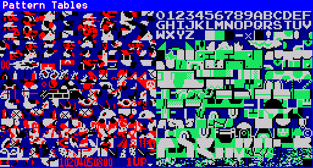
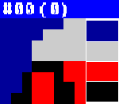
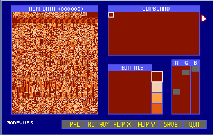
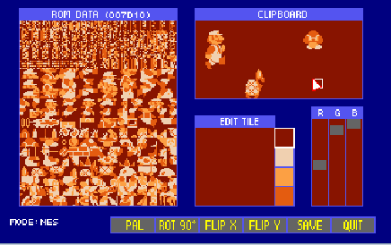

## Hacking Gráfico

Cambiar los gráficos de un juego puede ser divertido y tedioso al mismo tiempo, especialmente si tienes habilidades artísticas limitadas (como yo). Hay dos formas principales de hacerlo: usar el botón F2 de NESticle para que aparezcan las Pattern Tables, o usar un programa genial llamado Tile Layer. Aquí tienes los pros y los contras de cada uno:

### NESticle:

| Pros                                                                                                | Contras                                                                |
| --------------------------------------------------------------------------------------------------- | ---------------------------------------------------------------------- |
| Te permite editar en tiempo real, así que puedes ver los cambios a medida que los haces en pantalla. | No puedes guardar los cambios a menos que el juego tenga VROM (Video ROM). |
|                                                                                                     | Estás fastidiado si el juego no puede ser emulado por NESticle.        |

Tile Layer:

| Pros                                                                                                                    | Contras                                                                                                         |
| ----------------------------------------------------------------------------------------------------------------------- | --------------------------------------------------------------------------------------------------------------- |
| Te permite guardar los cambios en CUALQUIER juego, independientemente de si tiene VROM o no.                            | No puedes editar en tiempo real, así que tienes que hacer los cambios y luego cargar la ROM para ver cómo queda. |
| Te permite organizar los tiles en orden para que puedas verlos tal como aparecen en el juego (más sobre esto en breve). |                                                                                                                 |
| Te permite abrir dos ROMs a la vez, para que puedas cortar y pegar gráficos de una en la otra.                          |                                                                                                                 |
| También permite editar ROMs de Gameboy, Sega Master System, Virtual Boy y Super NES.                                    |                                                                                                                 |

Eso es todo. Una combinación de los dos es la mejor manera de conseguir lo que quieres, así que hazte también con Tile Layer. Una vez más, la sección de [Recursos](#RESOURCE) al final de este documento contiene un enlace al programa.

Bien, ahora vamos a empezar un poco de hacking de ROM real trasteando con algunos de los gráficos de Super Mario Brothers.

Lo que necesitas:

- NESticle  
- Tile Layer  
- Una ROM de Super Mario Brothers

Carga NESticle, haz clic en File y luego en Load ROM. Aparecerá una lista de los directorios de tu ordenador. Ve a donde se encuentra tu ROM de Super Mario Brothers y cárgala. Ahora, pulsa F2 y deberías ver una pantalla como esta.

Esto puede parecerte un montón de basura revuelta, pero en realidad son los gráficos que está usando el juego. (En Super Mario Brothers, ¡estos son en realidad TODOS los gráficos de todo el juego!). Esto es lo que se conoce como Pattern Tables, el espacio en la RAM de la NES que contiene los gráficos del juego. Los de la izquierda son los tiles de los sprites, como Mario y todos los enemigos. Los de la derecha son los tiles de fondo. Verás, la mayoría de las ROMs no guardan sus gráficos en orden, sino que tienen sus tiles desordenados. Tile Layer puede ayudar con eso, pero entraré en detalles en un segundo. En fin, haz clic en el primer tile de la izquierda, que tal vez puedas distinguir como la parte posterior de la cabeza de Mario. Debería aparecer otra pantalla como esta.

Aquí es donde puedes editar los gráficos, en este caso la parte de atrás de la cabeza de Mario. (Los números hexadecimales de la parte superior no son importantes para este tipo de cosas, pero serán útiles más adelante cuando entres en la edición de texto). El tile se compone de una cuadrícula de 8x8 con 4 colores, que son los cuadros de la derecha. (Ten en cuenta que el color superior es transparente). Puedes hacer clic con el botón derecho en el tile o en las tablas de patrones para cambiar los colores mostrados, aunque normalmente NESticle no muestra la paleta correcta. Lo mejor es poner el gráfico que quieres cambiar, como Mario de pie, en la pantalla, pausar el juego, entrar en las Pattern Tables y empezar a trastear con un tile que forme parte de Mario de pie. Podrás ver los cambios a medida que los hagas, lo cual es útil de narices. En cuanto a la edición del tile, solo tienes que elegir el color haciendo clic con el botón izquierdo sobre él y empezar a pintar como en cualquier otro programa de dibujo. Una vez que hayas terminado con la parte de atrás de la cabeza de Mario, haz clic en algunos tiles más y trastea si quieres.

Bien, ya has cambiado algunas cosas, pero todavía queda una cosa importante por hacer. Ve a File y haz clic en Write VROM. Esto guardará tu trabajo en la ROM.

Sin embargo, hay muchas ROMs que no tienen VROM, como Final Fantasy y The Legend of Zelda, por lo que los gráficos que cambies en NESticle no se podrán guardar. Y tal vez todos esos tiles desordenados te estén confundiendo muchísimo. ¿Qué pasa si quieres hackear un juego sin VROM, o quieres ver los tiles tal como aparecen en el juego? Fácil, es hora de sacar Tile Layer.

Para facilitar un poco las cosas, pon tu ROM de Mario en el mismo directorio donde tengas Tile Layer. Si usas Win95\98, tienes que ir al Símbolo del sistema de MS-DOS. Ve al directorio donde está Tile Layer y escribe:

tlayer.exe xxx.nes (xxx es el nombre de la ROM)

Ahora deberías ver esto:

Sí, más basura revuelta. Sin embargo, estos no son los gráficos del juego. Pulsa la tecla de flecha hacia abajo o Re Pág unas cuantas veces hasta que veas los tiles desordenados, que en Super Mario Brothers están en la parte inferior del archivo. Aquí es donde entra en juego una de las funciones más geniales de Tile Layer. Haz clic en la parte de atrás de la cabeza de Mario, luego ve al portapapeles (clipboard) y haz clic con el botón derecho del ratón. El tile debería estar ahora en el portapapeles. Ahora haz clic en la parte delantera de la cabeza de Mario y ponla delante del tile de la parte trasera de su cabeza. Haciendo esto puedes organizar los tiles para que se vean realmente como en el juego, así.

Hacer esto facilita muchísimo los hacks gráficos. La forma de funcionar es idéntica al editor de tiles de NESticle. Solo recuerda que tienes que volver a insertar los tiles en su lugar de origen. Por ejemplo, si cambias la cara de Mario, tienes que hacer clic con el botón izquierdo en el tile alterado del portapapeles, ir a la pantalla de la izquierda donde están los datos de la ROM y hacer clic con el botón derecho sobre el tile original de la cara de Mario. Como siempre, ¡acuérdate de guardar antes de salir!

Eso cubre básicamente el hacking gráfico básico. Pero espera, ¿qué es eso? ¿Te gustaría saber cómo cambiar palabras y cosas así en un juego? Bueno, ese es un tema totalmente nuevo, que se trata en...

[(Volver al Índice de Contenidos)](#MAIN)
