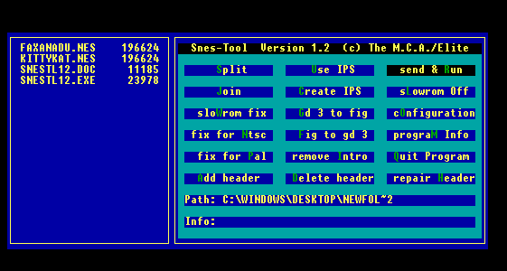

## Parches IPS

Así que has hackeado a fondo una ROM y te gustaría que todo el mundo la viera. ¿Cómo deberías hacerlo?

IPS significa International Patching System (Sistema de Parcheo Internacional), y es el método preferido para distribuir hackeos de ROMs por Internet. Verás, esa bonita ROM que has estado hackeando es una pieza de propiedad intelectual con derechos de autor, y distribuir una versión modificada de la misma probablemente molestará a sus dueños, ya que, ya sabes, es suya. Un parche IPS contiene ÚNICAMENTE los cambios que has realizado en el juego, los cuales pueden ser aplicados a una copia original de la ROM por otra persona para convertirla en tu versión hackeada. Como solo contiene tus cambios, no estás distribuyendo el código original con derechos de autor que hay en el juego, y además el tamaño del archivo es drásticamente menor que el de la ROM hackeada completa. Un programa llamado SNES-Tool puede crear uno de estos parches, el cual, sí, está en la sección de [Recursos](#RESOURCE).

Lo que necesitas.

- SNES-Tool  
- Tu ROM hackeada  
- Una copia inalterada de la ROM que has hackeado

Descomprime SNES-Tool en una carpeta con tu ROM hackeada y tu ROM inalterada. Ejecuta SNES-Tool y se te presentará este menú:

Resalta la opción que dice Create IPS y presiona enter. El programa te pedirá que selecciones tu archivo NO CAMBIADO (UNCHANGED). Resáltalo en el menú de la izquierda (en este caso, Faxanadu.nes) y presiona enter.

Ahora SNES-Tool te pedirá que elijas el archivo Cambiado (Changed), que es tu versión hackeada de la ROM (en este caso, Kittykat.nes). Resáltalo y presiona enter. Aparecerá un mensaje que dice IPS File Created en el cuadro Info:. Ahora debería haber un archivo en tu carpeta llamado xxx.ips (donde xxx es el nombre de tu ROM hackeada). Ahora tienes un bonito archivo IPS que puedes comprimir en un zip con un Readme o algo así, y subirlo a Internet para que otros puedan disfrutar de tu duro trabajo y esfuerzo. SNES-Tool también puede aplicar estos archivos a las ROMs mediante la opción Use IPS.

---

Bueno, eso cubre básicamente los fundamentos del hacking de ROMs de NES. Esperamos que este documento te haya servido de ayuda y que ahora puedas iniciarte en un hobby bastante divertido y gratificante.

Feliz hacking.
 

[(Volver al Índice de Contenidos)](#MAIN)
