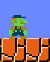
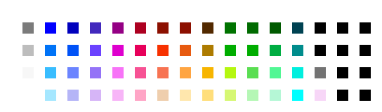

## Modificación de Paleta

¿Qué es el hacking de paletas? Bueno, cuando hackeas los gráficos de un juego, a veces querrás que tus nuevos gráficos usen colores diferentes a los que ya están usando. Para que no tengas que ir a buscar otra ROM, vamos a cambiar algunas paletas de colores en Super Mario Brothers.

Lo que necesitas.

- NESticle  
- Un editor hexadecimal  
- Una ROM de Super Mario Brothers

Carga Super Mario Brothers en NESticle. Presiona start y ponlo en pausa tan pronto como empieces en el Mundo 1-1. Ahora es cuando entra en juego el otro Botón Mágico de NESticle, la tecla F4. Al pulsarla aparecerá una pantalla como esta.

Estos son los colores que está usando el juego actualmente. La forma en que esto está configurado es que cada paleta es un conjunto de cuatro colores, con dos filas de cuatro paletas cada una. Aquí es donde vamos a cambiar algunas cosas. ¿Ves la primera paleta de la segunda fila, la que es azul claro, roja, óxido y marrón? Esta es la paleta que usa Mario cuando está en su forma normal o Super. Haz clic en cada uno de los colores y anota los valores hexadecimales que mostrará, que serán `22 16 27 18`. Cierra NESticle ahora y abre tu ROM de Mario en tu editor hexadecimal (incluso puedes usar Thingy sin una tabla como editor hexadecimal si quieres). Ahora busca `22162718`, así es, no uses espacios entre los valores. Cuando lo encuentres, cambia el `16 por 0C` y el `27 por 2A`. Guarda el archivo y ábrelo de nuevo en NESticle. Los colores de Mario se verán ahora así.

Has cambiado la paleta de Mario. Sin embargo, esto tiene un efecto secundario. Cualquier otro sprite que use esta misma paleta también verá cambiados sus colores, como Lakitu, creo. Otra cosa que hay que recordar es que en muchos juegos la primera coincidencia no será la paleta que estás buscando, ya que la misma cosa podría estar en la ROM varias veces. Así que, cuando se trata de esto, tienes que usar el método de prueba y error, cambiando cada una hasta que encuentres la paleta correcta. ¡Recuerda hacer copias de seguridad con frecuencia!

Una nota más sobre el hacking de paletas: a veces la ROM no incluye el primer color (que es el transparente), así que, por ejemplo, si no encontraras ninguna coincidencia para `22 16 27 28` en la ROM, intenta buscar `16 27 28`.

Además, la NES tiene un total de 64 colores, que se muestran aquí con sus valores hexadecimales en esta tabla. Quizás quieras guardar esto en tu disco duro para futuras consultas, ya que es de gran ayuda para encontrar qué colores puedes usar.
 

  
(No puedo atribuirme el mérito de esta imagen. Creo que Toma la creó. Espero que no le importe que la use).

Eso es todo sobre el hacking de paletas. Por último, hay una cosa más que tenemos que cubrir para quitar de en medio lo básico, y es...

[(Volver al Índice de Contenidos)](#MAIN)

-------------
