# Defectos Gráficos de la PlayStation 1

> Basado en la transcripción del video homónimo.  
> Una exploración técnica de por qué los gráficos de PS1 se ven tan característicos.

---

## Índice

1. [Introducción](#1-introducción)
2. [Pipeline de Renderizado](#2-pipeline-de-renderizado)
3. [Características particulares de la PS1](#3-características-particulares-de-la-ps1)
4. [Problema 1: Vertex Snapping](#4-problema-1-vertex-snapping-tembleque-de-polígonos)
5. [Problema 2: Error de Profundidad](#5-problema-2-error-de-profundidad-depth-error)
6. [Problema 3: Deformación de Texturas](#6-problema-3-deformación-de-texturas-affine-texture-warping)
7. [Problemas adicionales](#7-problemas-adicionales)
   - [Dithering](#71-dithering)
   - [Huecos por clipping](#72-huecos-por-clipping)
   - [T-Junctions](#73-t-junctions)
8. [Conclusión](#8-conclusión)

---

## 1. Introducción

Los gráficos de la PlayStation 1 son inconfundibles: polígonos que tiemblan, texturas que se deforman al mover la cámara, triángulos que aparecen donde no deberían. Estos "defectos" no son errores aleatorios, sino el resultado de decisiones de diseño por limitaciones de hardware.

Tres defectos principales:

| Defecto | Nombre técnico | Efecto visual |
|---|---|---|
| Tembleque de polígonos | **Vertex Snapping** | Los vértices saltan entre posiciones fijas |
| Error de profundidad | **Depth Error** | Triángulos aparecen delante de otros cuando deberían estar detrás |
| Texturas deformadas | **Affine Texture Warping** | Texturas con líneas rectas se curvan al mover la cámara |

---

## 2. Pipeline de Renderizado

Para entender los defectos, primero hay que entender cómo una consola convierte una escena 3D en una imagen 2D en pantalla.

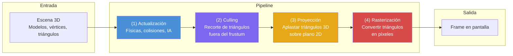

### 2.1 Frustum y Culling

El **frustum** es un poliedro que representa el cono de visión de la cámara. Todo triángulo fuera de él se descarta para no procesarlo innecesariamente.

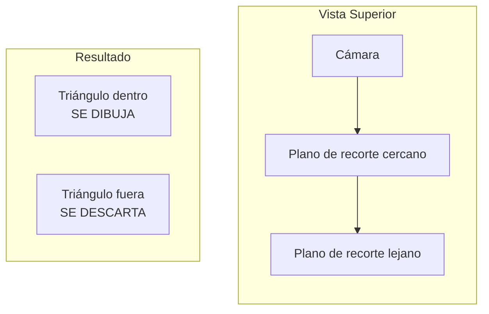

### 2.2 Proyección

Los triángulos 3D se "aplastan" sobre un plano 2D usando matrices de proyección. En este proceso se pierde la profundidad (eje Z), que es clave para saber qué está delante de qué.

### 2.3 Rasterización

Se divide el plano de proyección en una grilla según la resolución. Por cada triángulo, se recorren los píxeles: si un píxel cae dentro del triángulo, se pinta del color correspondiente.

---

## 3. Características particulares de la PS1

La PlayStation 1 tenía varias limitaciones de hardware que condicionaron todo su pipeline gráfico:

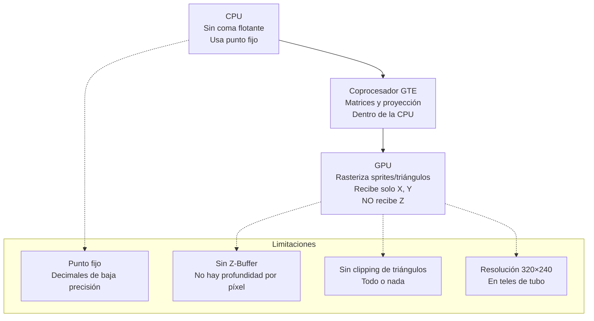

| Característica | Detalle |
|---|---|
| **Resolución típica** | 320 × 240 píxeles |
| **CPU** | Sin soporte de coma flotante (usaba **punto fijo**) |
| **GTE** | Coprocesador interno para operaciones de matrices y proyección |
| **GPU** | Rasterizaba sprites/triángulos; solo recibía coordenadas **X, Y** (sin Z) |
| **Clipping** | No recortaba triángulos parcialmente — los dibujaba enteros o los descartaba |
| **Subdivisión automática** | Sony recomendaba subdividir triángulos grandes cerca de la cámara |

---

## 4. Problema 1: Vertex Snapping (Tembleque de polígonos)

### 4.1 Causa

La PS1 trabajaba con **punto fijo** en lugar de coma flotante. Al proyectar los triángulos, las coordenadas resultantes tenían decimales, pero la GPU solo aceptaba coordenadas de **píxeles enteros** (sin subpíxel).

Cada vértice se "redondea" al centro del píxel más cercano — esto se llama **snapping**.

### 4.2 Efecto visual

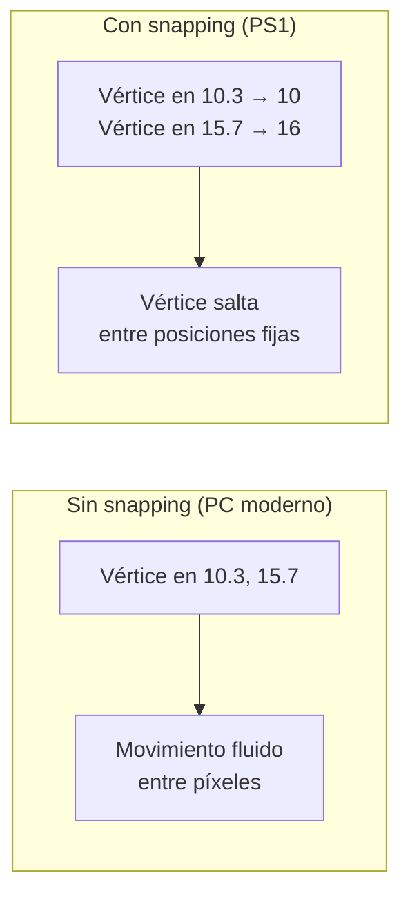

- Los polígonos parecen **temblar** o respirar de forma descoordinada
- Los vértices de un mismo modelo no saltan al mismo tiempo, lo que **deforma la figura**
- Es especialmente notorio en personajes como Harry Mason (Silent Hill)

### 4.3 Por qué ocurría

| Hardware | Limitación |
|---|---|
| **GPU** | Solo aceptaba coordenadas enteras (cada unidad = 1 píxel) |
| **GTE** | Proyectaba con punto fijo, perdiendo precisión subpíxel |
| **Resultado** | Los vértices solo podían caer en el **centro de un píxel** |

Los motores modernos manejan **subpíxel** (posiciones intermedias entre píxeles), lo que da movimientos suaves. La PS1 no podía hacerlo.

---

## 5. Problema 2: Error de Profundidad (Depth Error)

### 5.1 Causa

La GPU de la PS1 **no recibía la coordenada Z** de profundidad. Solo recibía X e Y. Sin Z, no podía usar un **Z-Buffer** (buffer de profundidad por píxel).

### 5.2 El algoritmo del pintor

La PS1 usaba el **algoritmo del pintor**: dibujar primero los triángulos más lejanos y luego los más cercanos, tapando a los anteriores.

### 5.3 Problema del algoritmo del pintor

El algoritmo del pintor **falla** cuando hay triángulos que se intersectan o se entrelazan:

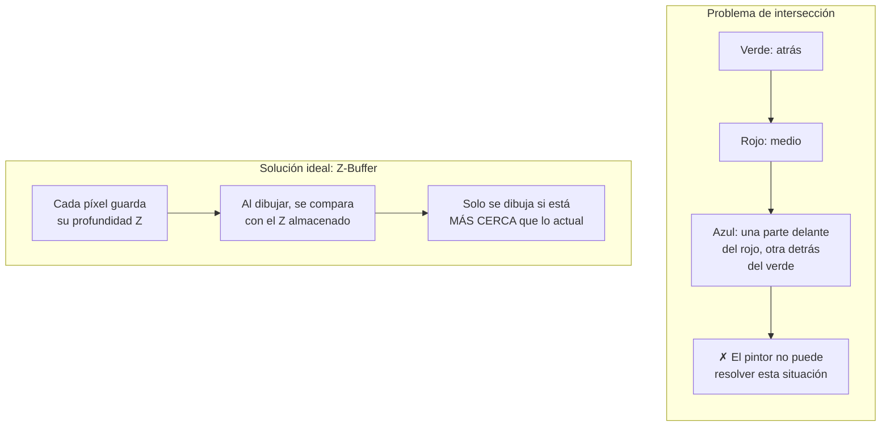

### 5.4 Sin Z-Buffer en PS1

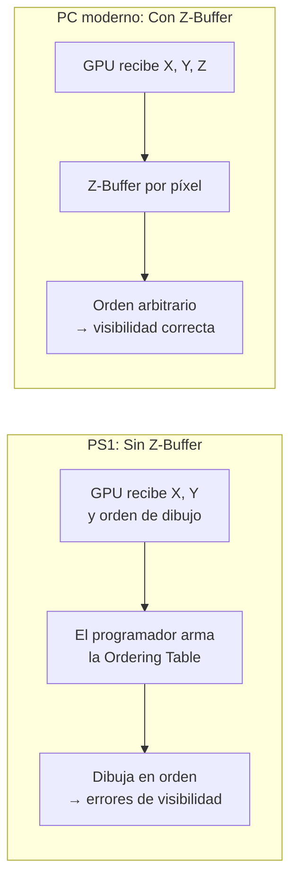

La **Ordering Table** quedaba en manos del desarrollador, lo que generaba errores no contemplados o decisiones que sacrificaban corrección por rendimiento.

---

## 6. Problema 3: Deformación de Texturas (Affine Texture Warping)

### 6.1 Causa

Al aplicar texturas durante la rasterización, los triángulos ya están **aplanados** (sin profundidad). La PS1 usaba **Affine Texture Mapping**, que pega la textura ignorando la perspectiva original del triángulo.

### 6.2 Comparativa

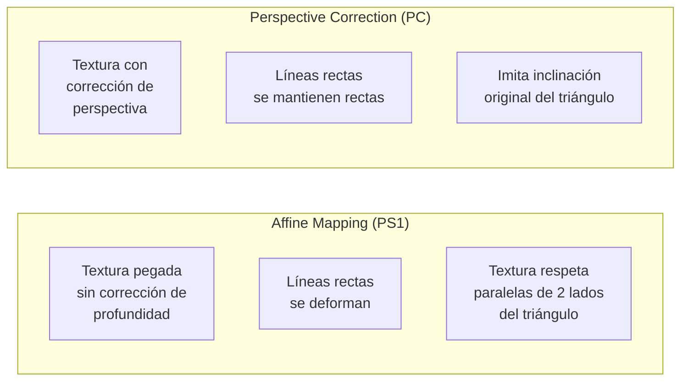

### 6.3 Efecto visual

- Visible en texturas con **líneas rectas** (cuadrículas, paredes, patrones)
- Al mover la cámara, las texturas parecen **"respirar"** o deformarse
- En triángulos adyacentes, la deformación crea una **costura visible** en la intersección si los lados no son paralelos

### 6.4 Mitigación: Subdivisión

Sony recomendaba subdividir triángulos grandes en triángulos más pequeños. **Mientras más pequeño es el triángulo, menos se nota la deformación** de la textura.

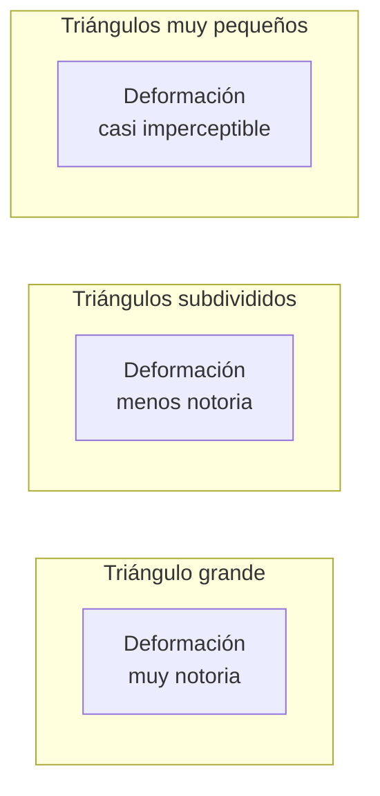

---

## 7. Problemas adicionales

### 7.1 Dithering

La PS1 aplicaba un efecto de **entramado (dithering)** sobre toda la pantalla. En las generaciones de 8 y 16 bits, esto servía para simular más colores aprovechando el difuminado de las teles de tubo y el video compuesto.

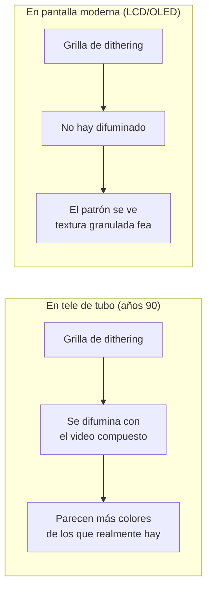

En pantallas modernas se ve mal porque no ocurre el difuminado. Los emuladores permiten desactivarlo.

### 7.2 Huecos por clipping

La PS1 **no recortaba triángulos** parcialmente: o los dibujaba enteros o los descartaba.

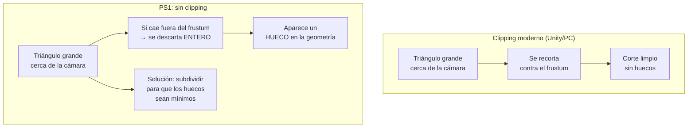

Cuando un triángulo grande cerca de la cámara quedaba parcialmente fuera del frustum, la PS1 lo descartaba por completo, dejando un **hueco**. Por esto Sony recomendaba la subdivisión automática de triángulos.

### 7.3 T-Junctions

Aparecen huecos también por problemas de **precisión numérica**. Cuando dos vértices que deberían estar juntos se redondean a posiciones distintas, queda un espacio entre ellos.

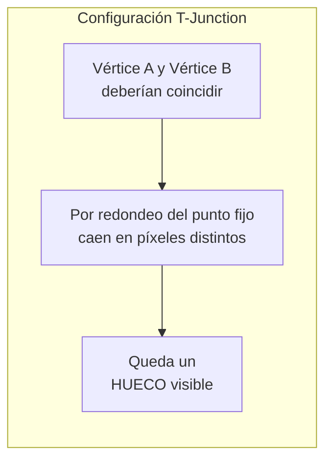

Ocurre especialmente cuando un vértice cae exactamente sobre el lado de otro triángulo (configuración en forma de T). La falta de precisión del punto fijo y el redondeo a enteros hacen que aparezca un agujero.

---

## 8. Conclusión

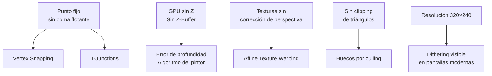

Los defectos gráficos de la PS1 no son fallos aislados, sino la consecuencia directa de las limitaciones de su hardware:

- **CPU sin coma flotante** → punto fijo → vertex snapping y T-junctions
- **GPU sin Z** → algoritmo del pintor → errores de profundidad
- **GPU sin perspectiva** → affine texture mapping → texturas deformadas
- **Sin clipping** → triángulos descartados enteros → huecos

En su época, corriendo a 320×240 en teles de tubo, muchos de estos defectos pasaban desapercibidos. Los emuladores y las pantallas modernas los hacen mucho más evidentes.

---

> **Fuente:** Transcripción del video *"Los DEFECTOS gráficos de la PlayStation 1"* (YouTube)
