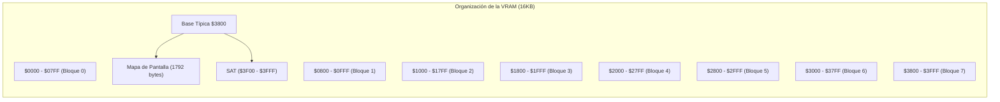
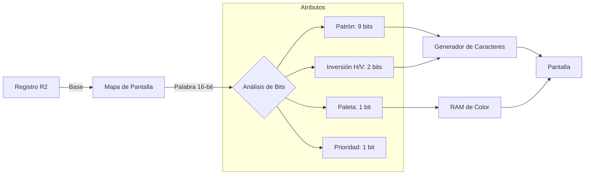
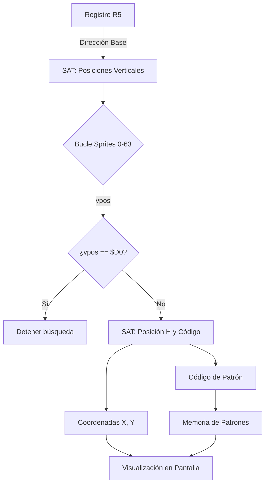
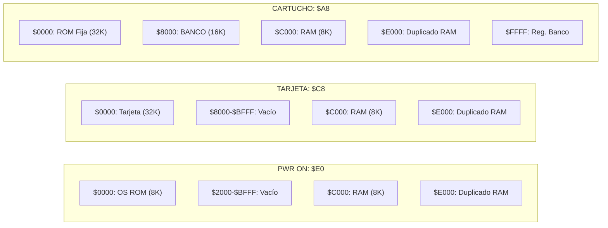

## Ilustraciones de Apoyo

### MOC
*   Mapa de Pantalla
*   Bit de Reloj Temprano (Early Clock Bit)
*   Sistema de Fondo 
*   Sistema de Sprites
*   Mapas de Memoria

### Mapa de Pantalla (Screen Map)

Representación de los 16K Bytes de la RAM de Video (VRAM):

*   **$0000 - $0800**: Bloque de 2K Bytes (000)
*   **$0800 - $1000**: Bloque de 2K Bytes (001)
*   **$1000 - $1800**: Bloque de 2K Bytes (010)
*   **$1800 - $2000**: Bloque de 2K Bytes (011)
*   **$2000 - $2800**: Bloque de 2K Bytes (100)
*   **$2800 - $3000**: Bloque de 2K Bytes (101)
*   **$3000 - $3800**: Bloque de 2K Bytes (110)
*   **$3800 - $4000**: Bloque de 2K Bytes (111)

**Detalle del Mapa de Pantalla (Dirección Base típica $3800):**
*   **Ancho:** 64 Bytes (32 caracteres x 2 bytes por carácter).
*   **Alto (Visible):** 24 líneas (1792 bytes).
*   **Alto (No visible):** 4 líneas (256 bytes).
*   **Espacio de Sprites:** Los últimos 256 bytes ($3F00-$3FFF) se usan para la descripción de sprites (SAT).
*   **Nota:** Si no se utiliza el desplazamiento vertical, los códigos de carácter en las direcciones $3F0 - $3F7 están disponibles para almacenar 8 patrones de caracteres.

---

### Bit de Reloj Temprano (Early Clock Bit)

Diagrama de la pantalla:
*   **Valor 00**: Esquina superior izquierda.
*   **Reloj Temprano = 0**: Sin desplazamiento adicional.
*   **Reloj Temprano = 1**: Desplaza el área de visualización (posiblemente para ocultar el borde izquierdo).
*   **Recorte (Cut off)**: Lado derecho de la pantalla en $FF.

---

### -- SISTEMA DE FONDO (BACKGROUND SYSTEM) --

Muestra el flujo desde el **Mapa de Pantalla** hacia los **Patrones**:

1.  **Entrada del Mapa de Pantalla (16 bits):**
    *   **Número de Patrón (9 bits):** Selecciona uno de los 512 patrones de 32 bytes cada uno.
    *   **Inversión Horizontal/Vertical (2 bits):** 1=Invertir, 0=No invertir.
    *   **Banco de Color (1 bit):** 0=Primeros 16 colores, 1=Segundos 16 colores.
    *   **Prioridad (1 bit):** 
        *   0: Todos los sprites delante del fondo.
        *   1: Colores de fondo 1-15 delante de los sprites.
    *   **Uso de S/W (3 bits):** Para banderas de software.

2.  **Color del Borde (Registro R7):** Selecciona el color desde el segundo grupo de 16 colores.

3.  **Dirección Base (Registro R2):** Apunta a la ubicación del Mapa de Pantalla en la VRAM.

---

### -- SISTEMA DE SPRITES (SPRITE SYSTEM) --

Muestra cómo se posicionan los objetos en la pantalla:

1.  **Tabla de Atributos de Sprites (SAT):**
    *   Ubicada desde la dirección base establecida por el registro **R5** (típicamente $3F00).
    *   **Sección de Posición V:** Direcciones $3F00-$3F3F (vpos #0 a vpos #63).
    *   **Código de Terminación ($D0):** Detiene la búsqueda de sprites.
    *   **Sección de Atributos H/Carácter:** Direcciones $3F80-$3FFF (hpos #0, código de carac. #0, etc.).

2.  **Memoria de Patrones:**
    *   Cada código de carácter en la SAT apunta a un patrón de 32 bytes en la memoria de patrones.
    *   Direccionamiento: `dirección = código * 32`.

3.  **Resultado en Pantalla:** El patrón seleccionado aparece en la coordenada `(x, y)` calculada.

---

### MAPA DE MEMORIA (MEMORY MAP)

#### Figura M-1: ENCENDIDO (PWR ON)
*   **Puerto $3E = $E0**
*   **$0000 - $1FFF**: ROM del S.O. (8K).
*   **$C000 - $DFFF**: RAM de 8K.
*   **$E000 - $FFFF**: Duplicado de la RAM de 8K.

#### Figura M-2: TARJETA (32K)
*   **Puerto $3E = $C8**
*   **$0000 - $7FFF**: TARJETA de 32K Bytes.
*   **$C000 - $FFFF**: RAM de 8K (y su duplicado).

#### Figura M-3: CARTUCHO (128K / 1 Megabit)
*   **Puerto $3E = $A8**
*   **$0000 - $7FFF**: 32K Bytes de ROM FIJOS.
*   **$8000 - $BFFF**: SEIS BANCOS de 16K Bytes seleccionables.
*   **$C000 - $FFFF**: RAM de 8K (y su duplicado).
*   **$FFFF**: Escribir en esta dirección selecciona el banco activo (del 02 al 07).

