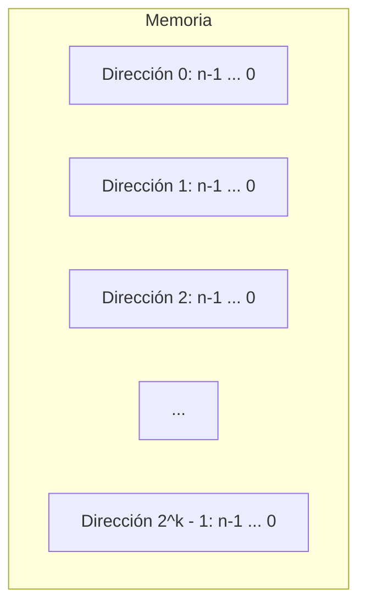
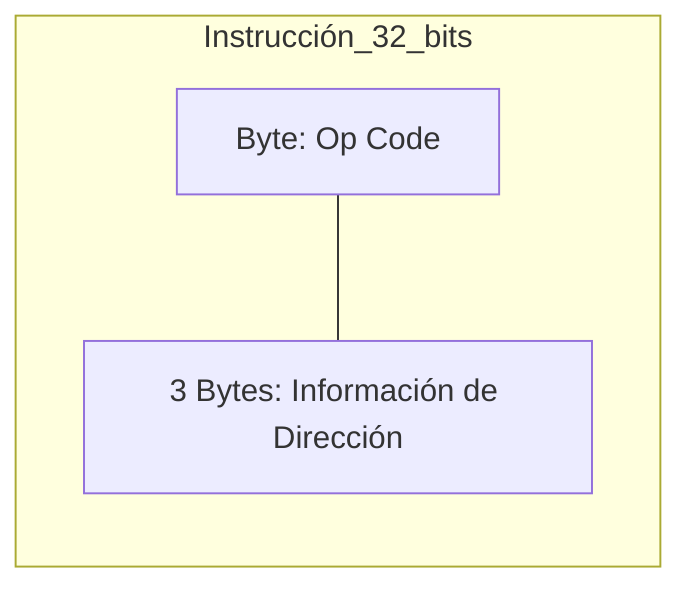
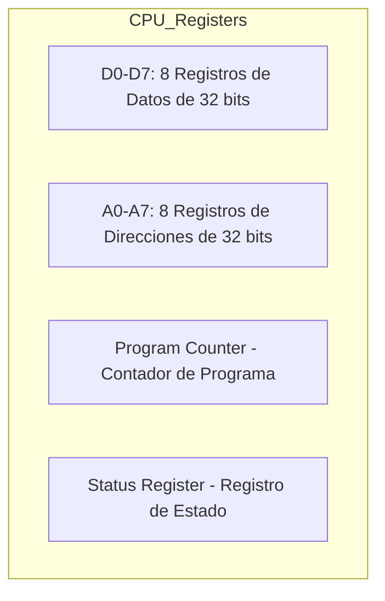

# Ubicaciones de Memoria, Direcciones y Secuenciación de Instrucciones

Este documento explora cómo se organiza la memoria, cómo se direccionan los datos y cómo se ejecutan las secuencias de instrucciones en un procesador.

---

## 1. Introducción a la Organización de Memoria
Para entender la organización de una computadora, debemos estudiar:
- ¿Cómo se organizan los datos e instrucciones en la memoria principal?
- ¿Cómo se direcciona la memoria? (Modos de direccionamiento).

---

## 2. Estructura de la Memoria
La memoria almacena tanto instrucciones como datos. Si tenemos $k$ bits de dirección y $n$ bits por ubicación:

### Capacidad según bits de dirección ($k$)
| Bits ($k$) | Número de ubicaciones | Notación |
| :--- | :--- | :--- |
| 10 | $2^{10} = 1,024$ | 1K |
| 16 | $2^{16} = 65,536$ | 64K |
| 20 | $2^{20} = 1,048,576$ | 1M |
| 24 | $2^{24} = 16,777,216$ | 16M |

**Nota:** $n$ es típicamente 8 (byte), 16 (palabra/word) o 32 (palabra larga/long word).

### Diagrama de Direccionamiento

---

## 3. Almacenamiento de Datos e Instrucciones
Considerando una palabra larga de 32 bits, esta puede almacenar:

### Números en Complemento a 2 (Enteros)
El rango para $n$ bits es:
$$(-2^{n-1}) \text{ a } (2^{n-1} - 1)$$
Para $n = 32$, el rango es aproximadamente $-2G$ a $2G-1$ (donde $G = 2^{30}$).

### Caracteres ASCII
Una palabra de 32 bits puede almacenar 4 caracteres ASCII (1 byte cada uno).

### Instrucciones de Máquina
Una instrucción simple puede dividirse en un Código de Operación (Op Code) y la información de dirección.

---

## 4. Orden de Bytes (Endianness)
Las máquinas direccionables por bytes pueden organizar los bytes de dos formas:

- **Big-endian:** El byte más significativo se almacena en la dirección más baja (0, 1, 2, 3).
- **Little-endian:** El byte menos significativo se almacena en la dirección más baja (3, 2, 1, 0).

---

## 5. Secuenciación de Instrucciones
Las instrucciones suelen usar múltiples palabras de 16 bits.

**Ejemplo de instrucción ADD:**
$$C = A + B$$
En memoria, esto se representa como: `Add A, B, C`, lo que implica la operación $[A] + [B] \to C$.

### Problemas con múltiples ubicaciones de memoria:
1. **Instrucciones largas:** Si una dirección requiere 24 bits, una instrucción de 3 direcciones (A, B, C) ocuparía $3 \times 24 + 4$ (opcode) $= 76$ bits. Esto consume mucho espacio.
   - **Solución:** Usar instrucciones de una o dos direcciones, o usar registros de la CPU.
2. **Tiempo de acceso:** El acceso a la memoria principal es lento.
   - **Solución:** Usar registros del procesador para almacenar operandos y resultados temporales.

---

## 6. Registros de la CPU
Los registros son visibles para el programador y permiten un acceso ultra rápido.

### Organización de Registros (Ejemplo Típico)

*   **A7** suele funcionar como puntero de pila (Stack Pointer).
*   **SR** contiene banderas de condición (N: Negativo, Z: Cero, V: Overflow, C: Carry).

---

## 7. Ejemplos de Instrucciones en Ensamblador

### Operación ADD (Suma)
- `ADD B, D0` $\to [B] + [D0] \to D0$
- Al menos uno de los operandos debe ser un registro de datos.

### Operación MOVE (Mover)
- `MOVE A, D0` $\to [A] \to D0$
- Para hacer $C = A + B$:
  1. `MOVE.L A, D0`
  2. `ADD.L B, D0`
  3. `MOVE.L D0, C`

### Otras Instrucciones Ilustrativas
| Instrucción | Operación | Descripción |
| :--- | :--- | :--- |
| `SUB B, D0` | $[D0] - [B] \to D0$ | Resta |
| `CMP B, D0` | $[D0] - [B]$ | Compara y actualiza banderas (N, Z, V, C) |
| `CLR A` | $0 \to A$ | Limpia (pone a cero) un registro o dirección |
| `TST A` | $[A] - 0$ | Prueba el valor para actualizar banderas |
| `ADDQ #2, D5`| $[D5] + 2 \to D5$ | Suma rápida de una constante pequeña |
